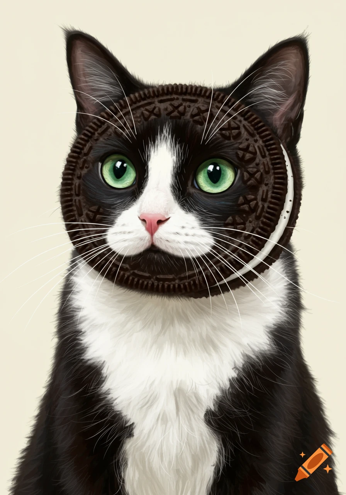
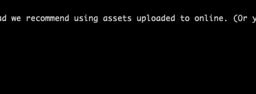

<style scoped>
  section {
    font-size: 20px; /* Adjust this value as needed */
  }
</style>

# Course intro

This is an intro to the course, blah blah blah this is some more content.This is an intro to the course, blah blah blah this is some more content.This is an intro to the course, blah blah blah this is some more content.This is an intro to the course, blah blah blah this is some more content.This is an intro to the course, blah blah blah this is some more content.

```JavaScript
async function getFiles() {
  const fileMap = {};
  const files = await readdir(DATA_DIRECTORY);
  const markdownFiles = files.filter((file) => file.endsWith(".md"));
  markdownFiles.forEach((file) => {
    fileMap[file.slice(0, -3)] = `${DATA_DIRECTORY}/${file}`;
  });
  return fileMap;
}

```

- one
- two

1. one
2. two

---

## This is the second slide

Amazing right?

---

## Slide with image




---

## Slide with a script

<canvas id="canvas"></canvas>

<script>
const canvas = document.getElementById('canvas');
const ctx = canvas.getContext('2d');

// Resize canvas to fill window
function resizeCanvas() {
    canvas.width = window.innerWidth;
    canvas.height = window.innerHeight;
}
window.addEventListener('resize', resizeCanvas);
resizeCanvas();

// Circle object
const circle = {
    x: 100,
    y: 100,
    radius: 30,
    dx: 2,
    dy: 2,
    color: '#4fc3f7'
};

// Animation loop
function animate() {
    ctx.clearRect(0, 0, canvas.width, canvas.height);

    // Move circle
    circle.x += circle.dx;
    circle.y += circle.dy;

    // Bounce off edges
    if (circle.x + circle.radius > canvas.width || circle.x - circle.radius < 0)
    circle.dx *= -1;
    if (circle.y + circle.radius > canvas.height || circle.y - circle.radius < 0)
    circle.dy *= -1;

    // Draw circle
    ctx.beginPath();
    ctx.arc(circle.x, circle.y, circle.radius, 0, Math.PI * 2);
    ctx.fillStyle = circle.color;
    ctx.fill();

    requestAnimationFrame(animate);
}

animate();
</script>
