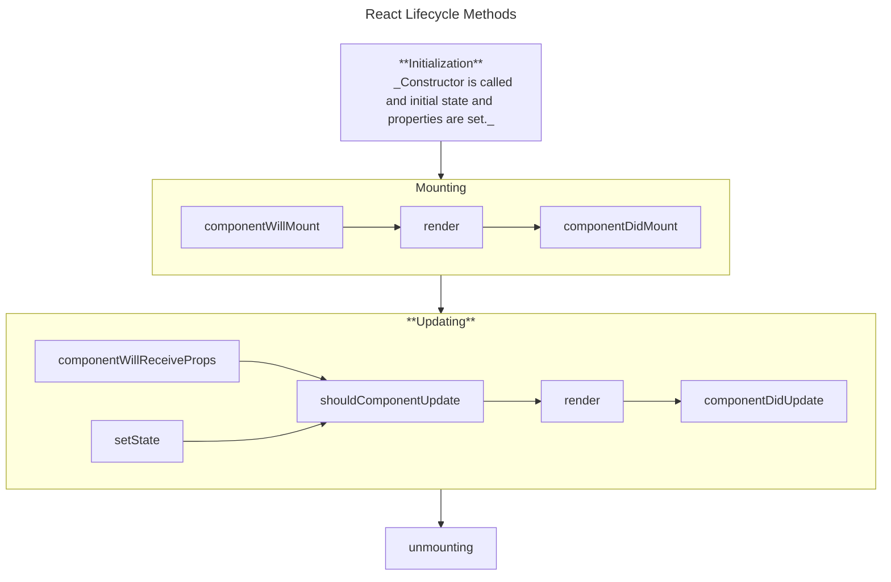

```mermaid
---
title: React Lifecycle Methods
---
flowchart TD
    mounting-->updating
    updating-->unmounting
    initialization[
        **Initialization**
        _Constructor is called and initial state and properties are set._
    ]-->mounting
    subgraph mounting[Mounting]
        direction LR
        componentWillMount-->
        render-->
        componentDidMount
    end
    subgraph updating[
        **Updating**
    ]
        direction LR
        componentWillReceiveProps --> shouldComponentUpdate
        setState --> shouldComponentUpdate
        shouldComponentUpdate -->
        render2[render] -->
        componentDidUpdate
    end
```
