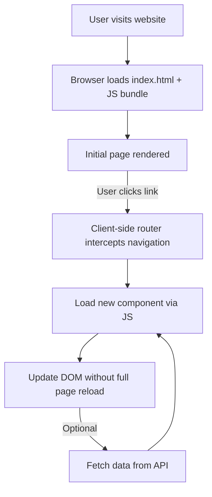

## SPA Architecture

```mermaid
flowchart TD
A[User visits website] --> B[Browser loads index.html + JS bundle]
B --> C[Initial page rendered]
C -->|User clicks link| D[Client-side router intercepts navigation]
D --> E[Load new component via JS]
E --> F[Update DOM without full page reload]
F -->|Optional| G[Fetch data from API]
G --> E
```
