## SPA Architecture

Classic client-only React: the server sends a JavaScript bundle, then the browser fetches data from a separate API before anything useful can paint. Later clicks stay on the same HTML page.

```mermaid
%%{init: {
  "theme": "dark",
  "themeVariables": {
    "primaryColor": "#2c2c2c",
    "primaryTextColor": "#f5f5f5",
    "primaryBorderColor": "#9ca3af",
    "lineColor": "#c4c4c4",
    "secondaryColor": "#3a3118",
    "tertiaryColor": "#222222",
    "fontFamily": "Segoe UI, Helvetica Neue, Arial, sans-serif",
    "fontSize": "16px"
  },
  "flowchart": {
    "curve": "basis",
    "padding": 16,
    "nodeSpacing": 28,
    "rankSpacing": 40
  }
}}%%
flowchart LR
  subgraph first["1. First visit"]
    direction TB
    A[User visits the website] --> B[Browser loads index.html + JS bundle]
    B --> C[React boots in the browser]
    C -->|second request| D[Fetch data from a separate API]
    D --> E[React paints the UI]
  end

  subgraph later["2. Later clicks — same HTML page"]
    direction TB
    F[User clicks a link] --> G[Client-side router intercepts]
    G --> H[Load the new component via JS]
    H -->|optional| I[Fetch data from the API]
    I --> J[Update the DOM — no full page reload]
    J -.->|repeat| F
  end

  E -->|user keeps browsing| F
```

