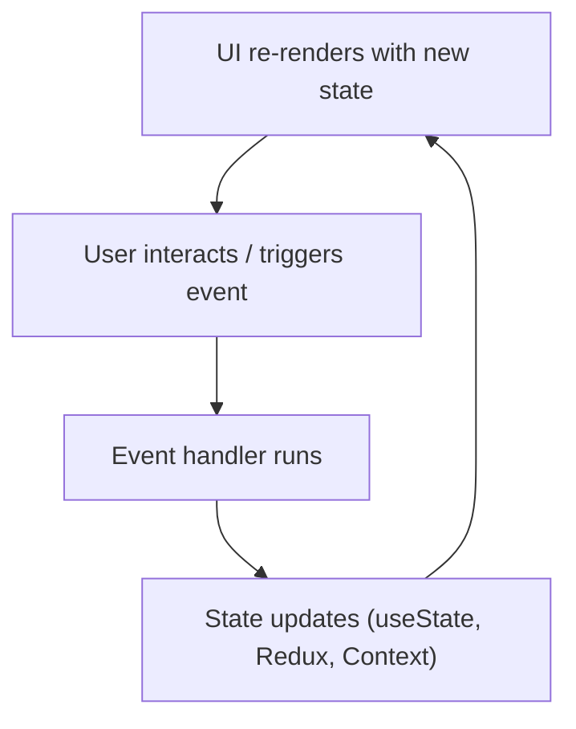

```mermaid
flowchart TD
    A["UI renders"] --> B["User interacts / triggers event"]
    B --> C["Event handler runs"]
    C --> D["State updates (useState, Redux, Context)"]
    D --> A["UI re-renders with new state"]

```
