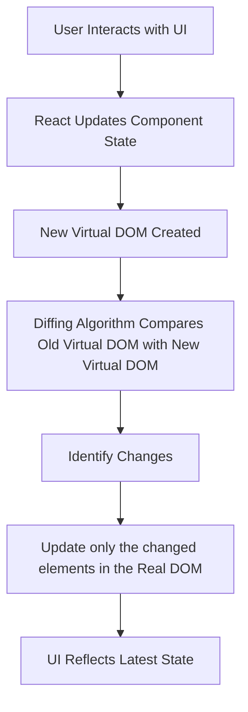
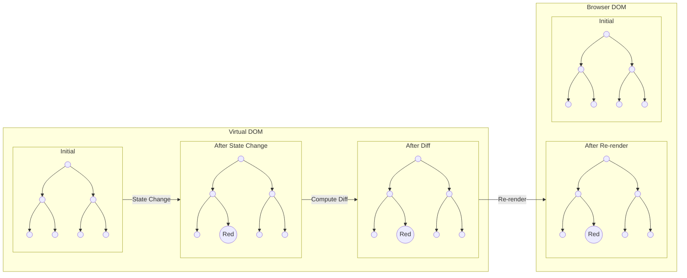

```mermaid
flowchart TD
    A[User Interacts with UI] --> B[React Updates Component State]
    B --> C[New Virtual DOM Created]
    C --> D[Diffing Algorithm Compares Old Virtual DOM with New Virtual DOM]
    D --> E[Identify Changes]
    E --> F[Update only the changed elements in the Real DOM]
    F --> G[UI Reflects Latest State]
```

```mermaid
flowchart LR
    %% Virtual DOM
    subgraph VDOM["Virtual DOM"]
        direction LR
        %% Initial
        subgraph V1["Initial"]
            A(( )) --> B(( ))
            A --> C(( ))
            B --> D(( ))
            B --> E(( ))
            C --> F(( ))
            C --> G(( ))
        end

        %% After State Change
        subgraph V2["After State Change"]
            A2(( )) --> B2(( ))
            A2 --> C2(( ))
            B2 --> D2(( ))
            B2 --> E2((Red)):::changed
            C2 --> F2(( ))
            C2 --> G2(( ))
        end

        %% After Diff
        subgraph V3["After Diff"]
            A3(( )) --> B3(( ))
            A3 --> C3(( ))
            B3 --> D3(( ))
            B3 --> E3((Red)):::changed
            C3 --> F3(( ))
            C3 --> G3(( ))
        end
    end

    %% Browser DOM
    subgraph RDOM["Browser DOM"]
        direction LR

        %% After Re-render
        subgraph R2["After Re-render"]
            X2(( )) --> Y2(( ))
            X2 --> Z2(( ))
            Y2 --> P2(( ))
            Y2 --> Q2((Red)):::changed
            Z2 --> R2n(( ))
            Z2 --> S2(( ))
        end

        %% Initial DOM
        subgraph R1["Initial"]
            X(( )) --> Y(( ))
            X --> Z(( ))
            Y --> P(( ))
            Y --> Q(( ))
            Z --> R(( ))
            Z --> S(( ))
        end


    end

    %% Flow Arrows
    V1 -->|State Change| V2 -->|Compute Diff| V3 -->|Re-render| R2


```
