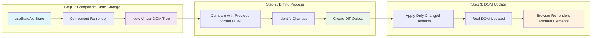
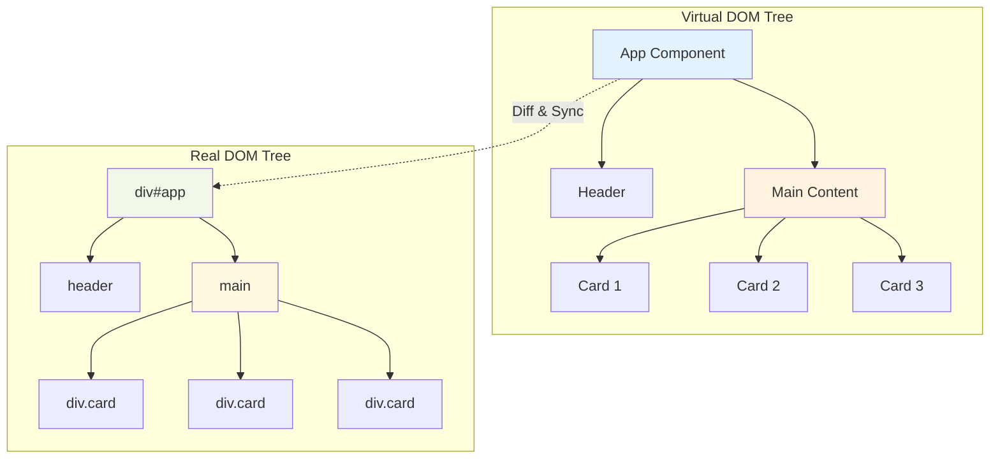
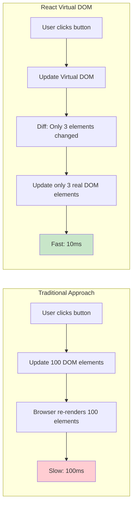
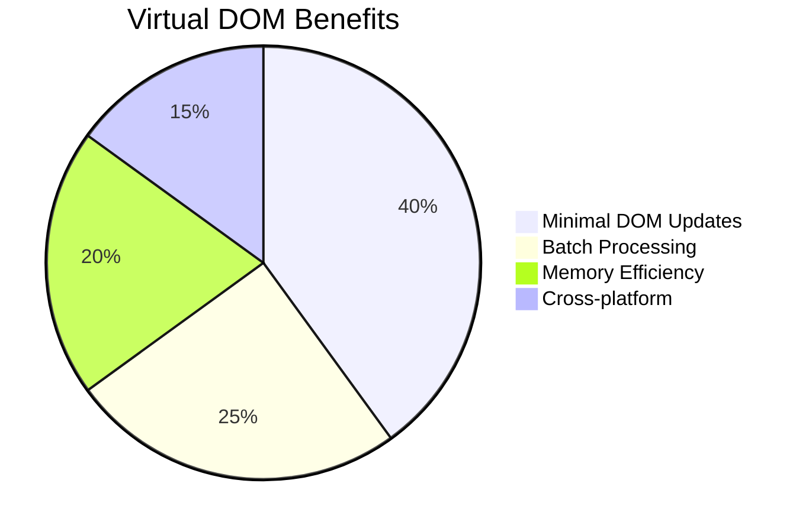
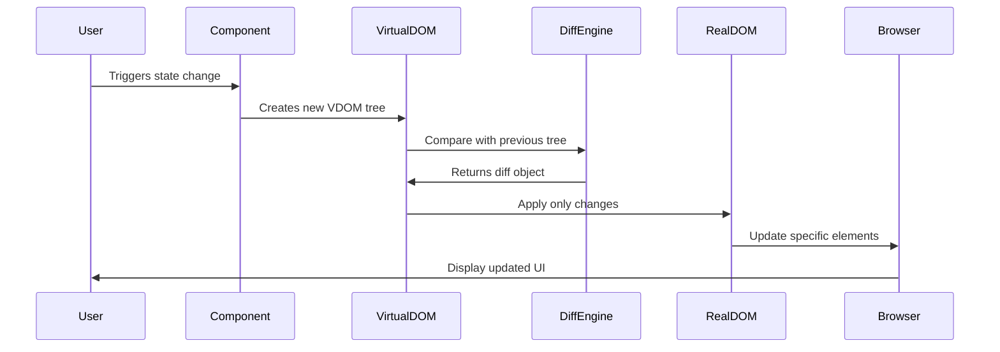

# React Virtual DOM Diagram

This diagram illustrates how React's Virtual DOM works compared to traditional DOM manipulation.

## Virtual DOM vs Real DOM

```mermaid
graph TD
    subgraph "Traditional DOM Manipulation"
        A[User Action] --> B[Direct DOM Update]
        B --> C[Browser Re-renders]
        C --> D[Expensive Operation]
        D --> E[Slow Performance]
    end

    subgraph "React Virtual DOM"
        F[User Action] --> G[State Change]
        G --> H[Virtual DOM Update]
        H --> I[Diff Algorithm]
        I --> J[Minimal Real DOM Changes]
        J --> K[Efficient Re-render]
        K --> L[Fast Performance]
    end

    style A fill:#ff9999
    style F fill:#99ff99
    style E fill:#ff6666
    style L fill:#66ff66
```

## Detailed Virtual DOM Process

## Component Tree with Virtual DOM

## Performance Comparison

## Memory and Performance Benefits

## React Reconciliation Process

## Key Concepts Explained

### 1. **Virtual DOM Tree**

- Lightweight JavaScript object representation of the real DOM
- Contains only the essential information needed for rendering
- Can be created and manipulated quickly

### 2. **Diffing Algorithm**

- Compares previous and current Virtual DOM trees
- Identifies only the elements that have changed
- Creates a minimal set of operations to update the real DOM

### 3. **Batch Updates**

- React batches multiple state changes together
- Reduces the number of DOM updates
- Improves overall performance

### 4. **Memory Efficiency**

- Virtual DOM objects are lightweight
- Can be garbage collected quickly
- Reduces memory footprint compared to direct DOM manipulation

## Benefits Summary

| Aspect             | Traditional DOM          | React Virtual DOM         |
| ------------------ | ------------------------ | ------------------------- |
| **Performance**    | Slow (direct updates)    | Fast (batched updates)    |
| **Memory**         | High (DOM manipulation)  | Low (lightweight objects) |
| **Complexity**     | High (manual management) | Low (automatic)           |
| **Cross-platform** | Limited                  | Universal                 |
| **Debugging**      | Difficult                | Easy (React DevTools)     |

This Virtual DOM approach is what makes React so efficient and why it's become the standard for modern web development.

