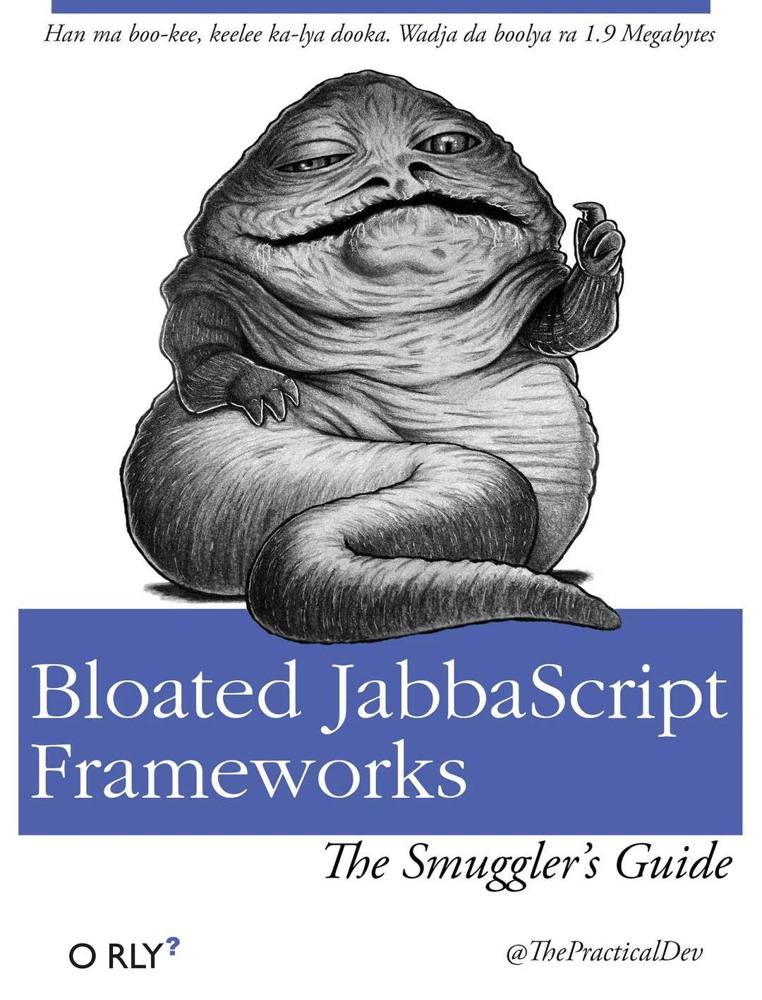
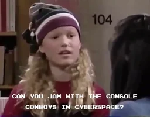
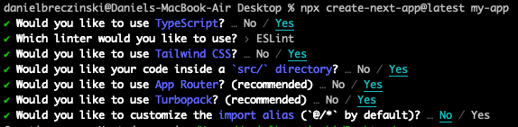

<!-- only include once in document -->

<!-- class: invert -->

# Frontend Development - Course Overview

## Instructor: Dan Breczinski

---

<!-- class: lead -->

## Today's class

- Class overview
- Tooling
- AI Workflow (spec driven development)
- JS Fundamentals

---

## Class Structure / Assessments

- Weeks 1 - 4, React/TS
  - Final _written exam_ covering theoretical topics.
  - Theory topics will come from at home reading assignments and in-class reading assignments.
  - 50% of grade
- Weeks 5 - 7 React Native
  - Final React Native _project_.
  - 50% of grade
- To pass the course, both assessments must receive a minimum passing grade of 55.

---

## Class Materials

The material for this portion of the course is contained in two repos. One is for learning materials and includes all presentations (including this one). The other contains example code which we will look at together and use for various exercises in class.

Course material:

[https://github.com/danpaul/frontend_development_course](https://github.com/danpaul/frontend_development_course)

Course code:

Clone it: [https://github.com/danpaul/frontend_development_course_code](https://github.com/danpaul/frontend_development_course_code)

_Clone both of these. Read the README files._

---

## Main Topics Covered

- Frontend development using React, TypeScript, React Native
- Technologies used
  - JS/TS
  - React
  - Next.js
  - State management (TanStack Query, Redux)
  - Tailwind
  - Lots of other related frameworks and tooling

---

## Class format

- At home:
  - Complete assigned reading (~3 hours)
  - Work on your hackathon project (~3 hours)
- In class:
  - Lectures, discussions, activities

Each week we will cover a small set of topics as an introduction. You will dive deeper into the topic through assigned readings which we will discuss briefly the following week.

_**All materials, reading, lecture, discussion are eligible for inclusion in the final exam!**_

---

## Theory Exam

Format: TestVision exam
Materials covered: weeks 1-4, lecture, discussion, reading

---

## Hackathon

Can _you_ jam with the console cowboys in cyberspace?

- Goals
  - Find a small project that motivates you
  - Practice the theory topics we are covering in class
  - Prepare for implementation portion of course
  - GitHub portfolio, resume material
  - Cash prizes, fame, etc.

---

## Hackathon details

- Use the Stack we are using for this class
- You may work in small groups (2-3 people) or individually
- Hackathon presentation (week 4):
  - ~5-10 minutes
  - Demo your product
  - Describe an interesting learning and show a relevant code snippet

---

## Hackathon judging

The hackathon judges will be judging based on the following:

- **product quality** - how interesting, innovative, and unique the product is
- **product polish** - how polished an professional the product appears
- **technical understanding** - how clear the description of the code snippet is

---

## Hackathon Speed Dating Activity

1. Take a few minutes to brainstorm ideas for the Hackathon
2. 3 x 5 minute speed dating rounds to briefly discuss your idea. _Try to meet with someone you haven't met yet._

<!-- --- -->

<!-- ## Activity: Get Started

Create a Next App!

[https://nextjs.org/docs/app/getting-started/installation](https://nextjs.org/docs/app/getting-started/installation)

Install a current version Node and npx (if not already installed)

run `npx create-next-app@latest my-hackathon-app`

Use these options:

Look at the `package.json`

Explore the project files.

Run `npm run dev` -->
