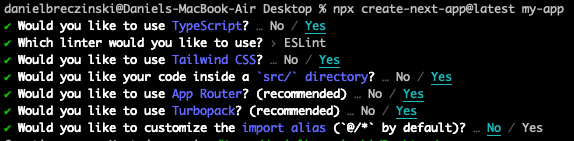

<!-- only include once in document -->

<!-- class: invert -->

# Frontend Development - Course Overview

## Instructor: Dan Breczinski

---

<!-- class: lead -->

## Today's class

- Class overview
- Hackathon planning
- Tooling setup
- JS highlights and toolings
- TypeScript

---

## Class Structure / Assessments

- Weeks 1 - 4, React/TS
  - Final _written exam_ covering theoretical topics.
  - Theory topics will come from at home reading assignments and in-class reading assignments.
  - 50% of grade
- Weeks 5 - 7 React Native
  - Final React Native _project_.
  - 50% of grade
- To pass the course, both assessments must receive a minimum passing grade of 55.

---

## Class Materials and Info Activity

The material for this portion of the course is in the class repo. Lets take a minute to get familiar with that now!

- Clone it: [https://github.com/danpaul/frontend_development_course](https://github.com/danpaul/frontend_development_course)
- Read the [README](../README.md)
- Read the [study guide](../STUDY_GUIDE.md)

---

## Quiz Time!

Should you read the presentation materials for upcoming class before class (read week 2 presentations before week 2)?

**Yes!**

The course contains only one assessment.

**False!** _There is a theory exam for weeks 1-4 and a practical project for weeks 5-7._

During this portion of the course, you should be reading presentations, reading referenced materials and working on your hackathon project.

**True!**

---

## Main Topics Covered

- Frontend development using React, TypeScript, React Native
- Technologies used
  - JS/ES6
  - React
  - TypeScript
  - Next.js
  - TanStack Query
  - Redux
  - React Native

---

## Class format

- At home:
  - Review upcoming week's presentation material (before class)
  - Read/watch supplementary materials referenced in the presentations
  - Build your hackathon project and reading documentation
- In class:
  - Review presentations (lecture), ask questions and clarify
  - Project work, discussion, feedback

---

## Hackathon

Can _you_ jam with the console cowboys in cyberspace?

- Goals
  - Find a small project that motivates you
  - Practice the theory topics we are covering in class
  - Prepare for implementation portion of course
  - GitHub portfolio, resume material
  - Cash prizes, fame, etc.

---

## Hackathon Planning Activity

1. Form groups of 2-3
2. Brainstorm some ideas, select your best 2-3 (5 minutes)
3. Discuss, get feedback (10 minutes)

---

## Tooling

- Node (current version)
- NPM (current version)
- VS Code
  - TS/React/Next Extensions
  - Prettier extension
- React Developer Tools (Chrome extension)
  - _We recommend standardizing on Chrome as a primary development browser_

---

## On your marks, get set...

You have the tools you need. You know the stack we're using. You know how to read docs. You have everything you need. Now go build!

You don't need to wait until we officially cover something in class to start using it. It's a good idea to start reading and working through the documentation as you start building your project before we get to it.

---

## Activity: Get Started

Create a Next App!

[https://nextjs.org/docs/app/getting-started/installation](https://nextjs.org/docs/app/getting-started/installation)

Install a current version Node and npx (if not already installed)

run `npx create-next-app@latest my-hackathon-app`

Use these options:

Look at the `package.json`

Explore the project files.

Run `npm run dev`
