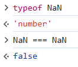
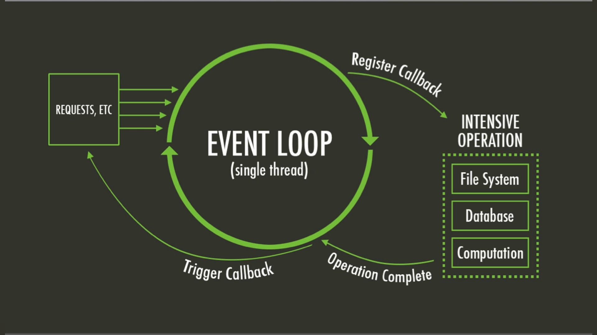
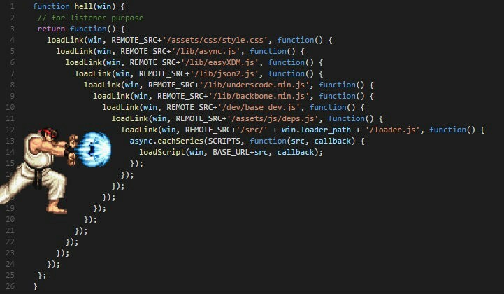

<style scoped>
@media screen {
  /* Hide not current fragments */
  [data-marpit-fragment]:not([data-marpit-fragment]:current) {
    display: none;
  }
}
</style>

## Frontend Development Week 2 agenda

- Conversation around SDD, Tailwind
- JS Fundamentals
- TS Basics


<!-- https://blogfiles.wfmu.org/KF/2015/12/16/TobiasRoth_God_Michaelangelo_apple.gif -->

---

<!-- class: invert -->

# JavaScript Essentials

---

<!-- class: lead -->

# NaN (not a number) / I ❤️ JS



JS was created by Brendan Eich at Netscape as an early browser-based scripting language.

The language was created in ~10 days. Can you tell? (^\_~)

---

<style scoped>
  section {
    font-size: 21px;
  }
</style>

## All is water


After a sip from a mysterious bottle, Alice shrinks — then weeps a pool of tears so deep she has to swim in it. A mouse, a dodo, and a crowd of curious creatures tumble in too. Everything that was separate on land is now mixed in the same water.

**JavaScript is (like) that pool.**

**What could I possibly mean by that?**

<div data-marpit-fragment>

**In JavaScript, data and functions swim in the same medium.** Objects and data can be deconstructed, reconstructed, and recombined in endless combinations.

Functionality and data are mixed. Functions can be passed around like any other piece of data and can maintain data and context through multiple invocations.

**This can be a paradigm shift for developers coming from more object-oriented languages, which rely on more rigid class hierarchies and inheritance.**

</div>

---

<style scoped>
  section {
    font-size: 18px; /* Adjust this value as needed */
  }
</style>

## Overview

- **Functions**: declarations, expressions, and arrow functions, first-class functions and closures
- **`this`, Binding, Closures**
  - determining `this` in a function context
  - determining scope during function invocation
- **Asynchronous Programming**
  - Callbacks, promises, and async/await
  - Event loop and non-blocking operations
  - Error handling in async code
- **JS Syntax Highlights**
  - Array methods (map, filter, reduce, etc.)
  - Object destructuring and spread syntax
- **JS Modules**
  - CommonJS (CJS)
  - ES Modules (ESM)

---

<!-- class: invert -->

# Functions


---

<!-- class: lead -->

## Why Functions Matter

Functions are important for many reasons we are already familiar with. They allow you to:

- **Reuse code** and avoid repetition
- **Organize logic** into manageable pieces

In JS, functions take a more central role and allow us to easily:

- **Pass behavior** as data (first-class functions)
- **Handle event-based systems**, i.e. UIs, via callbacks and event handlers
- **Handle asynchronous code efficiently and understandably**

---

## JS function basics


JS functions can look very familiar. In this simple example we see a function which takes a parameter and returns a value.

```javascript
function greet(name) {
  return `Hello, ${name}! Welcome to wonderland.`;
}

// Usage
console.log(greet("Alice")); // "Hello, Alice! Welcome to wonderland."
```

---

<style scoped>
  section {
    font-size: 20px;
  }
</style>

## JS functions, alternate syntaxes

JS functions can be defined using alternative syntaxes:

#### Function Declaration (Hoisted)

```javascript
function greet(name) {
  return `Hello, ${name}!`;
}
```

#### Function Expression (Not hoisted)

```javascript
const greet = function (name) {
  return `Hello, ${name}!`;
};
```

#### Arrow Function (ES6+)

```javascript
// automatic return
const greet = (name) => `Hello, ${name}!`; // with/without parens
// explicit return
const greet = (name) => {
  return `Hello, ${name}!`;
};
```

**Exercise:** `/01_function_syntax.txt` — run it, then fix the two bugs.

---

<style scoped>
  section {
    font-size: 22px;
  }
  .columns {
    display: grid;
    grid-template-columns: 1fr 1fr;
    gap: 1.5rem;
    align-items: start;
  }
  pre {
    font-size: 16px;
  }
</style>

## Anonymous functions & First-Class Functions

<div class="columns">
<div>

- Unlike programming languages like C#, functions are commonly treated as **first-class objects** in JS
- Functions can be **passed to other functions** and **returned by functions**
- This enables powerful patterns like **higher-order functions**

</div>
<div>

```javascript
const hello = (name) => `Hello, ${name}!`;

function greet(fn) {
  return fn("World");
}

console.log(greet(hello));
// Hello, World!

console.log(greet((n) => `Hi, ${n}!`));
// Hi, World!
```

</div>
</div>

---

<style scoped>
  section {
    font-size: 24px;
  }
</style>

### Exercise: first-class and anonymous functions


<!-- https://en.wikipedia.org/wiki/Alice_in_Wonderland_syndrome -->

1. Use the code `02_potion.js` - **don't run it or view AI output**
1. Determine the expected output
1. Compare output with a partner
1. Analyze if you agree and describe the control flow
1. Run the code and verify output `node potion`
1. Remove as many return statements as possible without changing functionality

---

## Understanding the Output

**What's happening:**

1. `getPotion(true)` returns a function that makes Alice grow (uppercase)
2. `getPotion(false)` returns a function that makes Alice shrink (lowercase)
3. `takePotion` calls the returned function with `"Alice"`
4. This is a **higher-order function** pattern - functions that return functions

---

<!-- class: invert -->

# `this`, binding, closures


---

<style scoped>
  section {
    font-size: 22px;
  }
  pre {
    font-size: 22px;
    text-align: left;
  }
</style>

<!-- class: lead -->

## Guess the output — don't run it

It's the **same `greet` function** every time. What do the three logs print?

```javascript
const alice = {
  name: "Alice",
  greet() {
    console.log(this.name);
  },
};

alice.greet();

const greet = alice.greet;
greet();

const hatter = { name: "Mad Hatter", greet };
hatter.greet();
```

Write down all three, then compare with a partner.

---


<style scoped>
  section {
    font-size: 22px;
  }
</style>

## Understanding the output

`this` is **not** stored on the function. It is decided **when the function is called**.

1. `alice.greet()` → **`Alice`** — called as a method of `alice`, so `this` is `alice`
2. `greet()` → **`undefined`** — extracted and called with no object; `this` is lost
3. `hatter.greet()` → **`Mad Hatter`** — same function, now called as a method of `hatter`

The function never belonged to Alice. Whoever is left of the `.` at the call site becomes `this`.

**Regular functions** use that call-site rule. **Arrow functions** ignore it — they keep `this` from the surrounding (lexical) scope.

---

<style scoped>
  section {
    font-size: 22px;
  }
  .columns {
    display: grid;
    grid-template-columns: 1fr 1fr;
    gap: 1.5rem;
    align-items: start;
  }
  pre {
    font-size: 18px;
  }
</style>

## `this` in C# vs JavaScript

C# binds `this` to the **instance**. JS binds `this` to **how the function is called**.

<div class="columns">
<div>

**C# — the instance is baked in**

```csharp
class Person {
  public string Name { get; set; }
  public void Greet() =>
    Console.WriteLine(this.Name);
}

var alice = new Person { Name = "Alice" };
alice.Greet();           // Alice

Action greet = alice.Greet;
greet();                 // Alice  ✅
```

</div>
<div>

**JS — decided at the call site**

```javascript
const person = {
  name: "Alice",
  greet() {
    console.log(this.name);
  },
};

person.greet();          // Alice

const greet = person.greet;
greet();                 // undefined  ❌
```

</div>
</div>

Extracting a C# method keeps `this`. Extracting a JS method **loses** it.

---

<style scoped>
  section {
    font-size: 22px;
  }
  .columns {
    display: grid;
    grid-template-columns: 1fr 1fr;
    gap: 1.5rem;
    align-items: start;
  }
  pre {
    font-size: 18px;
  }
  footer {
    font-size: 16px;
  }
</style>

<!-- _footer: "**Lexical:** decided by where the code is written, not how it is called." -->

## Arrow functions ignore the call site

Same calls, different `this`. The arrow never becomes Alice or the Hatter.

<div class="columns">
<div>

**Regular — follows the caller**

```javascript
const alice = {
  name: "Alice",
  greet() {
    console.log(this.name);
  },
};

alice.greet();           // Alice

const hatter = {
  name: "Mad Hatter",
  greet: alice.greet,
};
hatter.greet();          // Mad Hatter
```

</div>
<div>

**Arrow — locked where it was written**

```javascript
const alice = {
  name: "Alice",
  greet: () => {
    console.log(this.name);
  },
};

alice.greet();           // undefined

const hatter = {
  name: "Mad Hatter",
  greet: alice.greet,
};
hatter.greet();          // undefined
```

</div>
</div>

An arrow's `this` is **lexical**. Moving it to another object does not rebind it.

---

<style scoped>
  section {
    font-size: 22px;
  }
  .columns {
    display: grid;
    grid-template-columns: 1fr 1fr;
    gap: 1.5rem;
    align-items: start;
  }
  pre {
    font-size: 20px;
  }
</style>

## `.bind()`

**Binding** is attaching a function to a specific `this` — the object it should use as its context when it runs.

`.bind(object)` returns a **new function** with `this` locked to that object. Call it later — no object on the left of `.` needed.

<div class="columns">
<div>

**Regular — `this` stays locked**

```javascript
const alice = { name: "Alice" };

const greet = function () {
  console.log(this.name);
}.bind(alice);

greet(); // Alice
```

</div>
<div>

**Arrow — `.bind()` is ignored**

```javascript
const alice = { name: "Alice" };

const greet = (() => {
  console.log(this.name);
}).bind(alice);

greet(); // undefined
```

</div>
</div>

`.bind()` can fix a regular function's `this`. It cannot override an arrow's lexical `this`.

---

<style scoped>
  section {
    font-size: 26px;
  }
  .columns {
    display: grid;
    grid-template-columns: 2fr 3fr;
    gap: 1.5rem;
    align-items: start;
  }
  pre {
    font-size: 20px;
  }
</style>

## Closures

<div class="columns">
<div>

Functions in JS are able to "see" (keep in scope) their surrounding context, even after the outer function has completed execution.

A **closure is the binding of a function with its enclosing scope**.

</div>
<div>

```javascript
function queenOfHearts(name) {
  const decree =
    name === "Alice"
      ? "Off with her head!"
      : "Off with his head!";

  setTimeout(() => console.log(decree), 1000);
}

queenOfHearts("Alice");     // Off with her head!
queenOfHearts("the Knave"); // Off with his head!
```

</div>
</div>

---

<style scoped>
  section {
    font-size: 24px;
  }
  .columns {
    display: grid;
    grid-template-columns: 2fr 3fr;
    gap: 1.5rem;
    align-items: start;
  }
  pre {
    font-size: 22px;
  }
</style>

## Closures in Node

<div class="columns">
<div>

Each incoming request is handled by a **callback**. That callback still sees `accused` — even though `startCourt` has already finished.

**Closures are how Node keeps setup data (config, a name, a db connection) across later requests.**

</div>
<div>

```javascript
const http = require("http");

function startCourt(accused) {
  http.createServer((req, res) => {
    res.end(`Off with ${accused}'s head!`);
  }).listen(3000);
}

startCourt("Alice");
```

</div>
</div>

---

<style scoped>
  section {
    font-size: 24px;
  }
  .columns {
    display: grid;
    grid-template-columns: 2fr 3fr;
    gap: 1.5rem;
    align-items: start;
  }
  pre {
    font-size: 22px;
  }
</style>

## Closures in React

<div class="columns">
<div>

A click happens later — long after the component function has returned.

The event handler still sees `name` from that render.

**Closures are how React handlers keep the props they were created with.**

</div>
<div>

```jsx
function SentenceButton({ name }) {
  function handleClick() {
    alert(`Off with ${name}'s head!`);
  }

  return (
    <button onClick={handleClick}>
      Sentence {name}
    </button>
  );
}
```

</div>
</div>

---

<style scoped>
  section {
    font-size: 22px;
  }
</style>

### Exercise: debug the Queen's Court — 10 minutes

Open `02_code/04_court/`, run `node server.js`, open [http://localhost:3000](http://localhost:3000). **Don't use AI.**

**Two bugs — both `this`**

1. **Sentence Alice** → `Off with Alice's head! (undefined)` — should be `(Wonderland)`
2. **Hear ye** → `undefined says: Off with their heads!` — should name the Queen

With a partner: where is `this` lost? Fix with `.bind(...)` or by calling the method on the object.

---

<style scoped>
  section {
    font-size: 22px;
  }
</style>

## Why it broke

Same rule on the client and the server: **whoever is left of the `.` at the call site is `this`.** Extract the method, and `this` is gone.

1. **Hear ye** — `addEventListener` calls `announce()` with no object, so `this` is the button.  
   Fix: `queen.announce.bind(queen)` or `() => queen.announce()`

2. **`(undefined)` instead of `(Wonderland)`** — `const handleSentence = court.sentence` extracts the method. The server calls `handleSentence(req, res)` with no object, so `this.place` is lost.  
   Fix: `court.sentence.bind(court)` or `court.sentence(req, res)`

Worked solution: `02_code/_solution_04_court/`

---

<!-- class: invert -->

# Asynchronous Programming


---

<!-- class: lead -->

## Why Async Programming?

JavaScript is **single-threaded** - it can only do one thing at a time. Without async programming:

- **Blocking operations** (network calls, database calls, file I/O) would freeze the entire application
- **User interfaces** would become unresponsive

Async programming and the event loop allow JavaScript to handle multiple things _**concurrently**_.

Unlike many other popular programming languages (C#, Java, PHP), **async functionality is built into JavaScript and is typically an essential part of JS codebases**.

---



---

## 🔄 The Event Loop

The event loop allows a single-threaded JS agent to manage asynchronous events.

Parts of the event loop:

1. **Call Stack** – JavaScript runs functions here in a last-in, first-out (LIFO) order.
2. **Task Queue** – Asynchronous tasks (like setTimeout, I/O, or events) wait here until the stack is empty.
3. **Microtask Queue** – High-priority tasks (like resolved Promises) are processed before the regular task queue.
4. **Event Loop** – Keeps checking if the call stack is empty, then moves tasks from the queues to the stack for execution.

---

## Callbacks

There are three main ways to deal with async code: `callbacks`, `promises` and `async/await`.

Callbacks are the oldest style. They work by passing a function to another function. After the asynchronous action is complete, the callback function is called.

---

<style scoped>
  section {
    font-size: 24px;
  }
</style>

### Exercise: callback order — don't run it

Open `02_code/05_white_rabbit.js`. **Don't run it or use AI.**

Alice makes a **real HTTP request**, then a **second request** that depends on the first.

1. Find every callback (there are more than two)
2. Write down the order of the `console.log` lines
3. Compare with a partner
4. Run `node 05_white_rabbit.js` and check

---

<style scoped>
  section {
    font-size: 24px;
  }
</style>

## Callback output order

```
Alice: I'll ask the catalog for a reader.
Alice: Meanwhile I'll look around the stacks.
Catalog: Leanne Graham
Catalog: first title is sunt aut facere ...
```

**What's happening:**

1. First log runs immediately — `getJson` *starts* the request and returns
2. The "Meanwhile" log runs while the network is still in flight
3. When the user arrives, that callback runs and starts the posts request
4. When the posts arrive, the nested callback runs

The second request lives *inside* the first callback, so it cannot start until the first response is in. That nesting is the start of callback hell.

---

## Callback overuse

<style scoped>
  section {
    font-size: 25px;
  }
</style>



**Problems with excessive callback nesting:**

- Hard to read and maintain
- Error handling is difficult
- Code becomes deeply nested

---

## Promises

The Promise object represents the eventual completion (or failure) of an asynchronous operation and its resulting value.

Promises can be in one of three states:

- `pending`: The promise has not completed.
- `fulfilled`: The promise completed successfully.
- `rejected`: The promise failed.

Promises have three main methods:

- `.then()`: Invoked after successful completion
- `.catch()`: Invoked if an error occurs
- `.finally()`: Invoked on success _or_ error

---

## 🔗 Promise Chaining

Promises can be chained to avoid callback nesting.

The return value of the first `.then()` is passed as the first argument to the subsequent `.then()`.

An error anywhere in the chain stops execution and goes directly to the `catch()`.

```javascript
fetchUser(userId)
  .then((user) => fetchUserPosts(user.id))
  .then((posts) => fetchPostComments(posts[0].id))
  .then((comments) => fetchCommentAuthor(comments[0].authorId))
  .then((author) => console.log("Author:", author.name))
  .catch((error) => console.error("Error:", error));
```

---

<style scoped>
  section {
    font-size: 24px;
  }
</style>

### Exercise: callbacks vs promises — don't run it

Open `02_code/05_white_rabbit.js` and `02_code/06_white_rabbit_promise.js`.

Same two catalog requests. One uses callbacks; one uses promises. With a partner, answer:

1. How did `getJson`'s **signature** change? What does it return now?
2. Where did the **nesting** go? What does `return getJson(...)` in the first `.then()` do?
3. How is **error handling** different? What happens if the first request fails in each version?
4. The promise file has `.finally()`. When does that log run — success, failure, or both?
5. Does using promises make Alice **wait**? Will she still look around the stacks before the catalog replies?
6. Write down the `console.log` **order**, then run `node 06_white_rabbit_promise.js` and check

---

<style scoped>
  section {
    font-size: 21px;
  }
</style>

## Promise.all()

`Promise.all()` waits for many **independent** promises at once. They all **start immediately**. You get one result when every one of them has finished (or one error if any of them fails).

```javascript
Promise.all([
  fetchUser(userId),
  fetchLatestPosts(),
  fetchNotifications(),
])
  .then(([user, posts, notifications]) => {
    console.log(user.name, posts.length, notifications.length);
  })
  .catch((error) => console.error("Error:", error));
```

**Concurrency vs parallelism**

- **Concurrency** — overlapping work on **one** thread. `Promise.all` is concurrent: the event loop waits on several I/O operations at the same time. JS still executes one line at a time.
- **Parallelism** — multiple cores actually running at the same time. The main JS thread does not do this.

For true parallelism, JavaScript supports **Web Workers** (and `worker_threads` in Node): separate threads for CPU-heavy work, so the event loop stays free.

---

## Activity: async/await review

1. Review the async/await implementation of the White Rabbit `07_white_rabbit_async.js`
1. What changed from the Promise implementation?
1. What is an async function _really_?

---

<!-- class: invert -->

# JS Syntax Highlights (quick tour!)

---

<!-- class: lead -->

<style scoped>
  section {
    font-size: 20px;
  }
</style>

## Array Challenge

From the Mad Hatter's tea table, I want a new array with only the names of the sweet pastries. How?

```javascript
const food = [
  {
    name: "jam tart",
    type: "pastry",
    isSweet: true,
  },
  {
    name: "Eat Me cake",
    type: "pastry",
    isSweet: true,
  },
  {
    name: "bread-and-butter",
    type: "pastry",
    isSweet: false,
  },
  {
    name: "turtle soup",
    type: "soup",
    isSweet: false,
  },
];
```

---

<style scoped>
  section {
    font-size: 28px;
  }
</style>

## Solution: `for` loop

```javascript
const sweetPastryNames = [];

for (let i = 0; i < food.length; i++) {
  const item = food[i];

  if (item.type === "pastry" && item.isSweet) {
    sweetPastryNames.push(item.name);
  }
}

console.log(sweetPastryNames); // ["jam tart", "Eat Me cake"]
```

Is this a good solution?

---

## Solution: Array Methods

```javascript
const sweetPastryNames = food
  .filter((item) => item.type === "pastry" && item.isSweet)
  .map((item) => item.name);

console.log(sweetPastryNames); // ["jam tart", "Eat Me cake"]
```

**What we did:**

1. **Filtered** for pastries that are sweet
2. **Mapped** to get just the names
3. **Chained** the methods together

Is this a better option?

---

## Essential Array Methods

| Method     | Purpose                              | Returns              | Chainable |
| ---------- | ------------------------------------ | -------------------- | --------- |
| `map()`    | Transform each element               | New array            | ✅        |
| `filter()` | Select elements that match condition | New array            | ✅        |
| `reduce()` | Combine elements into single value   | Any value            | ❌        |
| `find()`   | Find first matching element          | Element or undefined | ❌        |
| `some()`   | Check if any element matches         | Boolean              | ❌        |
| `every()`  | Check if all elements match          | Boolean              | ❌        |

---

<style scoped>
  section {
    font-size: 26px;
  }
</style>

## Object Destructuring

Object destructuring allows us to pluck properties out of objects and turn them into variables.

This is commonly used when methods are returning multiple values or if we want to make our code more readable.

```javascript
const cake = {
  cakeName: "Eat Me cake",
  type: "pastry",
  isSweet: true,
};

// destructuring the object
const { cakeName, isSweet } = cake;

console.log(`The ${cakeName} is sweet: `, isSweet);
// ~> The Eat Me cake is sweet:  true
```

---

## Destructuring function arguments

React components receive one argument: a `props` object. Destructuring it in the parameter list turns those properties into local variables.

```jsx
// without destructuring
function Greeting(props) {
  return <h1>Hello, {props.name}!</h1>;
}

// with destructuring
function Greeting({ name }) {
  return <h1>Hello, {name}!</h1>;
}

<Greeting name="Alice" />
```

Same idea as the cake — pluck the properties you need, skip the rest.

---

## Array Destructuring

Arrays can also be destructured:

```javascript
const fruits = ["banana", "apple"];
const [banana, apple] = fruits;

console.log(`The first fruit is the ${banana}`);
```

---

## Spread operator

The spread operator (`...`) can be used to flatten objects and arrays and "spread" the properties into new objects or arrays.

```javascript
const baseFruit = { type: "fruit", isHealthy: true };

// spread base fruit properties into apple
const apple = { ...baseFruit, name: "apple" };

console.log(apple.type); // ~> fruit

let fruits = [apple];

// spread base fruit elements into fruits array and add a new fruit
fruits = [...fruits, { ...baseFruit, name: "banana" }];

```

---

## Overriding properties

When spreading properties, it is possible to override as long as the spread comes before the new assignment.

```javascript
const baseFruit = { type: "fruit", isHealthy: true };

// spread base fruit and override type when creating a carrot
const carrot = { ...baseFruit, type: "veg", name: "carrot" };

console.log(carrot.type); // ~> veg
```

---

## Object destructuring on function arguments, defaults

Object destructuring can be used with function parameters.

Defaults can be set on the destructured argument.

```javascript
const printFruit = ({ type = "fruit", isHealthy = true, name } = {}) => {
  console.log(`The ${name} is of type ${type} and is healthy: ${isHealthy}`);
};
printFruit({ name: "mango" });
// ~> The mango is of type fruit and is healthy: true
```

---

## Rest operator

The rest operator (`...`) is the inverse of spread. In destructuring, it gathers **whatever is left** into a new object or array.

```javascript
const cake = {
  cakeName: "Eat Me cake",
  type: "pastry",
  isSweet: true,
};

const { cakeName, ...details } = cake;

console.log(cakeName); // ~> Eat Me cake
console.log(details);  // ~> { type: "pastry", isSweet: true }
```

**Spread** copies properties *into* a new value. **Rest** collects remaining properties *out* of one.

---

<style scoped>
  section {
    font-size: 24px;
  }
  .columns {
    display: grid;
    grid-template-columns: 2fr 3fr;
    gap: 1.5rem;
    align-items: start;
  }
  pre {
    font-size: 16px;
  }
</style>

## Practice: Destructuring & Spread

<div class="columns">
<div>

Don't run it. Trace the syntax, then answer **yes or no**.

**After this runs, is `alice.pockets.drink` still `"shrinking potion"`?**

<div data-marpit-fragment>

**No.** Rest and object spread copy the top level only. `pockets` is the same nested object, so mutating `tallerAlice.pockets` mutates `alice.pockets`. (`companions` _was_ copied — `[...companions]` built a new array.)

</div>

</div>
<div>

```javascript
const alice = {
  name: "Alice",
  size: "small",
  pockets: {
    drink: "shrinking potion",
    cake: "Eat Me",
  },
  companions: ["White Rabbit", "Cheshire Cat"],
};

const { pockets, companions, ...identity } = alice;

const tallerAlice = {
  ...identity,
  size: "tall",
  pockets,
  companions: [...companions, "Mad Hatter"],
};

tallerAlice.pockets.drink = "empty bottle";
```

</div>
</div>

---

## Destructuring reference

[https://developer.mozilla.org/en-US/docs/Web/JavaScript/Reference/Operators/Destructuring](https://developer.mozilla.org/en-US/docs/Web/JavaScript/Reference/Operators/Destructuring)

---

<!-- class: invert -->

# Modules

---

<!-- class: lead -->

## Why Modules?

Modules help you:

- **Organize code** into logical units
- **Reuse code** across files
- **Avoid naming conflicts**
- **Control what's public/private**

---

## Importing and exporting modules

**Modules are a central concept in JavaScript.**

Modules are file-based. Data and functionality can be explicitly exported and made public using the **export statement** from within a module.


There are two main module systems in JS:

- **CommonJS**
- **ECMAScript Modules (ESM)**

---

## CommonJS

CommonJS was the original module management system for Node. Generally this style is deprecated in favor of ESM (which Node fully supports), but it is still commonly seen.

CommonJS uses the `module.exports` property to export from a module and `require()` to import that module from another file.

CommonJS is typically only used outside the browser context (typically on the server).

---

## CommonJS Example

_Avoid this style in favor of ESM (which Node supports)!_

```javascript
// foo.js
const myFunction = () => {
  console.log("foo!");
};

module.exports = myFunction;
```

```javascript
// index.js
const foo = require("./foo");
foo(); // ~> foo!
```

---

## ECMAScript modules (ESM)

ESM is the **official JS module system**.

ESM is designed to work **both in the browser and on the server**.

ESM allows exporting items from a file using the `export` statement and importing them using the `import` statement. Object destructuring is commonly used when importing module items.

ESM supports **named exports** of individual items and **default exports**.

---

<style scoped>
  section {
    font-size: 22px;
  }
  pre {
    font-size: 20px;
  }
</style>

## ESM export example

Use the `export` keyword to export anything from a file.

Use `export default` to define the default export.

```javascript
// fruit.js

// named export
export const fruitType = "fruit";

// named export (function)
export const printFruit = ({ type, name }) => {
  console.log(`Fruit type: ${type}, name: ${name}`);
};

// default export, class
export default class Fruit {
  constructor({ type = fruitType, name } = {}) {
    this.type = type;
    this.name = name;
  }
}
```

---

## ESM import example

Use the `import` keyword to import items from another module.

The `default export` (the `Fruit` class) does not need to be destructured but the non-default exports do.

```javascript
// import named exports
import { fruitType, printFruit } from "./fruit.js";
```

```javascript
// import default export
import Fruit from "./fruit.js";
```

```javascript
// import both
import Fruit, { fruitType, printFruit } from "./fruit.js";
```

---

<style scoped>
  section {
    font-size: 20px;
  }
</style>

## Summary


Functions and data still swim in the same pool.

- **Functions** are first-class: declarations, expressions, and arrows. Pass them, return them, nest them.
- **`this`** is decided at the **call site**, not stored on the function. Arrows keep lexical `this`. `.bind()` locks a regular function.
- **Closures** keep enclosing scope after the outer function returns — Node callbacks, React handlers.
- **Async** is built in: single-threaded + event loop. Callbacks → promises → `async/await`. `Promise.all` for independent work.
- **Syntax**: chain `map`/`filter`/`reduce`; destructure; spread *into* and rest *out of*. Spread copies the top level only.
- **Modules**: prefer **ESM** (`import`/`export`) over CommonJS (`require`/`module.exports`). Named vs default exports.