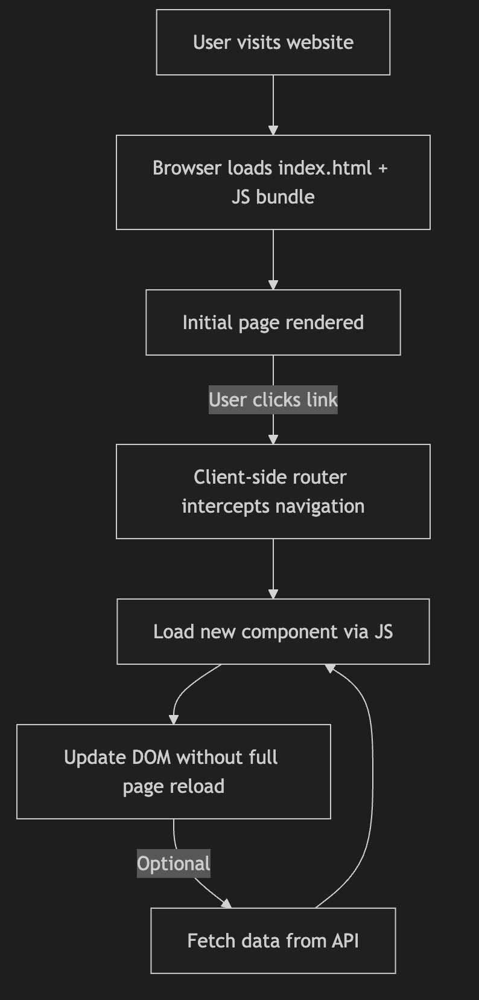
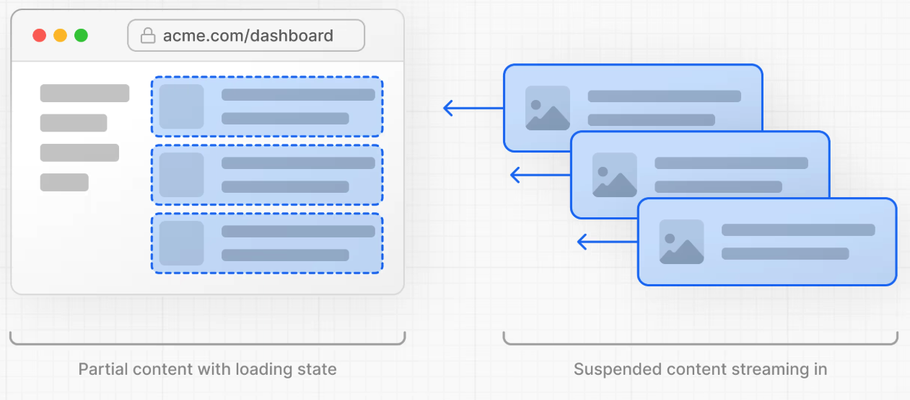
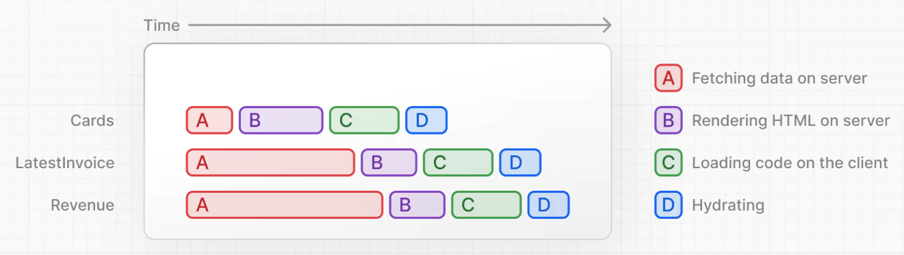

<style scoped>
@media screen {
  /* Hide not current fragments */
  [data-marpit-fragment]:not([data-marpit-fragment]:current) {
    display: none;
  }
}
</style>

<!-- class: invert -->

# Introduction to Next.js

_A modern JavaScript library for building fullstack React applications_

---

<!-- class: lead -->

## What we'll learn in this presentation:


- What Next is and what the benefits of using it over standalone React are.
- Different rendering strategies and tradeoffs in Next.
- How to get started with Next.
- How to deploy a Next application.

---

## Single Page Application (SPA)

<style scoped>
  section {
    font-size: 22px;
  }
</style>


In the very far away, extremely distant, pre-historic JavaScript past (_last year_ 😜), SPAs were the most common way to develop applications in React. SPAs work something like this:

- The client makes a request to sever which returns a giant bundle of JS.
- Once loaded, the giant JS bundle eventually comes to life, starts calling the _completely separate_ server API to get the data.
- Eventually, once the app has all its data, it renders the DOM UI.
- As the user interacts with the DOM, the client app responds to events, calls the API to get the data it needs and refreshes the view.

_Read: [What is a Spa?](https://www.geeksforgeeks.org/javascript/what-is-single-page-application/)_

---

## SPA Flowchart



---

## SPA Downsides

<style scoped>
  section {
    font-size: 26px;
  }
</style>

Do we see any downsides or limitation to SPAs?

<div data-marpit-fragment>

- **Performance**
  - **Bundle size** - Perhaps the client only needs some static content, i.e. a landing or about page. With a SPA we must download the entire bundle of the entire application
  - **Page rendering speed** - the time to first paint (the time between navigation to a page and when the first pixels are displayed) can be quite slow with a SPA. Two network requests must occur, a large bundle delivered, the client side application must start up, load data, etc. The content being delivered could potentially be a static page where most of the SPA overhead is unnecessary.
- **SEO/Accessibility** - Crawlers and accessibility tools potentially have a harder time parsing dynamic DOM content loaded at some time after the HTML for the page has been delivered.
- **Developer Experience** - Developers typically need to either context switch between front and back end code (SPA/API) or even work on completely separate front/back end teams.

</div>

---

## Next.js to the rescue

<style scoped>
  section {
    font-size: 24px;
  }
</style>


- Next is a _fullstack_ framework for building React applications. You write the same React code that runs on both the client and the server.
- Next can improve performance by statically rendering and server rendering pages and using _code splitting_ to only return the functionality and markup to the client that it needs.
- Next can improve SEO and accessibility by returning valid HTML from the server instead of a JS bundle.
- Next improves developer experience by allowing you to seamlessly work across the stack without changing context or codebase.

---

## Next Build and Render Strategies


- Next supports a variety of rendering strategies, going far beyond SPAs including:
  - Fully client rendered
  - Fully server rendered
  - Statically rendered
  - Hybrid options which combine static, server and client rendering

(More on all this later...)

---

## Nextistential Crisis


Using Next requires something of a paradigm shift. Depending on build and rendering strategies you may be working as frontend and a backend developer. You may be working on React code the runs on the server, on the client, or both. This is quite different than how many other web development frameworks work.

---

<!-- class: invert -->

# Routing and Rendering in Next.js

---

<!-- class: lead -->

## Routing

Next.js uses files and directories to define application routes.

Are these client or server side routes?

<div data-marpit-fragment>


(they are both, depending on build, rendering strategy and where the navigation occurs)

</div>

---

## Next.js Rendering Strategies

<style scoped>
  section {
    font-size: 22px;
  }
</style>

Unlike traditional React applications which rely on frontend only rendering, Next.js supports a variety rendering strategies.

It's important to note that these can be (and often are) combined. Portions of a Next application may be statically generated while others may be server or client generated. Further, some of the newer Next features allow us to combined strategies _even more granularly_. With PPR, portions of the same page can be statically rendered while others are generated dynamically.

### Main strategies:

- **CSR (Client-Side Rendering)**: standard React behavior (single page application, SPA).
- **SSR (Server-Side Rendering)**: pages are rendered dynamically, at runtime, on the server (still using React)
- **SSG (Static Site Generation)**: pages are generated at buildtime and served statically
- **ISR (Incremental Static Regeneration)**: pages _may_ be built at buildtime or _generated and cached_ by server when requested. Cache expiries can be defined and static pages can be built dynamically, as needed, instead of all at once.
- **PPR (Partial Pre-rendering)**: the newest technique. Parts of the page are built statically or per request while other parts are are generated dynamically.

---

## Important Term: Hydration

An important term related to hybrid JS application rendering is **hydration**.

_Hydration is the process where an application, initially rendered on the server, and served as plain HTML, becomes reconnected to the client-side JS application and becomes dynamic and interactive._


---

## Routing Systems


There are two routing systems in Next. These are:

- **Pages Router**: the original routing system
- **App Router**: the newer router, supporting cutting-edge React 19 features like Server Components and Partial Pre-Rendering (PPR)

In general, App Router should be used for new applications.

We will discuss both as both are still commonly used.

_Please be aware, when looking at Next docs, there is a different set for each routing type. Also, many existing applications will use Pages Router._

---

## Pages Router

<style scoped>
  section {
    font-size: 22px;
  }
</style>

Pages router was the original way to route pages in Next and uses the `pages` directory to defined file based routes. I.e.: `pages/index.js` for the landing pages, `pages/post/[id].js` for a dynamic route handling requests for a specific blog post.

<!-- Pages router uses `getStaticProps` and `getServerSideProps` to fetch data during static site generation or server side requests. Pages router uses `getStaticPaths` to get data -->

Pages router uses two primary methods to fetch data on the back end:

- `getStaticProps` - used at _buildtime_ to get data needed for building a _statically rendered_ Next application.
- `getServerSideProps` - used at _runtime_ to get data dynamically for a server rendered Next application.

Additionally, `getStaticPaths` is used to get data for generating _paths_ for a static build. I.e. all blog post ids if you are building a statically generated blog.

We will look at these in more detail now. It is important to note that the static methods `getStaticProps` and `getStaticPaths` can not be used in combination with `getServerSideProps`.

**Read:**

- [Project Structure](https://nextjs.org/docs/pages/getting-started/project-structure)
- [Dynamic Routes](https://nextjs.org/docs/pages/building-your-application/routing/dynamic-routes)

---

## Hydration Example with `getServerSideProps`

<style scoped>
  section {
    font-size: 20px;
  }
</style>

In this example, we see a simple application initially rendered on the server with data, become hydrated and interactive on the client.

```jsx
// file location: pages/counter.tsx
import { useState } from "react";

export default function Home({ initialCount }: { initialCount: number }) {
  // This state will be hydrated on the client
  const [count, setCount] = useState(initialCount);

  return (
    <div>
      <h1>Counter: {count}</h1>
      <button onClick={() => setCount(count + 1)}>Increment</button>
    </div>
  );
}

// SSR: fetch initial count
export async function getServerSideProps() {
  return {
    props: {
      initialCount: 10, // server-rendered initial value
    },
  };
}
```

---

## Counter Demo and Exercise

Open `demos/next_counter` in terminal.

Run:

- `npm install`
- `npm run dev`

Look at the counter file: `demos/next_counter/src/pages/counter.tsx`

Open it in the browser: [http://localhost:3000/counter](http://localhost:3000/counter)

View and format the page HTML source.

Are you able to see the counter in the raw HTML?

How does the hydrated client-side app get the counter data initialized on the server?

---

## Truncated Counter Demo raw HTML

```html
<body class="antialiased">
  <div id="__next">
    <!-- Raw HTML of the React code from the server! -->
    <div>
      <h1>
        Counter:
        <!-- -->10
      </h1>
      <button>Increment</button>
    </div>
  </div>
  <!-- Data used for hydration -->
  <script id="__NEXT_DATA__" type="application/json">
    {
      "props": { "pageProps": { "initialCount": 10 }, "__N_SSP": true },
      "page": "/counter",
      "query": {},
      "buildId": "development",
      "isFallback": false,
      "gssp": true,
      "scriptLoader": []
    }
  </script>
</body>
```

---

## Pages Router - `getServerSideProps`

<style scoped>
  section {
    font-size: 24px;
  }
</style>

- Runs at _runtime_ during a page request
- Used to fetch data for a dynamic request
- To use, simply export an `async` function called `getServerSideProps` from the `/pages` route file.

```jsx
// pages/index.js
export default function Home({ time }) {
  return <h1>Current time: {time}</h1>;
}

export async function getServerSideProps() {
  // normally this would be a call to a dynamic changing data source
  //  database, API, key/value store, etc.
  return {
    props: {
      time: new Date().toISOString(),
    },
  };
}
```

---

<style scoped>
  section {
    font-size: 22px;
  }
</style>

## Pages Router - `getStaticProps`

- Runs at _build time_
- Used to fetch data to statically build pages
- To use, simply export an `async` function called `getStaticProps` from the `/pages` route file
- Can _not_ be used with `getServerSideProps`, only used for static build

```jsx
// inside pages/index.jsx
export default function Home({ message }) {
  return <h1>{message}</h1>;
}

export async function getStaticProps() {
  // normally this would contain an async data request, i.e. to a headless CMS
  //  or for a static asset (i.e. a JSON or markdown file)
  return {
    props: {
      message: "Hello from getStaticProps!",
    },
  };
}
```

---

## Pages Router - `getStaticPaths`

<style scoped>
  section {
    font-size: 24px;
  }
</style>

`getStaticPaths` is a function that gets called to determine what paths need to be built for a static page. For instance, for a blog site, this function would likely return an array of ids for each blog post that needs to be generated.

It looks something like this:

```tsx
export async function getStaticPaths() {
  const posts = [{ id: "1" }, { id: "2" }, { id: "3" }];

  const paths = posts.map((post) => ({
    params: { id: post.id },
  }));

  return {
    paths,
    fallback: false,
  };
}
```

---

## Pages Router - `getStaticPaths` and `getStaticProps`, putting it all together

`cd` into `demos/next_static`

Install npm packages, look at the package.json, run it.

Goto: [http://localhost:3000/posts/1](http://localhost:3000/posts/1)

Try routes for post 2 & 3.

Look at the page component, read the code and comments: `demos/next_static/src/pages/posts/[id].tsx`

---

## App Router

App Router is the new, recommended Next routing system.

App Router routing files reside in the `/app` directory, instead of the `/pages` directory.

Instead of `getStaticProps` and `getServerSideProps`, to fetch data at buildtime, App Router uses async functions directly within Sever Components.

App Router also supports nested layouts, streaming and loading states.

---

## Server What Now?

<style scoped>
  section {
    font-size: 24px;
  }
</style>


**App Router relies on Server Components to handle server side build and rendering.**

Server Components are a new type of React components that allow React components to be built on the server, either at buildtime in CI/CD environment or during a live server request.

Server Components are typically used within the context of a framework (typically Next).

The following two slides show a comparison between a client side rendered component (CSR) and with the use of Server Component (SCR) solution in a React application to render Markdown content.

**Read: [Server Components](https://react.dev/reference/rsc/server-components)**

---

## Example Implementation Without Server Component

<style scoped>
  section {
    font-size: 24px;
  }
</style>

```jsx
// bundle.js
import marked from "marked"; // 35.9K (11.2K gzipped)
import sanitizeHtml from "sanitize-html"; // 206K (63.3K gzipped)

function Page({ page }) {
  const [content, setContent] = useState("");
  // NOTE: loads *after* first page render.
  useEffect(() => {
    fetch(`/api/content/${page}`).then((data) => {
      setContent(data.content);
    });
  }, [page]);

  return <div>{sanitizeHtml(marked(content))}</div>;
}
```

```js
// api.js
app.get(`/api/content/:page`, async (req, res) => {
  const page = req.params.page;
  const content = await file.readFile(`${page}.md`);
  res.send({ content });
});
```

---

## Example Implementation with Server Component

```jsx
import marked from "marked"; // Not included in bundle
import sanitizeHtml from "sanitize-html"; // Not included in bundle

async function Page({ page }) {
  // NOTE: loads *during* render, when the app is built.
  const content = await file.readFile(`${page}.md`);

  return <div>{sanitizeHtml(marked(content))}</div>;
}
```

---

## Implementation Comparison

<style scoped>
  section {
    font-size: 24px;
  }
</style>

_What are the tradeoffs to these solutions?_

<div data-marpit-fragment>

- **Faster page load for RSC** - the CSR example requires two request/response cycles, one for the app, the second for the data that app needs. With RSC, both app and data are returned at the same time.
- **Smaller bundle size for RSC** - packages in the RSC component are not bundled with the app, resulting in a smaller bundle size.
- **Better SEO for RSC** - RSC is returning actual HTML which tends to perform much better for SEO purposes than a simple JS bundle.

</div>

_When might you use one solution over the other?_

<div data-marpit-fragment>

In general RSC has advantages over CSR but, if you are building a true web app, like a dashboard, utility or game, where SEO is less important, CSR can be preferable to simplify development (only a single front end context).

</div>

---

## Introducing Client-Side Interactivity into a RSC components

To add client-side interactivity, child components should use the "use client" directive.

```jsx
// Client Component
"use client";

export default function Expandable({ children }) {
  const [expanded, setExpanded] = useState(false);
  return (
    <div>
      <button onClick={() => setExpanded(!expanded)}>Toggle</button>
      {expanded && children}
    </div>
  );
}
```

---

## App Router - Data Fetching

Instead of fetching data via a separate method (`getStaticProps` or `getServerSideProps`), App Router uses an async function directly in an async Server Component.

```jsx
export default async function Dashboard() {
  const res = await fetch("https://api.example.com/live-data", {
    cache: "no-store", // always fetch fresh data
  });
  const data = await res.json();

  return <pre>{JSON.stringify(data, null, 2)}</pre>;
}
```

---

## App Router - `generateStaticParams`

<style scoped>
  section {
    font-size: 24px;
  }
</style>

`generateStaticParams` is used instead of `getStaticPaths` to get data for static builds using App Router.

Now, we can use `fetch` directly in the page Sever Component (instead of exporting a separate function). Much cleaner!

```jsx
// app/posts/[id]/page.tsx
export async function generateStaticParams() {
  const res = await fetch("https://api.example.com/posts");
  const posts = await res.json();

  return posts.map((post: any) => ({
    id: post.id.toString(),
  }));
}

export default async function Post({ params }: { params: { id: string } }) {
  const res = await fetch(`https://api.example.com/posts/${params.id}`);
  const post = await res.json();

  return <h1>{post.title}</h1>;
}
```

---

## App Router - Demo

Run the Next app in `demos/next_app_router`.

Review the code in: `demos/next_app_router/src/app/posts/page.tsx`

---

## Next Fetch

For Server Components, Next has extended the browser `fetch` function and added some additional functionality to support features like managed caching.

**Read: [fetch](https://nextjs.org/docs/app/api-reference/functions/fetch)**

---

## Incremental Static Regeneration (ISR)

Next supports incremental static regeneration to allow fine-grained control over page caching.

With ISR, you can specify a simple expiry how long a static built page should be served or custom custom validation logic. You can also invalidate caches.

This has significant advantages over needing to rebuild _the entire_ site whenever code or content changes.

For App Router Next apps, simply exporting a `revalidate` variable will define a page expiry.

Read: [How to implement Incremental Static Regeneration (ISR)](https://nextjs.org/docs/app/guides/incremental-static-regeneration)

---

## Incremental Static Regeneration (ISR) Example

<style scoped>
  section {
    font-size: 18px;
  }
</style>

Note: `export const revalidate = 60`

```jsx
interface Post {
  id: string
  title: string
  content: string
}

// Next.js will invalidate the cache when a
// request comes in, at most once every 60 seconds.
export const revalidate = 60

export async function generateStaticParams() {
  const posts: Post[] = await fetch('https://api.vercel.app/blog').then((res) =>
    res.json()
  )
  return posts.map((post) => ({
    id: String(post.id),
  }))
}

export default async function Page({
  params,
}: {
  params: Promise<{ id: string }>
}) {
  const { id } = await params
  const post: Post = await fetch(`https://api.vercel.app/blog/${id}`).then(
    (res) => res.json()
  )
  return (
    <main>
      <h1>{post.title}</h1>
      <p>{post.content}</p>
    </main>
  )
}
```

---

## PPR (Partial Pre-Rendering)


Partial Pre-Rendering (PPR) is the final boss, bleeding edge of Next's rendering strategies. PPR allows portions of a page to be pre-rendered while others are dynamically generated.

This allows granular control of what is cached and/or pre-rendered within a Next page.

Prior to PPR caching and pre-building was typically an all or nothing choice (either the entire or pages was cached or none of it was).

---

## Streaming Server-Side Rendering

Streaming Server-Side Rendering is closely related to Partial Pre-Rendering. Both techniques allow the browser to begin displaying content while the server is still generate sections of the page.

Streaming SSR is a rendering technique where a server sends HTML components to the client as they become ready, improving performance by allowing users to see content sooner than with traditional SSR. Partial Prerendering (PPR) is an even more advanced pattern, used in Next.js, that combines the benefits of static generation (SSG) for static content with streaming for dynamic parts, delivering a single stream of HTML that includes both pre-rendered static sections and dynamically streamed components, resulting in a faster initial load and a smoother user experience.

**Read: [Streaming Server-Side Rendering](https://www.patterns.dev/react/streaming-ssr/)**

---

## `<Suspense>`

<style scoped>
  section {
    font-size: 24px;
  }
</style>

[`<Suspense>`](https://react.dev/reference/react/Suspense) is a React feature that allows you to display a fallback Component if an asynchronous component is in a `pending`.

Suspense can be used for [lazy loading components](https://react.dev/reference/react/lazy). In these cases, if, for instance conditional logic hides then shows a component, `Suspense` will be displayed while the lazy loaded component renders. Lazy components can also be code-split and the component itself may be fetched and rendered as needed.

In the case of Server Components, `Suspense` can be used to allow **streaming components** (in the case of PPR). In this case, the page can initially load and paint while the server is still asynchronously streaming slower loading components wrapped in `<Suspense>`.

`Suspense` is a very powerful feature for hybrid React apps that improves performance, SEO and interactivity for web sites and applications. It prevents slow requests that only affect a section of the page from blocking the rendering of the rest of the page.

**Read: [Suspense/](https://react.dev/reference/react/Suspense)**

---

## `Suspense` Visualized 1/2



---

## `Suspense` Visualized 2/2



---

**Watch:**

<iframe width="560" height="315" src="https://www.youtube.com/embed/MTcPrTIBkpA?si=FOzOYctxabK7oORB" title="YouTube video player" frameborder="0" allow="accelerometer; autoplay; clipboard-write; encrypted-media; gyroscope; picture-in-picture; web-share" referrerpolicy="strict-origin-when-cross-origin" allowfullscreen></iframe>

---

<!-- class: invert -->

## Next Components

---

<!-- class: lead -->

Next has a [few components](https://nextjs.org/docs/app/api-reference/components) that provide various optimization over their raw HTML alternatives.

We will focus on three of the most important components:

- [Image](https://nextjs.org/docs/app/api-reference/components/image)
- [Link](https://nextjs.org/docs/app/api-reference/components/link)
- [Script](https://nextjs.org/docs/app/api-reference/components/script)

_Generally, these should always be used over their HTML equivalents._

---

## Next/Image

The Next Image component provides optimizations, resizing images, delivering scalable alternatives and building these to the CDN for efficient delivery to the client.

Import:

```jsx
import Image from "next/image";
```

Use:

```jsx
<Image src="/hero.png" alt="Hero banner" width={1200} height={600} priority />
```

---

## Next/Link

The Next Link component provides optimized client-side routing in Next applications. Without using the Link component, navigation can result in very inefficient full-page refreshes while navigating through an application.

Import:

```jsx
import Link from "next/link";
```

Use:

```jsx
<Link href="/dashboard">Dashboard</Link>
```

---

## Next/Script

<style scoped>
  section {
    font-size: 18px;
  }
</style>

The Next Script component allows you to include third party scripts within your application and specify when those scripts are loaded.

Example GA (Google Analytics) script inclusion:

```jsx
import Script from "next/script";

export default function Home() {
  return (
    <div>
      <h1>My Page</h1>

      {/* Loads Google Analytics after the page is interactive */}
      <Script
        src="https://www.googletagmanager.com/gtag/js?id=GA_MEASUREMENT_ID"
        strategy="afterInteractive"
      />

      <Script id="google-analytics" strategy="afterInteractive">
        {`
          window.dataLayer = window.dataLayer || [];
          function gtag(){dataLayer.push(arguments);}
          gtag('js', new Date());
          gtag('config', 'GA_MEASUREMENT_ID');
        `}
      </Script>
    </div>
  );
}
```

---

<!-- class: invert -->

## Next API

---

<!-- class: lead -->

## Next API

<style scoped>
  section {
    font-size: 24px;
  }
</style>

You can add API routes directly to your Next application.

This allows Next to work as a true full stack framework. Not only can we render our React components on the server, we can also enable true REST API routes to support dynamic data in our application.

API development can be handy not only to provide data for your Next web application but to served data to other client's (i.e. a React Native mobile application 😉).

However, if only your app need the data, you may not need an API (you can simply use server components).

---

## Next API - Usage

API development in Next works slightly differently between Pages Router and App Router. We will only discuss the most updated routing option, _App Router_.

To add a route, simply add a new route file under the `/app/api` directory. This file should be called `route.ts` (for TS projects). I.e. `/app/api/users/route.ts` to get all users.

Dynamic routes can also be handled by placing the dynamic route portions inside square brackets: `/app/api/user/[id]/route.ts`.

To create a Next API route with the _App Router_, simply add a new route file under the

---

## Next API - Example Get Users 1/2

<style scoped>
  section {
    font-size: 22px;
  }
</style>

Here we have a get all users route (`/app/api/users/route.ts`).

## Next API - Example Get Users 2/2

<style scoped>
  section {
    font-size: 22px;
  }
</style>

```jsx
export async function GET(request: Request) {
  // For example, fetch data from your DB here
  const users = [
    { id: 1, name: "Alice" },
    { id: 2, name: "Bob" },
  ];
  return new Response(JSON.stringify(users), {
    status: 200,
    headers: { "Content-Type": "application/json" },
  });
}
```

---

## Going further

We have really just scratched the surface of API development in Next. If you would like to learn more, how to handle query parameters, adding auth middleware and more, here are some additional resources:

- [Route Handlers and Middleware](https://nextjs.org/docs/app/getting-started/route-handlers-and-middleware)
- [Building APIs with Next.js](https://nextjs.org/blog/building-apis-with-nextjs)

---

<!-- class: invert -->

## Getting Started

---

<!-- class: lead -->

<style scoped>
  section {
    font-size: 24px;
  }
</style>

To get started with Next, run the following:

```bash
npx create-next-app@latest
```

Select your configuration options. Make sure to enable TS, use App Router. Otherwise, the defaults are fine.

```bash
What is your project named? my-app
Would you like to use TypeScript? No / Yes
Would you like to use ESLint? No / Yes
Would you like to use Tailwind CSS? No / Yes
Would you like your code inside a `src/` directory? No / Yes
Would you like to use App Router? (recommended) No / Yes
Would you like to use Turbopack? (recommended) No / Yes
Would you like to customize the import alias (`@/*` by default)? No / Yes
What import alias would you like configured? @/*
```

## After installation, `cd` to the new directory, and run `npm run dev`.

---

<!-- class: invert -->

<!-- ## Deployment - TK -->

<!-- --- -->

<!-- class: lead -->

---

## Summary - TK
