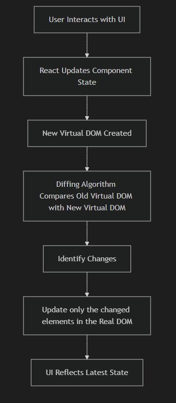
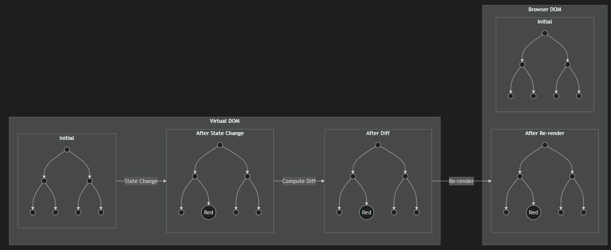

<!-- class: invert -->

# Introduction to React

_A modern JavaScript library for building user interfaces_


---

<!-- class: lead -->

## Why Use React? 1/2

### 🚀 **Performance**

- Virtual DOM for efficient updates
- Optimized rendering algorithms
- Minimal DOM manipulation

### 🧩 **Component Reusability**

- Build once, use everywhere
- Composable architecture
- Easy to maintain and test

---

## Why Use React? 2/2

### 🌐 **Ecosystem**

- Massive community support
- Rich library ecosystem
- Excellent developer tools

### 📱 **Cross-Platform**

- Web applications
- Mobile apps (React Native)
- Desktop apps (Electron)

---

## Who uses React? (everyone)

| **Social Media** | **Entertainment** | **E-commerce** | **Productivity** |
| ---------------- | ----------------- | -------------- | ---------------- |
| Facebook         | Netflix           | Shopify        | Notion           |
| Instagram        | Discord           | Airbnb         | Figma            |
| Twitter 🤫       | Twitch            | Uber           | Slack            |
| LinkedIn         | Spotify           | Amazon         | Trello           |

---

## Welcome to React!

### What questions will we answer today?

- **Definition & History** - What is React? When and why was it developed?
- **Motivation** - Why should we learn and use React?
- **Architecture** - What architecture does React use and why?
- **JSX** - What is JSX and how do we write JSX code?
- **Components** - What is a component and how do we use it?
  - **Props & State** - How is data managed within a component?
  - **Hooks** - How do we add dynamical functionality to our components?
  - **Event Handling** - How are user interactions and other events handled?

---

## 🎯 **Learning Objectives**

By the end of this session, you will be able to:

- Understand React's component-based architecture
- Write JSX to describe UI elements
- Create reusable React components
- Manage component data with state and props
- Use React hooks to add dynamic functionality to your components
- Handle user events in components

---

<!-- class: invert -->

## React History

---

<!-- class: lead -->

<style scoped>
  section {
    font-size: 24px;
  }
</style>

## React's Evolution

| Year     | Milestone           | Key Features                     |
| -------- | ------------------- | -------------------------------- |
| **2011** | Created at Facebook | Internal use for Facebook Ads    |
| **2013** | Open-sourced        | Released to public               |
| **2015** | React Native        | Mobile development               |
| **2016** | React Fiber         | New reconciliation algorithm     |
| **2018** | React Hooks         | Functional components with state |
| **2020** | React 18            | Concurrent features, Suspense    |

### Key Contributors:

- **Jordan Walke** - Original creator
- **Facebook/Meta** - Primary maintainer
- **Open Source Community** - Ecosystem growth

Read: [The History of React.js on a Timeline](https://blog.risingstack.com/the-history-of-react-js-on-a-timeline/)

---

## Pre-React Facebook

Before React, Facebook developed its user interfaces using an MVC and lower level JS that directly manipulated the DOM.

What potential issues do you see with using JS to directly manipulate the DOM?

---

<style scoped>
  section {
    font-size: 24px;
  }
</style>

## Problems with low-level JS DOM manipulation 1/2

Do you see any issues with this code?

_Hint: how many times does the DOM get updated?_

```html
<ul id="item-list"></ul>

<script>
  const items = [];

  // Simulate adding 1000 items one by one
  for (let i = 1; i <= 1000; i++) {
    items.push(`Item ${i}`);
  }

  const ul = document.getElementById("item-list");

  for (let i = 0; i < items.length; i++) {
    const li = document.createElement("li");
    li.textContent = items[i];
    ul.appendChild(li);
  }
</script>
```

---

<style scoped>
  section {
    font-size: 20px;
  }
</style>

## Problems with low-level JS DOM manipulation 2/2

Any problems with this code?

_Hint: Global data stored in the presentation layer anyone?_

```html
<button id="btn1">Click me</button>
<button id="btn2">Click me</button>

<script>
  document.getElementById("btn1").setAttribute("data-count", 0);
  document.getElementById("btn2").setAttribute("data-count", 0);

  function handleClick(event) {
    const btn = event.target;
    let count = parseInt(btn.getAttribute("data-count"));
    count++;
    btn.setAttribute("data-count", count);
    btn.textContent = `Clicked ${count} times`;
  }

  // Adding event listeners
  document.getElementById("btn1").addEventListener("click", handleClick);
  document.getElementById("btn2").addEventListener("click", handleClick);
</script>
```

---

## Issues with direct DOM manipulation in JS

Traditional direct DOM manipulation posed several problems for Facebook including:

- **Inefficiency** - directly manipulating the DOM can cause inefficient re-rendering in the browser which results in a poor user experience.
- **Messy Code** - without a well defined architecture, control flow and data storage can become disorganized.
- **Difficult to manage complexity** - without a well defined architecture, data and logic become mixed, concerns are not clearly separated and code produces unintended side affects. Over time this complexity becomes unmanageable.

---

## React Motivation

Although React wasn't the first frontend JS framework, programming complex user interactions using direct DOM manipulation via JQuery was a common approach before React.

React introduced a few key architectural decision that improved code organization and efficiency significantly. These include:

- **declarative programming** - Define what should happen not how.
- **component based architecture** - Encapsulate data, logic and presentation in a single reusable element.
- **use of a virtual DOM** - Maintain an in memory representation of the DOM to avoid

To understand these concepts, lets start with our first React example (a counter).

---

<!-- this works in the generated HTML slide -->

<div id="simple-react-demo"></div>

<script type="text/babel">
  const { useState } = React;

  function SimpleCounter() {
    const [count, setCount] = useState(0);

    return (
      <div style={{ 
        textAlign: 'center', 
        padding: '20px', 
        border: '2px solid #4CAF50', 
        borderRadius: '8px',
        backgroundColor: '#f0f8f0'
      }}>
        <h3>Simple React Counter</h3>
        <p>Count: <strong>{count}</strong></p>
        <button 
          onClick={() => setCount(count + 1)}
          style={{
            padding: '10px 20px',
            margin: '5px',
            backgroundColor: '#4CAF50',
            color: 'white',
            border: 'none',
            borderRadius: '4px',
            cursor: 'pointer'
          }}
        >
          Increment
        </button>
        <button 
          onClick={() => setCount(count - 1)}
          style={{
            padding: '10px 20px',
            margin: '5px',
            backgroundColor: '#f44336',
            color: 'white',
            border: 'none',
            borderRadius: '4px',
            cursor: 'pointer'
          }}
        >
          Decrement
        </button>
      </div>
    );
  }

  ReactDOM.createRoot(document.getElementById('simple-react-demo')).render(<SimpleCounter />);
</script>

<script src="https://unpkg.com/react@18/umd/react.development.js" crossorigin></script>
<script src="https://unpkg.com/react-dom@18/umd/react-dom.development.js" crossorigin></script>
<script src="https://unpkg.com/@babel/standalone/babel.min.js"></script>

---

## Counter Component

<style scoped>
  section {
    font-size: 26px;
  }
</style>

```jsx
import React, { useState } from "react";

export default function Counter() {
  const [count, setCount] = useState(0);

  return (
    <div>
      <h2>Counter</h2>
      <p>Count: {count}</p>
      <button onClick={() => setCount(count + 1)}>Increase</button>
      <button onClick={() => setCount(count - 1)}>Decrease</button>
    </div>
  );
}
```

What is happening in this component?
How is the component declarative?
Does the component contain, data, logic and presentation code?

---

## Counter Component Analysis 1/2

### What is happening in this component?

1. **State Management**: `useState(0)` creates a state variable `count` starting at 0
2. **Event Handling**: Button clicks trigger `setCount()` to update the state
3. **Re-rendering**: When state changes, React automatically re-renders the component
4. **UI Updates**: The new count value is displayed in the paragraph

---

<style scoped>
  section {
    font-size: 23px;
  }
</style>

## Counter Component Analysis 2/2

### How is the component declarative?

- **We describe WHAT we want**: "Show the count value" and "Update count when button is clicked"
- **We don't specify HOW**: No manual DOM manipulation, no `document.getElementById()`, no `innerHTML`
- **React handles the details**: React figures out what DOM changes are needed and applies them efficiently

### Does the component contain data, logic, and presentation code?

**Yes! All three are encapsulated in one component:**

- **Data**: `count` state variable
- **Logic**: `setCount(count + 1)` and `setCount(count - 1)` functions
- **Presentation**: JSX that renders the UI elements

This is the **component-based architecture** - each component is self-contained with its own data, logic, and presentation.

---

## Virtual DOM

React use a virtual DOM instead of directly manipulating the DOM. The virtual DOM is diffed against the actual DOM after a rendering cycle is complete and only the changed areas in the actual DOM are updated.

This results in more efficient UI updates.

The following slides shows a simplified version of this process visually.



---



---

## React Architectural Motivation - Summary

### 🎯 **Problems React Solves**

| **Traditional DOM Manipulation**    | **React's Solution**                  |
| ----------------------------------- | ------------------------------------- |
| **1000 DOM updates** for 1000 items | **Single re-render** with Virtual DOM |
| **Data mixed with presentation**    | **Component-based** architecture      |
| **Manual DOM manipulation**         | **Declarative** programming model     |
| **Complex state management**        | **Built-in state** with hooks         |
| **Performance bottlenecks**         | **Efficient diffing** and updates     |

---

<style scoped>
  section {
    font-size: 26px;
  }
</style>

### 🏗️ **Key Architectural Decisions**

1. **Virtual DOM** - In-memory representation for efficient updates
2. **Component-Based** - Encapsulated, reusable UI pieces
3. **Declarative** - Describe what you want, not how to do it
4. **Unidirectional Data Flow** - Predictable state management (more on this later)
5. **JSX** - Familiar HTML-like syntax with JavaScript power (more on this later)

### 💡 **Why This Matters**

- **Performance**: Only update what changed
- **Maintainability**: Clear separation of concerns
- **Developer Experience**: Intuitive, familiar patterns
- **Scalability**: Components can be composed and reused
- **Reliability**: Predictable rendering and state updates

---

<!-- class: invert -->

## React Fundamentals - JSX

---

<!-- class: lead -->

## JSX

JSX is a **syntax extension** for JavaScript that looks **like HTML but compiles down to JavaScript**.

It allows us to add **code and logic directly inside our markup**.

It's used with React to describe the UI in a **more readable and declarative way**.

---

## JSX Syntax

JSX looks like HTML but compiles to JS.

Example JSX:

```jsx
const element = <h1>Hello, world!</h1>;
```

Compiles to:

```js
const element = React.createElement("h1", null, "Hello, world!");
```

---

## JSX Embedding Expressions

You can embed any JavaScript expression in JSX by wrapping it in curly braces `{}`.

```jsx
const name = "John Doe";
const element = <h1>Hello, {name}!</h1>;

// You can also use expressions
const user = { firstName: "John", lastName: "Doe" };
const greeting = (
  <h1>
    Hello, {user.firstName} {user.lastName}!
  </h1>
);

// Function calls work too
function formatName(user) {
  return user.firstName + " " + user.lastName;
}
const formattedGreeting = <h1>Hello, {formatName(user)}!</h1>;
```

---

<style scoped>
  section {
    font-size: 24px;
  }
</style>

## JSX as an expression

JSX can be stored in variables, passed to functions, passed to other components and returned from functions.

```jsx
// Stored in a variable
const element = <h1>Hello, world!</h1>;

// returned by a function
function getGreeting(user) {
  if (user) {
    return <h1>Hello, {formatName(user)}!</h1>;
  }
  return <h1>Hello, Stranger.</h1>;
}

// Use in loops
function NumberList(props) {
  const numbers = props.numbers;
  const listItems = numbers.map((number) => (
    <li key={number.toString()}>{number}</li>
  ));
  return <ul>{listItems}</ul>;
}
```

---

<style scoped>
  section {
    font-size: 23px;
  }
</style>

## Conditional Rendering in JSX

JSX supports conditional rendering using JavaScript expressions. _if/else_ statements are not possible directly in JSX. Ternary and logical operators are the most common ways to handle conditional logic in JSX.

```jsx
// Using ternary operator
function Greeting({ isLoggedIn }) {
  return (
    <div>{isLoggedIn ? <h1>Welcome back!</h1> : <h1>Please sign up.</h1>}</div>
  );
}

// Using logical AND operator
function Mailbox({ unreadMessages }) {
  return (
    <div>
      <h1>Hello!</h1>
      {unreadMessages.length > 0 && (
        <h2>You have {unreadMessages.length} unread messages.</h2>
      )}
    </div>
  );
}
```

---

<style scoped>
  section {
    font-size: 24px;
  }
</style>

## Rendering lists in JSX

You can render lists in JSX using JavaScript's `map()` function.
After changes, when diffing virtual DOM, React requires a unique key on each element.

It is a good idea to use the array index as the key?

```jsx
// Basic list rendering
const numbers = [1, 2, 3, 4, 5];
const listItems = numbers.map((number) => (
  <li key={number.toString()}>{number}</li>
));

// In a component
function NumberList({ numbers }) {
  return (
    <ul>
      {numbers.map((number) => (
        <li key={number.toString()}>{number}</li>
      ))}
    </ul>
  );
}
```

---

<style scoped>
  section {
    font-size: 27px;
  }
</style>

## Array method chaining when rendering lists

Chainable JS array methods like `filter()` are useful for making nice concise JSX expressions.

You should _not_ use array indexes as keys since an array may change even if it's length does not.

```jsx
// With filtering
function TodoList({ todos }) {
  return (
    <ul>
      {todos
        .filter((todo) => !todo.completed)
        .map((todo) => (
          <li key={todo.id}>{todo.text}</li>
        ))}
    </ul>
  );
}
```

---

<style scoped>
  section {
    font-size: 26px;
  }
</style>

## Event Handling in JSX

JSX uses camelCase for most things including event names. You can pass named on anonymous function to event handlers.

```jsx
// Event handling with a named function
function Button() {
  function handleClick() {
    alert("Button clicked!");
  }

  return <button onClick={handleClick}>Click me</button>;
}

// Event handling with an anonymous function and a parameter
function Button({ id, text }) {
  function handleClick(id) {
    console.log(`Button ${id} clicked`);
  }

  return <button onClick={() => handleClick(id)}>{text}</button>;
}
```

---

## Handling data, change and submit events in a form

```jsx
// Form handling
function NameForm() {
  const [value, setValue] = useState("");

  function handleSubmit(event) {
    event.preventDefault();
    alert("A name was submitted: " + value);
  }

  return (
    <form onSubmit={handleSubmit}>
      <input
        type="text"
        value={value}
        onChange={(e) => setValue(e.target.value)}
      />
      <button type="submit">Submit</button>
    </form>
  );
}
```

---

## Common JSX Rules

There are subtile differences between writing

- **Single Parent Element**: JSX must have exactly one parent element
- **Use `className` instead of `class`**: HTML attributes use camelCase
- **Self-closing tags are required**: `<input />` not `<input>`
- **Use `htmlFor` instead of `for`**: For label elements
- **Use `onClick` instead of `onclick`**: Event handlers use camelCase

---

<style scoped>
  section {
    font-size: 22px;
  }
</style>

## JSX vs HTML Differences

| HTML                      | JSX                      |
| ------------------------- | ------------------------ |
| `class="container"`       | `className="container"`  |
| `<input>`                 | `<input />`              |
| `for="name"`              | `htmlFor="name"`         |
| `onclick="handleClick()"` | `onClick={handleClick}`  |
| `style="color: red"`      | `style={{color: 'red'}}` |

```jsx
// HTML style
<div class="container" onclick="handleClick()">
  <label for="name">Name:</label>
  <input type="text" id="name">
</div>

// JSX style
<div className="container" onClick={handleClick}>
  <label htmlFor="name">Name:</label>
  <input type="text" id="name" />
</div>
```

---

<style scoped>
  section {
    font-size: 26px;
  }
</style>

## Single JSX root, including fragment

```jsx
// ❌ Wrong - multiple parent elements
function WrongComponent() {
  return (
    <h1>Title</h1>
    <p>Paragraph</p>
  );
}

// ✅ Correct - single parent element
function CorrectComponent() {
  return (
    <div>
      <h1>Title</h1>
      <p>Paragraph</p>
    </div>
  );
}

// ✅ Better - using React Fragment
function BetterComponent() {
  return (
    <>
      <h1>Title</h1>
      <p>Paragraph</p>
    </>
  );
}
```

---

<!-- class: lead -->

## Getting Started

```bash
# Create a new React project
npx create-react-app my-app
cd my-app
npm start
```

---

<!-- class: invert -->

## React Components

---

<!-- class: lead -->

## Components

Components are the building blocks of React applications. They let you split the UI into independent, reusable pieces.

Components can be exported, imported, saved to variables, nested inside other components and _even passed to other components as data (props)_.

---

## What are Components?

Components are **functions or classes** that return JSX. They can be:

- **Reusable** - Use the same component multiple times
- **Composable** - Combine components to build complex UIs
- **Isolated** - Each component manages its own logic and styling

---

## Class Based Components

There are two main types of components in React, functional and class based. In class based components, the `render()` method is called when the component renders and must always return JSX.

_Class based was the original way to create components in React but this style is deprecated._

```jsx
import { Component } from "react";

class Greeting extends Component {
  render() {
    return <h1>Hello, {this.props.name}!</h1>;
  }
}
```

---

<style scoped>
  section {
    font-size: 22px;
  }
</style>

## Function Components

Function components are the preferred way to write components in React. Instead of a `render()` method, the function itself is called during rendering and the return JSX is rendered.

```jsx
// Function Component
function Welcome() {
  return <h1>Hello, World!</h1>;
}

// Arrow Function Component
const Welcome = () => {
  return <h1>Hello, World!</h1>;
};

// Using the component
function App() {
  return (
    <div>
      <Welcome />
      <Welcome />
      <Welcome />
    </div>
  );
}
```

---

## Component hierarchies

Components in a React application create a complex component tree. There is a parent/child relationship where the parent component renders child components inside it. The parent component can render additional JSX content inside the child.

---

## Component hierarchies example

```jsx
// card is the child (normally in a separate file)
// `children` is an automatic property that contains any JSX inside its
//  open/close tags
function Card({ heading, children }) {
  return (
    <div>
      <h3>{heading}</h3>
      <p>{children}</p>
    </div>
  );
}

// wrapper is the parent
function Wrapper() {
  return (
    <div>
      <h2>Wrapper Component</h2>
      <Card heading="First Card">
        {/* this content becomes `children` in `Card` */}
        {/* here the contents are a simple string but any valid JSX is acceptable */}
        This is the content of the first card, passed as children.
      </Card>
      <Card heading="Second Card">
        This is the content of the second card, also passed as children.
      </Card>
    </div>
  );
}

export default Wrapper;
```

---

<style scoped>
  section {
    font-size: 25px;
  }
</style>

## Styling Components

There are a couple options for styling React components.

How are styles being handled in this example? Styles as data, what are the implications of that?

Here we see inline styles 😱! Is this a problem? Why or why not? (It's complicated.)

```jsx
function StyledComponent() {
  return (
    <div
      style={{
        backgroundColor: "blue",
        color: "white",
        padding: "20px",
        borderRadius: "8px",
        fontSize: "18px",
      }}
    >
      Styled with inline styles
    </div>
  );
}
```

---

## Styling components analysis

Styles in React are handled differently than we may be used to in traditional web development. Since everything is component based, we have less concern about duplicating styles (we simply reuse the component and the styles are bundled with it).

That said, there are various style frameworks and approaches that are used. We will explore some of those layers.

Treating styles as data simplifies dynamic styles. Based on the app's current state, we can easily update the styles to reflect that state.

---

<style scoped>
  section {
    font-size: 23px;
  }
</style>

## Classes in React

To add classes in our components, we must use `className`.

```jsx
// Component
function StyledComponent() {
  return (
    <div className="card">
      <h2 className="card-title">Card Title</h2>
      <p className="card-content">Card content here</p>
    </div>
  );
}
```

We can use braces for our `className` attributed values to add expressions and make our styles more dynamic.

```jsx
function Button({ primary }) {
  return (
    <button className={`btn ${primary ? "btn-primary" : "btn-secondary"}`}>
      Click Me
    </button>
  );
}
```

---

<style scoped>
  section {
    font-size: 24px;
  }
</style>

## Event Handling

As we know, functions in JavaScript are first-class citizens. That means, we can pass them around like any other piece of data.

This is how we handle events in React, by passing functions as data (callbacks) which get evoked when an event occurs.

Take this example:

```jsx
function Button() {
  const handleClick = () => {
    alert("Button clicked!");
  };

  return <button onClick={handleClick}>Click me</button>;
}
```

The `button` is accepting our `handleClick` callback. This looks like how we pass data as props. That's because _it is_. _Functions are data_ and event handlers are really just props where the value is a function.

---

### Event with parameters and closures

```jsx
function Button({ id, text }) {
  const handleClick = (id, event) => {
    console.log(`Button ${id} clicked`);
    console.log("Event:", event);
  };

  return <button onClick={(e) => handleClick(id, e)}>{text}</button>;
}
```

In this example we are passing an anonymous function into an event handler. **This function is a closure**. A closure maintains its scope when it is invoked. Because of this this, when the anonymous function is invoked, it still has access to all data and functions in scope (`handleClick`, `id`, `text`).

This closure pattern is heavily used in React development.

---

## The event object and propagation

For native (not custom) events, an event object is emitted. If you are handling an event on a native element (button, form, link, etc.), the event object will be the first argument passed to the the callback.

Events "bubble up". Event if you handle an event there are may be other affects that the event triggers. `preventDefault()` and `stopPropagation()` can be called to prevent default actions and for the event to reach parent components.

---

## The event object and propagation example

```jsx
function Form() {
  const handleSubmit = (e) => {
    e.preventDefault(); // stop form from refreshing the page
    e.stopPropagation(); // stop event bubbling up
    alert("Form submitted!");
  };

  return (
    <form onSubmit={handleSubmit}>
      <input type="text" placeholder="Type here" />
      <button type="submit">Submit</button>
    </form>
  );
}

export default Form;
```

---

## Component lifecycle

Components

---

## Hooks

In function components, React uses hooks to add additional functionality (i.e. managing state) to our components.

There are many types of hooks that are provided that you can read about in [the documentation](https://react.dev/reference/react/hooks). We will discuss two of the most common, `useState` and `useAffect`.

You can also define your own hooks. We will take a look at that too.

---

<style scoped>
  section {
    font-size: 25px;
  }
</style>

## `useState`

`useState` allows us to maintain data between component render cycles. We saw an example of this with the counter example:

```jsx
import { useState } from "react";

function Counter() {
  // `count` is the bound data (when changed UI will re-render)
  // `setCount` is a callback function which we use to update the count
  // the argument passed to `useState` (0) is the initial value
  const [count, setCount] = useState(0);

  return (
    <div>
      <p>{count}</p>
      {/* using the callback here to update the count */}
      <button onClick={() => setCount(count + 1)}>Increase</button>
    </div>
  );
}

export default Counter;
```

---

## Component Lifecycle

In React, the component lifecycle describes how a component is created, updated, and removed from the DOM.

- Mounting → when the component is first added to the DOM.
- Updating → when props or state change, React re-renders the component and runs side effects again if dependencies changed.
- Unmounting → when the component is removed, React cleans up

Sometimes it is necessary to perform an action during a particular part of the component's lifecycle. In class based React components, lifecycle methods were defined on the class component.

For function component, lifecycle methods are typically handled with the `useEffect` lifecycle method.

---

## `useEffect`

Depending on how the `useEffect` hook is called, we can use it to run a callback function when:

- the component is mounted
- when the component is unmounted
- whenever the component updates
- whenever data (prop or state) changes

This can best be seen by example.

---

## `useEffect` example

```jsx
import { useState, useEffect } from "react";

function Timer() {
  const [seconds, setSeconds] = useState(0);

  // Runs on mount + every update
  useEffect(() => {
    console.log("Component rendered or updated");
  });

  // Runs only once on mount
  useEffect(() => {
    console.log("Component mounted");
    // Runs only once on unmount
    return () => {
      console.log("Cleanup before re-run or unmount");
    };
  }, []);

  // Runs only when `seconds` changes
  useEffect(() => {
    console.log(`Seconds changed: ${seconds}`);
  }, [seconds]);

  return (
    <div>
      <p>Time: {seconds}s</p>
      <button onClick={() => setSeconds(seconds + 1)}>Tick</button>
    </div>
  );
}
```

---

## Defining a custom hook (on window resize)

```jsx
import { useState, useEffect } from "react";

// Custom hook (normally in a separate file)
function useWindowWidth() {
  const [width, setWidth] = useState(window.innerWidth);

  useEffect(() => {
    const handleResize = () => setWidth(window.innerWidth);

    window.addEventListener("resize", handleResize);
    // always remove listeners on unmount!!!
    return () => window.removeEventListener("resize", handleResize); // cleanup
  }, []);

  return width;
}

// ✅ Using the custom hook
function App() {
  // width is bound data. Whenever the user resizes, this component will re-render.
  const width = useWindowWidth();

  return <p>Window width: {width}px</p>;
}

export default App;
```

---

<!-- class: invert -->

## TypeScript with React

---

<!-- class: lead -->

## Why TypeScript with React?

TypeScript adds **static type checking** to JavaScript, making React development more **reliable and maintainable**.

### 🎯 **Benefits**

- **Catch errors early** - Type errors at compile time, not runtime
- **Better IDE support** - Autocomplete, refactoring, and IntelliSense
- **Self-documenting code** - Types serve as documentation
- **Safer refactoring** - Confidence when changing code
- **Team collaboration** - Clear interfaces and contracts

---

## TypeScript React Setup

### Creating a TypeScript React Project

```bash
# Create React app with TypeScript template
npx create-react-app my-app --template typescript

# Or add TypeScript to existing project
npm install --save-dev typescript @types/react @types/react-dom
```

### File Extensions

```bash
# TypeScript React files
.tsx    # React components with TypeScript
.ts     # TypeScript files (utilities, hooks, etc.)
.d.ts   # Type declaration files
```

---

## TypeScript React Components

### Basic Component with Props

```tsx
interface UserCardProps {
  name: string;
  age: number;
  email?: string; // Optional prop
  onDelete: (id: number) => void;
}

function UserCard({ name, age, email, onDelete }: UserCardProps) {
  return (
    <div>
      <h3>{name}</h3>
      <p>Age: {age}</p>
      {email && <p>Email: {email}</p>}
      <button onClick={() => onDelete(1)}>Delete</button>
    </div>
  );
}

// Usage
<UserCard
  name="John Doe"
  age={25}
  email="john@example.com"
  onDelete={(id) => console.log(`Deleting user ${id}`)}
/>;
```

---

## TypeScript with React Hooks

### useState with Types

```tsx
import { useState } from "react";

// TypeScript infers the type from initial value
const [count, setCount] = useState(0); // number

// Explicit typing for complex state
interface User {
  id: number;
  name: string;
  email: string;
}

const [user, setUser] = useState<User | null>(null);
const [users, setUsers] = useState<User[]>([]);

// Custom hook with TypeScript
function useCounter(initialValue: number = 0) {
  const [count, setCount] = useState(initialValue);

  const increment = () => setCount(count + 1);
  const decrement = () => setCount(count - 1);
  const reset = () => setCount(initialValue);

  return { count, increment, decrement, reset };
}
```

---

## TypeScript Event Handling

### Typed Event Handlers

```tsx
import { ChangeEvent, FormEvent, MouseEvent } from "react";

function Form() {
  const [name, setName] = useState("");
  const [email, setEmail] = useState("");

  // Typed event handlers
  const handleNameChange = (e: ChangeEvent<HTMLInputElement>) => {
    setName(e.target.value);
  };

  const handleEmailChange = (e: ChangeEvent<HTMLInputElement>) => {
    setEmail(e.target.value);
  };

  const handleSubmit = (e: FormEvent<HTMLFormElement>) => {
    e.preventDefault();
    console.log({ name, email });
  };

  const handleClick = (e: MouseEvent<HTMLButtonElement>) => {
    console.log("Button clicked at:", e.clientX, e.clientY);
  };

  return (
    <form onSubmit={handleSubmit}>
      <input
        type="text"
        value={name}
        onChange={handleNameChange}
        placeholder="Name"
      />
      <input
        type="email"
        value={email}
        onChange={handleEmailChange}
        placeholder="Email"
      />
      <button type="submit" onClick={handleClick}>
        Submit
      </button>
    </form>
  );
}
```

---

## TypeScript Best Practices

### ✅ **Do's**

- **Use interfaces for props** - Clear component contracts
- **Type your state** - Explicit typing for complex state
- **Use generic types** - Reusable component types
- **Type event handlers** - Proper event typing
- **Use union types** - Handle multiple possible values

### ❌ **Don'ts**

- **Don't use `any`** - Defeats the purpose of TypeScript
- **Don't ignore type errors** - Fix them, don't suppress them
- **Don't over-type** - Let TypeScript infer when possible
- **Don't forget to type external libraries** - Install `@types` packages
