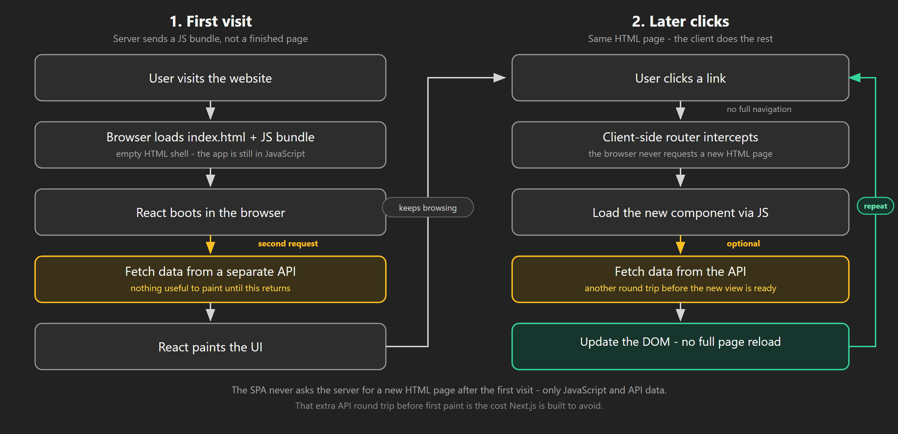
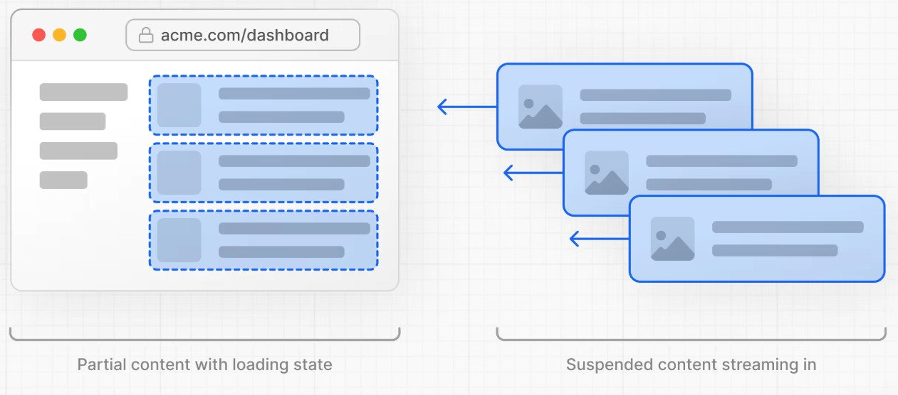
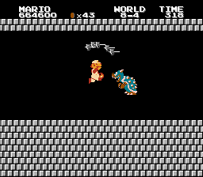

<style>
@media screen {
  [data-marpit-fragment]:not([data-marpit-fragment]:current) {
    display: none;
  }
}
</style>

<!-- class: invert -->

# Introduction to Next.js

_A fullstack React framework_


---

<!-- class: lead -->

## Learning objectives

By the end of this session, you will be able to:

- Scaffold an **App Router** Next.js app
- Fetch data in a **Server Component**
- Add `"use client"` only where you need interactivity
- Explain **static** vs **request-time** rendering
- Mutate data with a **Server Action**, or know when a `route.ts` API is the right tool

---

<style scoped>
  section {
    font-size: 22px;
  }
</style>

## Single Page Application (SPA)


Earlier we built React as a **client-only** app. That is the classic SPA model:

- The browser requests a page and gets a **JavaScript bundle**
- The bundle boots, then calls a **separate API** for data
- After the data arrives, React paints the UI
- Further clicks stay on one HTML page: the client fetches more data and re-renders

That model works. It also has costs that Next.js is built to avoid.

---

<style scoped>
  h2 {
    margin-bottom: 8px;
  }
</style>

## SPA flowchart



---

## SPA downsides

<style scoped>
  section {
    font-size: 26px;
  }
</style>

What problems do you see?

- **Performance**
  - **Bundle size** — a landing page still downloads the whole app
  - **Time to first paint** — JS download, boot, then a second request for data
- **SEO / accessibility** — crawlers and some tools see an empty shell until JS runs
- **Developer experience** — frontend and API live in different codebases and uses different mental models

---

## Next.js to the rescue

<style scoped>
  section {
    font-size: 24px;
  }
</style>


- Next is a **fullstack** framework for React. The same component model can run on the **server**, the **client**, or both.
- It improves performance with **server rendering**, **static generation**, and **code splitting** — send only the markup and JS a route needs.
- It improves **SEO and accessibility** by returning real HTML, not an empty shell.
- It improves **DX** (developer experience): data fetching, routing, and UI live in one project.

You are still writing React. Next decides **where** that React runs.

---

## Rendering strategies (preview)

<style scoped>
  section {
    font-size: 24px;
  }
</style>

Next can mix strategies in one app:

- **CSR** (Client-Side Rendering) — classic client React (SPA): the browser downloads JS, then React fetches data and paints the page
- **SSR** (Server-Side Rendering) — the server renders HTML on **each request**, then the browser hydrates it
- **SSG** (Static Site Generation) — HTML is rendered **at build time** and served as a static file
- **ISR** (Incremental Static Regeneration) — rebuild a page on a timer, without rebuilding the whole site
- **PPR** (Partial Pre-Rendering) — static shell, dynamic holes (later)

You do not pick one strategy for the whole app. You pick it **per route**, and often **per component**. Next generally infers the strategy.

---

<!-- class: invert -->

# The mental model

_Server Components, client islands, and navigation_

---

<!-- class: lead -->

<style scoped>
  section {
    font-size: 22px;
  }
  .columns {
    display: grid;
    grid-template-columns: 1.35fr 1fr;
    gap: 1.25rem 1.5rem;
    align-items: center;
  }
  figure {
    margin: 0;
    text-align: center;
  }
  figure img {
    max-width: 100%;
    height: auto;
    display: block;
    margin: 0 auto;
  }
  figcaption {
    font-size: 15px;
    font-style: italic;
    margin-top: 0.6rem;
    line-height: 1.3;
  }
</style>

## Default: Server Components

<div class="columns">
<div>

In the **App Router**, a file is a **Server Component** unless you opt out.

Server Components:

- Can be `async` and `await` data during render
- Can read files, talk to a database, use secrets — they never ship to the browser
- **Cannot** use `useState`, `useEffect`, or browser APIs (`window`, `document`)

They are React. They just run on the server first.

</div>
<div>

<figure>


<figcaption>"Render it on the server, ya dingus." - Dr. Steve Brule</figcaption>

</figure>

</div>
</div>

---

<style scoped>
  section {
    font-size: 22px;
  }
</style>

## Without a Server Component

```jsx
// bundle.js — ships to every visitor
import marked from "marked"; // 35.9K (11.2K gzipped)
import sanitizeHtml from "sanitize-html"; // 206K (63.3K gzipped)

function Page({ page }) {
  const [content, setContent] = useState("");
  // Loads *after* first paint
  useEffect(() => {
    fetch(`/api/content/${page}`).then((data) => {
      setContent(data.content);
    });
  }, [page]);

  return <div>{sanitizeHtml(marked(content))}</div>;
}
```

```js
// a separate API
app.get(`/api/content/:page`, async (req, res) => {
  const content = await file.readFile(`${req.params.page}.md`);
  res.send({ content });
});
```

---

## With a Server Component

```jsx
import marked from "marked"; // stays on the server
import sanitizeHtml from "sanitize-html"; // stays on the server

async function Page({ page }) {
  // Loads *during* render on the server
  const content = await file.readFile(`${page}.md`);

  return <div>{sanitizeHtml(marked(content))}</div>;
}
```

No `useEffect`. No extra round trip. Heavy libraries never enter the client bundle.

---

## Tradeoffs

<style scoped>
  section {
    font-size: 24px;
  }
</style>

What changed?

- **Fewer round trips** — HTML arrives with the data already in it
- **Smaller bundle** — Markdown parsing never ships
- **Better SEO** — the first response is real HTML

When might you still want CSR? A dashboard, editor, or game where SEO does not matter and almost everything is interactive.

---

## `"use client"` is a boundary

<style scoped>
  section {
    font-size: 20px;
  }
  h2 {
    margin-bottom: 8px;
  }
  pre {
    font-size: 14px;
    margin: 10px 0;
  }
  p {
    margin: 0.4em 0;
  }
</style>

To use hooks or event handlers, mark a **Client Component**:

```jsx
"use client";

import { useState } from "react";

export default function Expandable({ children }) {
  const [expanded, setExpanded] = useState(false);
  return (
    <div>
      <button onClick={() => setExpanded(!expanded)}>Toggle</button>
      {expanded && children}
    </div>
  );
}
```

`"use client"` does **not** mean “this one file only.” It means: **this module and everything it imports** become part of the client bundle.

Keep the directive on **leaves** — buttons, forms, anything that needs state. Keep pages and data fetching on the server.

---

## Nextistential crisis


Am I on the server or the client?

How the tree composes

- A **Server Component** can render a **Client Component**
- A **Client Component** cannot import a Server Component
- A Client Component **can** receive Server Components as `children`

---

<style scoped>
  section {
    font-size: 22px;
  }
  .columns {
    display: grid;
    grid-template-columns: 1fr 1fr;
    gap: 1.5rem;
    align-items: start;
  }
  pre {
    font-size: 14px;
  }
</style>

Think of client components as **islands** of interactivity in a server-rendered page.

<div class="columns">
<div>

```jsx
// Server Component (no directive)
import LikeButton from "./LikeButton";

export default async function Post({ post }) {
  return (
    <article>
      <h1>{post.title}</h1>
      <LikeButton postId={post.id} />
    </article>
  );
}
```

</div>
<div>

```jsx
"use client";

import { useState } from "react";

export default function LikeButton({ postId }) {
  const [liked, setLiked] = useState(false);
  return (
    <button onClick={() => setLiked(!liked)}>
      {liked ? "Unlike" : "Like"}
    </button>
  );
}
```

</div>
</div>

Props from server to client must be **serializable** (plain data, not functions or class instances).

---

## Hydration

An important term for hybrid rendering is **hydration**.

_Hydration is reconnecting server-rendered HTML to client JavaScript so the page becomes interactive._

The heading you already saw is HTML. The button that increments is a client island. Hydration wires up that island. It does not re-fetch the initial HTML.


---

<style scoped>
  section {
    font-size: 22px;
  }
</style>

## First load vs in-app navigation

Two different trips:

- **First visit / refresh** — the server sends **HTML**. Client islands hydrate. You can View Source and see the data.
- **`<Link>` click** — Next fetches an **RSC payload** (not a full HTML document) and swaps the **page segment**. **Layouts stay mounted.** Shared chrome does not remount.

That is why `layout.tsx` exists, and why we use `next/link` instead of a raw `<a>` for internal routes.

<!--
Network tab: a client navigation shows a request with `RSC` / `text/x-component`, not a new document.
-->

---

<!-- class: invert -->

# Demo: hydration

`demos/next_counter`

---

<!-- class: lead -->

<style scoped>
  section {
    font-size: 22px;
  }
  h2 {
    margin-bottom: 8px;
  }
  pre {
    margin: 8px 0;
  }
  p, ul {
    margin: 0.4em 0;
  }
</style>

## Counter demo

Open `/next_counter` in a terminal.

```bash
npm install
npm run dev
```

Look at:

- `src/app/counter/page.tsx` — Server Component, passes `initialCount`
- `src/app/counter/Counter.tsx` — `"use client"` island

Open [http://localhost:3000/counter](http://localhost:3000/counter)

View page source (not Inspect).

- Is **Counter: 10** in the raw HTML?
- What happens when you click Increment — does the HTML source change?

---

## What you should see

<style scoped>
  section {
    font-size: 20px;
  }
</style>

View source includes the server-rendered count:

```html
<body>
  <div>
    <h1>
      Counter:
      <!-- -->10
    </h1>
    <button>Increment</button>
  </div>
  <!-- client JS hydrates the button; it does not re-fetch 10 -->
</body>
```

The Server Component rendered `10` into HTML. The Client Component then hydrates so the button can update React state.

---

<!-- class: invert -->

# App Router

_Files, data, and the components you should actually use_

---

<!-- class: lead -->

<style scoped>
  section {
    font-size: 20px;
  }
  h2 {
    margin-bottom: 8px;
  }
  p {
    margin: 0.35em 0;
  }
  table {
    font-size: 18px;
    margin: 0.4em 0;
  }
  th, td {
    padding: 0.28em 0.55em;
  }
  td:first-child {
    white-space: nowrap;
  }
</style>

## File-based routing


The **App Router** (`app/`) maps folders to URLs. Special files give each segment behavior.

| File            | Role                                |
| --------------- | ----------------------------------- |
| `page.tsx`      | UI for that URL                     |
| `layout.tsx`    | Shared chrome; **does not remount** |
| `loading.tsx`   | Fallback while the page loads       |
| `error.tsx`     | Error boundary for the segment      |
| `not-found.tsx` | 404 UI                              |
| `route.ts`      | HTTP API (Route Handler)            |

`app/page.tsx` → `/`  
`app/posts/page.tsx` → `/posts`  
`app/posts/[id]/page.tsx` → `/posts/42`

<!--
Pages Router (`pages/`) still exists in old apps. Mapping table later. Do not demo it live.
-->

---

<style scoped>
  section {
    font-size: 22px;
  }
  h2 {
    margin-bottom: 8px;
  }
  .columns {
    display: grid;
    grid-template-columns: 1.15fr 0.85fr;
    gap: 1.2rem;
    align-items: start;
  }
  pre {
    font-size: 14px;
    margin: 8px 0;
  }
  p {
    margin: 0.45em 0;
  }
</style>

## `layout.tsx` and `page.tsx`

<div class="columns">
<div>

```tsx
// app/layout.tsx
export default function RootLayout({
  children,
}: {
  children: React.ReactNode;
}) {
  return (
    <html lang="en">
      <body>
        <nav>Rebel Roster</nav>
        {children}
      </body>
    </html>
  );
}
```

</div>
<div>

```tsx
// app/page.tsx
export default function HomePage() {
  return <h1>Home</h1>;
}
```

Root layout **must** include `<html>` and `<body>`. Nested layouts wrap only their segment.

</div>
</div>

---

## Dynamic params

<style scoped>
  section {
    font-size: 22px;
  }
</style>

`[id]` is a dynamic segment. In Next 15, `params` is a **Promise** — always `await` it.

```tsx
// app/posts/[id]/page.tsx
export default async function PostPage({
  params,
}: {
  params: Promise<{ id: string }>;
}) {
  const { id } = await params;
  const res = await fetch(`https://api.example.com/posts/${id}`);
  const post = await res.json();

  return <h1>{post.title}</h1>;
}
```

Same idea for `searchParams`.

---

## `Link` and `Image`

<style scoped>
  section {
    font-size: 22px;
  }
</style>

Use these instead of `<a>` and `` inside the app.

```tsx
import Link from "next/link";
import Image from "next/image";

<Link href="/posts/1">Open post</Link>

<Image
  src="/hero.png"
  alt="Hero banner"
  width={1200}
  height={600}
  priority
/>
```

- **`Link`** — client navigation (RSC payload, layouts stay mounted). Prefetches in viewport.
- **`Image`** — resizing, modern formats, lazy loading. Set `width` / `height` (or `fill`) to avoid layout shift.

A raw `<a href="/posts">` does a **full document reload**. That throws away the model we just built.

---

## Fetching data

<style scoped>
  section {
    font-size: 22px;
  }
</style>

No `getServerSideProps`. Await `fetch` (or a database client) in the Server Component:

```tsx
export default async function Dashboard() {
  const res = await fetch("https://api.example.com/live-data");
  const data = await res.json();

  return <pre>{JSON.stringify(data, null, 2)}</pre>;
}
```

In **Next 15**, `fetch` is **uncached by default** (`no-store`). Every request hits the source unless you opt into caching.

That is the opposite of Next 14. If a tutorial says “fetch is cached unless you opt out,” it is outdated.

---

## Opting into cache

<style scoped>
  section {
    font-size: 20px;
  }
</style>

When the data can be stale for a while:

```tsx
const res = await fetch("https://api.example.com/posts", {
  next: { revalidate: 3600 }, // ISR: at most once an hour
});
```

```tsx
const res = await fetch("https://api.example.com/posts", {
  cache: "force-cache", // cache until you invalidate
});
```

**ISR** is “rebuild this page on a schedule, not the whole site.”

---

## `generateStaticParams`

<style scoped>
  section {
    font-size: 20px;
  }
  h2 {
    margin-bottom: 8px;
  }
  pre {
    font-size: 14px;
    margin: 12px 0;
  }
</style>

For a dynamic route you want to **prebuild** (`/posts/1`, `/posts/2`, …):

```tsx
// app/posts/[id]/page.tsx
export async function generateStaticParams() {
  const res = await fetch("https://api.example.com/posts");
  const posts = await res.json();

  return posts.map((post: { id: number }) => ({
    id: post.id.toString(),
  }));
}

export default async function Post({
  params,
}: {
  params: Promise<{ id: string }>;
}) {
  const { id } = await params;
  const res = await fetch(`https://api.example.com/posts/${id}`);
  const post = await res.json();
  return <h1>{post.title}</h1>;
}
```

This replaces Pages Router `getStaticPaths`.

---

## App Router demo

Run `demos/next_app_router`:

```bash
npm install
npm run dev
```

Review:

- `src/app/layout.tsx` — root layout
- `src/app/posts/page.tsx` — Server Component, `fetch` with `revalidate: 3600`
- `src/app/posts/[id]/page.tsx` — `generateStaticParams` + `await params`

Open [http://localhost:3000/posts](http://localhost:3000/posts) and a post such as `/posts/1`.

---

<!-- class: invert -->

# Streaming

_Don't block the whole page on the slow part_

---

<!-- class: lead -->

## `<Suspense>`

<style scoped>
  section {
    font-size: 24px;
  }
</style>

[`<Suspense>`](https://react.dev/reference/react/Suspense) shows a **fallback** while a child is not ready.

On the server, wrap a slow Server Component. The rest of the page can paint; the slow hole **streams** in when it finishes.

```tsx
import { Suspense } from "react";

export default function Page() {
  return (
    <>
      <h1>Dashboard</h1>
      <Suspense fallback={<p>Loading stats…</p>}>
        <SlowStats />
      </Suspense>
    </>
  );
}
```

A slow database call in one widget should not block the header.

---

## `Suspense` visualized



---

## Partial Pre-Rendering (PPR)



PPR is the “static shell + dynamic holes” version of the same idea.

- The **shell** (nav, layout, cached content) can be sent immediately
- **Dynamic holes** (the current user, live data) stream in behind `<Suspense>`

Remember: **static shell, streamed holes** — not a third framework.

---

## Streaming demo

Run `demos/next_suspense_streaming`:

```bash
npm install
npm run dev
```

Open [http://localhost:3000](http://localhost:3000).

You should see fallbacks first, then each delayed Server Component as it resolves. The fast ones do not wait for the slow ones.
Inspect: `src/app/page.tsx`.

---

<!-- class: invert -->

# Mutations and APIs

---

<!-- class: lead -->

<style scoped>
  section {
    font-size: 22px;
  }
  .columns {
    display: grid;
    grid-template-columns: 1fr 1fr;
    gap: 1.5rem;
    align-items: start;
  }
  pre {
    font-size: 14px;
    margin: 12px 0;
  }
</style>

## Server Actions

For **forms in your own app**, prefer a Server Action over standing up a REST route.

<div class="columns">
<div>

```tsx
// app/actions.ts
"use server";

export async function addPilot(formData: FormData) {
  const name = String(formData.get("name") ?? "");
  // write to the database here
}
```

</div>
<div>

```tsx
// app/page.tsx
import { addPilot } from "./actions";

export default function Page() {
  return (
    <form action={addPilot}>
      <input name="name" placeholder="Pilot name" />
      <button type="submit">Add</button>
    </form>
  );
}
```

</div>
</div>

---

## Route Handlers

<style scoped>
  section {
    font-size: 22px;
  }
</style>

Use `app/api/.../route.ts` when you need a real HTTP API: a mobile client, a webhook, or another frontend.

`app/api/users/route.ts` → `GET /api/users`  
`app/api/users/[id]/route.ts` → `GET /api/users/42`

```ts
export async function GET() {
  const users = [
    { id: 1, name: "Alice" },
    { id: 2, name: "Bob" },
  ];
  return Response.json(users);
}
```

Export `GET`, `POST`, `PUT`, `PATCH`, `DELETE` as needed.

If only this Next app needs the data, a Server Component or Server Action is usually enough. You do not need an API just to talk to yourself.

---

## Deploy

The usual path:

1. `next build` locally — catch errors before you push
2. Push to GitHub
3. Import the repo on [Vercel](https://vercel.com) (the people who make Next)

Vercel runs `next build` and hosts the result. Environment variables go in the project settings, not in git.

A database is optional. Server Components can call any API or DB you configure. That is a later concern, not this hour.

---

## Summary

- **Next.js** is React that can run on the server and the client
- **App Router** (`app/`) is the default: files are routes; `layout.tsx` survives navigation
- **Server Components** fetch data and render HTML; **`"use client"`** marks interactive islands
- **Hydration** reconnects that HTML to client JS; `<Link>` then swaps an **RSC payload**
- **Next 15 `fetch` is uncached** until you opt in (`revalidate` / `force-cache`)
- **`<Suspense>`** streams slow holes; PPR is the same idea with a static shell
- **Server Actions** for in-app forms; **`route.ts`** for real HTTP APIs
- **Pages Router** is legacy — use the mapping table when you read old code

---

## Questions?


