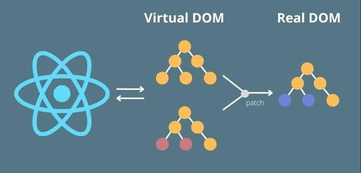

<style>
@media screen {
  [data-marpit-fragment]:not([data-marpit-fragment]:current) {
    display: none;
  }
}
</style>

<!-- class: invert -->

# Introduction to React

_A JavaScript library for building user interfaces_


---

<!-- class: lead -->

## Why React?

React is a **component** library: you describe UI as functions of data, and the library updates the DOM.

- **Declarative** - return what the UI should look like; React applies the DOM changes
- **Composable organization** - screens composed of reusable, modular, well defined components
- **Performant** - efficient, "under the hood", implementation details for performant rendering
- **Consistent model** - one model for frotend (React), backend (Next.js) and  mobile (React Native)

---

## Learning objectives

By the end of this session, you will be able to:

- Describe UI with **JSX**
- Split a screen into **function components** and **import / export** them across files
- Pass data with **props** and update the UI with **state**
- Handle events, including a **controlled form**
- Use **`useState`**, **`useEffect`**, and a small **custom hook**

---

## A short timeline

- **2013** - open-sourced at Facebook
- **2018** - **hooks**; function components can hold state
- **2022** - React **18**, concurrent rendering
- **2024** - React **19** (form Actions, better async).


---

<style scoped>
  section {
    font-size: 22px;
  }
</style>

## Before React: state in the DOM

Facebook was building complex UIs with MVC and jQuery-style DOM updates. Data often lived on the nodes themselves.

What is awkward about this?

```html
<button id="btn1">Click me</button>
<button id="btn2">Click me</button>
<script>
  document.getElementById("btn1").setAttribute("data-count", 0);
  document.getElementById("btn2").setAttribute("data-count", 0);

  function handleClick(event) {
    const btn = event.target;
    let count = parseInt(btn.getAttribute("data-count"));
    count++;
    btn.setAttribute("data-count", count);
    btn.textContent = `Clicked ${count} times`;
  }

  document.getElementById("btn1").addEventListener("click", handleClick);
  document.getElementById("btn2").addEventListener("click", handleClick);
</script>
```

<!--

- mixing data into the DOM
- The handler does three jobs: read state, write state, paint the button
- no standard, hacky
- brittle code - `getElementById` and `event.target`
- This is two buttons. A feed, a cart, or nested widgets means remembering which nodes to touch, in which order. Miss one and the screen and the data disagree.

Bridge: React keeps state in memory and treats the UI as a function of that state. You change the number; the library updates the DOM. Next slide.
-->

---

## What React changed

Direct DOM updates mixed **data**, **logic**, and **markup**, and made it easy to update the wrong node (or the same node too often).

React's answers:

- **Declarative UI** - describe _what_ the screen is, not _which DOM calls_ to run
- **Components** - data, logic, and markup for one piece of UI live together
- **UI as a function of state** - when data changes, the component function runs again

The library then updates the DOM. You do not.

---

<!-- this works in the generated HTML slide. CDN + Babel is a slide toy, not how we ship apps. -->

<div id="simple-react-demo"></div>

<script type="text/babel">
  const { useState } = React;

  function SimpleCounter() {
    const [count, setCount] = useState(0);

    return (
      <div style={{
        textAlign: 'center',
        padding: '20px',
        border: '2px solid #4CAF50',
        borderRadius: '8px',
        backgroundColor: '#f0f8f0'
      }}>
        <h3>Simple React Counter</h3>
        <p>Count: <strong>{count}</strong></p>
        <button
          onClick={() => setCount((c) => c + 1)}
          style={{
            padding: '10px 20px',
            margin: '5px',
            backgroundColor: '#4CAF50',
            color: 'white',
            border: 'none',
            borderRadius: '4px',
            cursor: 'pointer'
          }}
        >
          Increment
        </button>
        <button
          onClick={() => setCount((c) => c - 1)}
          style={{
            padding: '10px 20px',
            margin: '5px',
            backgroundColor: '#f44336',
            color: 'white',
            border: 'none',
            borderRadius: '4px',
            cursor: 'pointer'
          }}
        >
          Decrement
        </button>
      </div>
    );
  }

  ReactDOM.createRoot(document.getElementById('simple-react-demo')).render(<SimpleCounter />);
</script>

<script src="https://unpkg.com/react@18/umd/react.development.js" crossorigin></script>
<script src="https://unpkg.com/react-dom@18/umd/react-dom.development.js" crossorigin></script>
<script src="https://unpkg.com/@babel/standalone/babel.min.js"></script>

---

<style scoped>
  section {
    font-size: 26px;
  }
</style>

## Counter component

```tsx
import { useState } from "react";

export default function Counter() {
  const [count, setCount] = useState(0);

  return (
    <div>
      <h2>Counter</h2>
      <p>Count: {count}</p>
      <button onClick={() => setCount((c) => c + 1)}>Increase</button>
      <button onClick={() => setCount((c) => c - 1)}>Decrease</button>
    </div>
  );
}
```

What is happening in this component?
How is it declarative?
Does it contain data, logic, and presentation?

---

## Counter analysis

**What happens**

1. `useState(0)` keeps `count` across renders
2. Clicks call `setCount`, which schedules an update
3. React calls `Counter` again with the new state
4. The returned JSX is committed to the DOM

**Declarative:** we say "show `count`" and "when clicked, the next count is this." No `getElementById`, no `textContent`.

**One component:** data (`count`), logic (`setCount`), presentation (the JSX). That is the component model.

---

<style scoped>
  section {
    font-size: 22px;
  }
</style>

## The render model

Essentially, the UI is a function of data (state/props). Same data in, should produce the same view out:

**UI = f(state, props)**

When state or props change (new data), the component **function runs again** and returns new JSX.

React keeps a tree of objects that describe that UI (the virtual DOM), **diffs** it against the previous tree, and updates **only the DOM nodes that changed**.



---

<!-- class: invert -->

## JSX

---

<!-- class: lead -->

## JSX is JavaScript

JSX looks like HTML. It compiles to function calls.

```tsx
const element = <h1>Hello, world!</h1>;
```

compiles to:

```ts
const element = React.createElement("h1", null, "Hello, world!");
```

_Arguments: type, props, children_

You can store JSX in variables, return it from functions, and pass it as data. Curly braces `{}` embed any JavaScript **expression**.

---

<style scoped>
  section {
    font-size: 22px;
  }
  .columns {
    display: grid;
    grid-template-columns: 1fr 1fr;
    gap: 1.5rem;
    align-items: start;
  }
  pre {
    font-size: 16px;
  }
</style>

## Expressions and one root

<div class="columns">
<div>

Curly braces `{}` embed a JavaScript **expression**.

```tsx
function Greeting({
  user,
}: {
  user?: { firstName: string; lastName: string };
}) {
  if (!user) {
    return <h1>Hello, stranger.</h1>;
  }
  return (
    <h1>
      Hello, {user.firstName} {user.lastName}!
    </h1>
  );
}
```

</div>
<div>

A return must have **one parent**. Adjacent tags do not compile.

```tsx
return (
  <h1>Hello</h1>
  <p>Welcome.</p>
);
```

Wrap siblings in a `<div>` or a fragment `<>...</>` (no extra DOM node):

```tsx
return (
  <>
    <h1>Hello</h1>
    <p>Welcome.</p>
  </>
);
```

</div>
</div>

---

<style scoped>
  section {
    font-size: 22px;
  }
  .columns {
    display: grid;
    grid-template-columns: 1fr 1fr;
    gap: 1.5rem;
    align-items: start;
  }
  pre {
    font-size: 16px;
  }
  table {
    font-size: 18px;
  }
</style>

## JSX vs HTML

JSX looks like HTML, but it is JavaScript. A few names and rules differ.

<div class="columns">
<div>

| HTML                 | JSX                        |
| -------------------- | -------------------------- |
| `class`              | `className`                |
| `for`                | `htmlFor`                  |
| `<input>`            | `<input />`                |
| `onclick="..."`      | `onClick={handler}`        |
| `style="color: red"` | `style={{ color: "red" }}` |

</div>
<div>

```tsx
<label htmlFor="email" className="field">
  Email
  <input
    id="email"
    type="text"
    onChange={handleChange}
    style={{ color: "red" }}
  />
</label>
```

</div>


---

<style scoped>
  section {
    font-size: 22px;
  }
</style>

## Conditional rendering

`if` / `else` cannot sit _inside_ JSX (you must return an expression). Use a ternary, `&&`, or return early (as in `Greeting`).

```tsx
function Greeting({ isLoggedIn }: { isLoggedIn: boolean }) {
  return <h1>{isLoggedIn ? "Welcome back!" : "Please sign up."}</h1>;
}

function Mailbox({ unread }: { unread: string[] }) {
  return (
    <div>
      <h1>Hello!</h1>
      {unread.length > 0 && <h2>{unread.length} unread</h2>}
    </div>
  );
}
```

**Gotcha:** `{count && <p>{count} items</p>}` renders **`0`** when `count` is `0`. Prefer `count > 0 && ...` or a ternary.

---

<style scoped>
  section {
    font-size: 24px;
  }
</style>

## Rendering lists

`map` turns an array into JSX. After a change, React matches list items by **`key`**.

Is the array index a good key?

```tsx
function NumberList({ numbers }: { numbers: number[] }) {
  return (
    <ul>
      {numbers.map((number) => (
        <li key={number}>{number}</li>
      ))}
    </ul>
  );
}
```

---

<style scoped>
  section {
    font-size: 22px;
  }
</style>

## Keys must be stable

**No** - do not use the index if the list can reorder, insert, or delete. React will reuse the wrong DOM node (and any state inside it).

Use an **id from your data**. Indexes are only acceptable for a static list that never changes.

```tsx
type Todo = { id: string; text: string; done: boolean };

function TodoList({ todos }: { todos: Todo[] }) {
  return (
    <ul>
      {todos
        .filter((todo) => !todo.done)
        .map((todo) => (
          <li key={todo.id}>{todo.text}</li>
        ))}
    </ul>
  );
}
```

`filter().map()` is normal, readable JSX.

---

<!-- class: invert -->

## Components and props

---

<!-- class: lead -->

## Components are functions

A component is a **function that returns JSX**. You can export it, nest it, and pass it around.

```tsx
function Welcome() {
  return <h1>Hello, world!</h1>;
}

function App() {
  return (
    <div>
      <Welcome />
      <Welcome />
    </div>
  );
}
```

Class components with `render()` show up in old codebases. We write functions.

---

<style scoped>
  section {
    font-size: 22px;
  }
  .columns {
    display: grid;
    grid-template-columns: 1fr 1fr;
    gap: 1.5rem;
    align-items: start;
  }
  pre {
    font-size: 15px;
  }
</style>

## One file per component

Same **ESM** as the JS lecture. The usual pattern is **one component per file**.

<div class="columns">
<div>

```tsx
// Welcome.tsx
export default function Welcome() {
  return <h1>Hello, world!</h1>;
}
```

</div>
<div>

```tsx
// App.tsx
import Welcome from "./Welcome";

export default function App() {
  return (
    <div>
      <Welcome />
      <Welcome />
    </div>
  );
}
```

</div>
</div>

**Default:** `export default function Welcome` then `import Welcome from "./Welcome"`

**Named:** `export function Welcome` then `import { Welcome } from "./Welcome"`

Omit the `.tsx` in the import path. Name the file after the component.

<!--
Callback to JS modules. Default is the common choice when the file *is* the component (Vite's App, this week's Rebel roster: `import PilotRow from "./PilotRow"`). Named locks the import name to the export name — nicer when a file exports more than one thing.
-->

---

<style scoped>
  section {
    font-size: 22px;
  }
</style>

## Props are the argument

The one argument is a **props** object. Props are **read-only**. To change what a child shows, the parent passes new props.

This is the same **structural typing** you saw in the TypeScript lecture.

```tsx
type WelcomeProps = {
  name: string;
  subtitle?: string;
};

function Welcome({ name, subtitle }: WelcomeProps) {
  return (
    <header>
      <h1>Hello, {name}</h1>
      {subtitle && <p>{subtitle}</p>}
    </header>
  );
}

<Welcome name="Ada" subtitle="Countess of Lovelace" />;
```

Destructure in the parameter list. Annotate the props object.

---

<style scoped>
  section {
    font-size: 22px;
  }
</style>

## Spreading props

JSX attributes are object properties. `{...obj}` copies those keys onto the child's props — the same object spread from the JS lecture.

```tsx
const ada = {
  name: "Ada",
  subtitle: "Countess of Lovelace",
};

<Welcome name={ada.name} subtitle={ada.subtitle} />

<Welcome {...ada} />
```

Same result. Spread when you already have a props-shaped object — a row from an array, or remaining props after you pick a few off.

<!--
Callback to JS object spread. Extra keys that Welcome doesn't destructure are still on the props object (ignored unless forwarded). Don't dump the whole world — spread only what the child needs. Rest + spread is the usual wrap-and-forward pattern: `function Banner({ featured, ...rest }: WelcomeProps & { featured?: boolean }) { return <Welcome {...rest} />; }`.
-->

---

<style scoped>
  section {
    font-size: 22px;
  }
</style>

## Data down, events up

State lives in the parent that **owns** it. Children receive values as props, and callbacks to request a change.

```tsx
function Display({ value }: { value: number }) {
  return <p>Count: {value}</p>;
}

function Controls({ onInc }: { onInc: () => void }) {
  return <button onClick={onInc}>Increase</button>;
}

function Counter() {
  const [count, setCount] = useState(0);
  return (
    <div>
      <Display value={count} />
      <Controls onInc={() => setCount((c) => c + 1)} />
    </div>
  );
}
```

That is **unidirectional data flow**. Moving state up to a common parent is **lifting state**. Topic for week 4.

---

<style scoped>
  section {
    font-size: 26px;
  }
</style>

## `children` is a prop

Anything between a component's tags is passed as `children`. Type it as `ReactNode`.

```tsx
import { type ReactNode } from "react";

function Card({ heading, children }: { heading: string; children: ReactNode }) {
  return (
    <div>
      <h3>{heading}</h3>
      <div>{children}</div>
    </div>
  );
}

function Wrapper() {
  return (
    <Card heading="First card">
      Any JSX can go here - text, elements, other components.
    </Card>
  );
}
```

---

<style scoped>
  section {
    font-size: 26px;
  }
</style>

## Styling

`className` for CSS classes. Inline `style` takes an **object** - styles as data, which is handy when they depend on state.

```tsx
function Button({ primary }: { primary?: boolean }) {
  return (
    <button
      className={`btn ${primary ? "btn-primary" : "btn-secondary"}`}
      style={{ opacity: primary ? 1 : 0.85 }}
    >
      Click me
    </button>
  );
}
```

---

<!-- class: invert -->

## State and events

---

<!-- class: lead -->

<style scoped>
  section {
    font-size: 26px;
  }
</style>

## Events are props (and closures)

Event names are camelCase. The value is a function. That function is just another prop.

```tsx
import { type MouseEvent } from "react";

function Button({ id, text }: { id: string; text: string }) {
  function handleClick(buttonId: string, event: MouseEvent<HTMLButtonElement>) {
    console.log(`Button ${buttonId} clicked`, event.clientX);
  }

  return <button onClick={(e) => handleClick(id, e)}>{text}</button>;
}
```

The arrow function is a **closure**: when it runs, it still sees `id` and `handleClick` from this render. Closures are how handlers keep the props they were created with (same idea as the JS lecture).

---

<style scoped>
  section {
    font-size: 22px;
  }
</style>

## `useState`

`useState` is a **hook**: _a function that lets a component keep data across renders_. The `0` is the initial value; React uses it only on the first render.

```tsx
import { useState } from "react";

function Counter() {
  const [count, setCount] = useState(0);

  return (
    <>
      <p>{count}</p>
      <button onClick={() => setCount(count + 1)}>+1</button>
    </>
  );
}
```

The call returns a **pair**: the current value, and a setter. Calling `setCount` schedules a **re-render**. The next time `Counter` runs, `count` is the new value.

---

<style scoped>
  section {
    font-size: 19px;
  }
</style>

## `useState` and functional updates

The setter **schedules** an update; it does not change `count` in the current function body.

```tsx
import { useState } from "react";

function Counter() {
  const [count, setCount] = useState(0);

  function addTwiceBroken() {
    setCount(count + 1);
    setCount(count + 1); // still +1 — both reads see this render's `count`
  }

  function addTwice() {
    setCount((c) => c + 1);
    setCount((c) => c + 1); // +2 — each call sees the queued value
  }

  return (
    <>
      <p>{count}</p>
      <button onClick={addTwiceBroken}>+2 (broken)</button>
      <button onClick={addTwice}>+2</button>
    </>
  );
}
```

Pass a function when the next value depends on the previous one: counters, callbacks, and anywhere the click might not see the latest state.

---


<style scoped>
  section {
    font-size: 20px;
  }
</style>

## Controlled forms

A **controlled** input means React state is the source of truth: `value` + `onChange`.

```tsx
import { useState, type FormEvent, type ChangeEvent } from "react";

function NameForm() {
  const [value, setValue] = useState("");

  function handleSubmit(event: FormEvent<HTMLFormElement>) {
    event.preventDefault(); // stop the browser submit / full page load
    alert(`Submitted: ${value}`);
  }

  function handleChange(event: ChangeEvent<HTMLInputElement>) {
    setValue(event.target.value);
  }

  return (
    <form onSubmit={handleSubmit}>
      <input value={value} onChange={handleChange} />
      <button type="submit">Submit</button>
    </form>
  );
}
```

`preventDefault` is **not** bubbling. `stopPropagation` stops the event reaching parents. You rarely need both.

---

<style scoped>
  section {
    font-size: 26px;
  }
</style>

## Rules of Hooks

Hooks are the `use*` functions (`useState`, `useEffect`, and ones you write).

1. Call them **only at the top level** - not inside loops, conditions, or nested functions
2. Call them **only from React functions** - components or custom hooks
3. Call them in the **same order** every render

React matches hook state by call order. An `if` around `useState` breaks that matching.

---

<!-- class: invert -->

## Effects

---

<!-- class: lead -->

<style scoped>
  section {
    font-size: 20px;
  }
</style>

## `useEffect` synchronizes

Components **render**. Effects run **after** paint, to sync React with something it does not own: a listener, a timer, `document.title` or to trigger side effects as data changes.

```tsx
useEffect(() => {
  console.log("after every render");
});

useEffect(() => {
  console.log("after mount");
  return () => {
    console.log("unmount only - deps are []");
  };
}, []);

useEffect(() => {
  console.log(`seconds is ${seconds}`);
}, [seconds]);
```

Empty deps `[]`: run after mount; the cleanup (returned fucntion) runs on **unmount**. A missing deps array: runs after **every** render. An array with members: when those members change.

---

<style scoped>
  section {
    font-size: 20px;
  }
  .columns {
    display: grid;
    grid-template-columns: 1.2fr 0.8fr;
    gap: 1.4rem;
    align-items: start;
  }
  pre {
    font-size: 14px;
  }
</style>

## Custom hooks extract that sync

<div class="columns">
<div>

```tsx
function useWindowWidth() {
  const [width, setWidth] = useState(window.innerWidth);

  useEffect(() => {
    const handleResize = () => setWidth(window.innerWidth);
    window.addEventListener("resize", handleResize);
    return () => window.removeEventListener("resize", handleResize);
  }, []);

  return width;
}

function App() {
  const width = useWindowWidth();
  return <p>Window width: {width}px</p>;
}
```

</div>
<div>

A function whose name starts with `use` can call other hooks. Same rules.

Always clean up listeners, timers, and subscriptions. If you skip the cleanup, you leak - and you can `setState` on an unmounted component.

</div>
</div>

---

<style scoped>
  section {
    font-size: 20px;
  }
</style>

### Exercise: debug the Rebel roster — 15 minutes

In the `week_03` branch in the course code repo, open `/01_rebel_roster`, run `npm install` then `npm run dev`. Each component is its own file in `src/`. **Don't use AI.**

`src\App.tsx` is the starting point.

**Four bugs**

1. **Add to roster** — page reloads; the new pilot never sticks
2. **Scramble two X-wings** — count goes up by 1, not 2
3. Click **Toggle ready** next to Luke. Then click **Dismiss** next to Luke.
   **You see:** Wedge says "Airborne". **Should be:** "On deck".
4. **Close comms** — console still logs `This is Red Leader. Stay on target.`

With a partner: name the lecture idea, then fix.

Stretch: extract a `useRebelRadio` hook with cleanup.

<!--
Causes (for walking the room; debrief is the next slide):

1. Form submit has no preventDefault — the browser reloads and wipes React state
2. setXWings(xWings + 1) twice — both reads see this render's value; functional updates
3. key={index} plus ready state inside PilotRow — React reuses the wrong child; key with pilot.id
4. setInterval in useEffect with no cleanup — the interval outlives unmount
-->

---

<style scoped>
  section {
    font-size: 20px;
  }
</style>

## Why it broke

1. **Add to roster** — the form submits and the browser reloads. React state is gone.
   Fix: `event.preventDefault()` in the submit handler.

2. **Scramble +1** — `setXWings(xWings + 1)` twice. Both reads see this render's `xWings`.
   Fix: `setXWings((n) => n + 1)` twice.

3. **Wrong row after dismiss** — `key={index}` plus `ready` state inside `PilotRow`. React reuses the DOM node (and its state) for the next pilot at that index.
   Fix: `key={pilot.id}`.

4. **Comms after close** — `setInterval` in `useEffect` with no cleanup. Closing comms unmounts `RebelRadio`; the interval keeps firing.
   Fix: `return () => clearInterval(id)`.

---

<!-- class: lead -->

## Summary

- **React:** UI = f(state, props); components (`import` / `export`); React updates the DOM
- **JSX:** expressions, one root / fragments, lists need **stable keys**
- **Props:** read-only input; data down, events up; `children` is a prop
- **State:** `useState`, **functional updates**, controlled inputs
- **Events:** handlers are function props; `preventDefault` ≠ `stopPropagation`
- **Effects:** sync with the outside; clean up; custom hooks reuse that

### Questions

- What was surprising today?
- Which topic do you want to go deeper on?
- Anything from a project you want to map onto props vs state?
