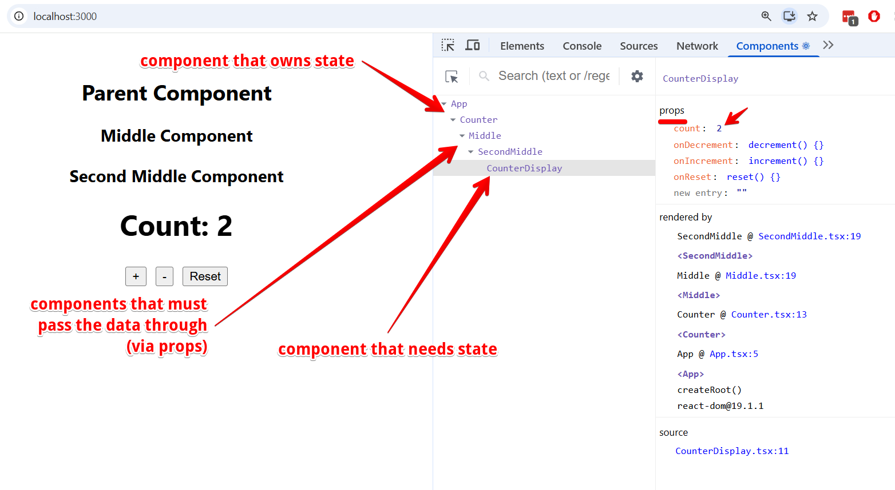
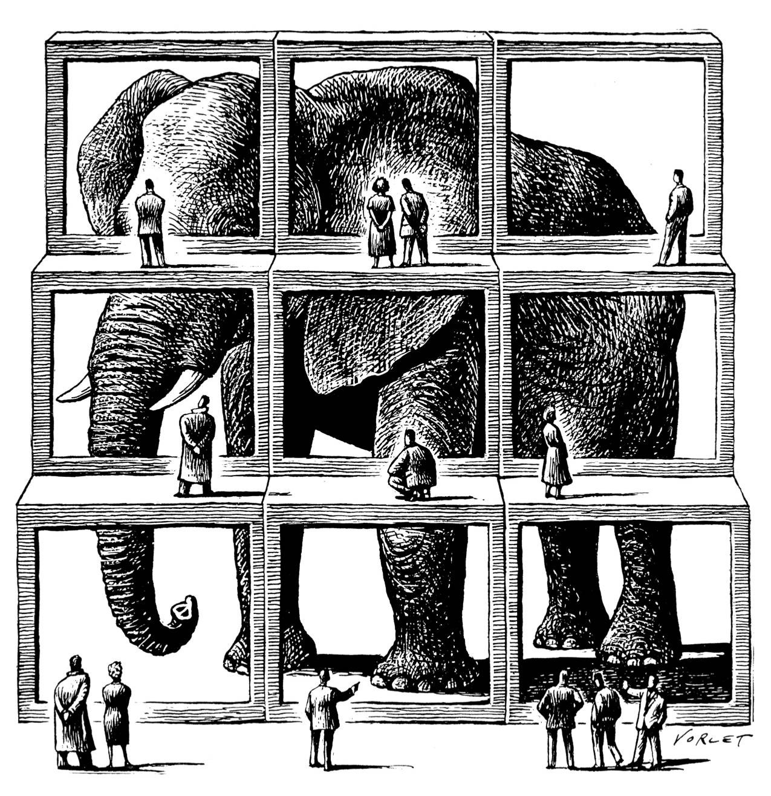

<style>
@media screen {
  [data-marpit-fragment]:not([data-marpit-fragment]:current) {
    display: none;
  }
}
</style>

<!-- class: invert -->

# State and Data Management

_Where does this data live, and who owns the cache?_

---

<!-- class: lead -->

## Learning objectives

By the end of this session, you will be able to:

- Decide **where a piece of state belongs** (component, URL, context, server, client cache, client store)
- **Lift state** or use **context** on purpose — and say when each is the wrong tool
- Write a typed **`useQuery` / `useMutation`** with a **stable query key**
- Explain when **TanStack Query** is useful in Next.js, and when a **Server Component** is enough

---

<style scoped>
  section {
    font-size: 20px;
  }
  table {
    font-size: 18px;
  }
  th, td {
    padding: 0.3em 0.55em;
  }
</style>

## Where does the data live?

| Kind of data | Lives in | Tool |
| --- | --- | --- |
| Modal open, form draft, hover | Component | `useState` |
| Auth, theme, locale | App-wide client | Context |
| Wizard / multi-step client flow | Structured client | `useReducer` + context |
| Current page, filters, selected tab | URL | `searchParams`, route params |
| Posts, products, the logged-in user | Server | Server Component `fetch` / Prisma |
| Same server data, but the **client** must refetch, poll, or share a cache | Client cache of server data | TanStack Query |
| Editor, game, offline world | Client store | Zustand / Redux Toolkit — sketch |

---

<style scoped>
  section {
    font-size: 22px;
  }
</style>

## Client state vs server state

**Client state** is UI the browser owns. Close the tab and it is gone, unless you persist it on purpose.

**Server state** lives on a machine you do not control. The client can hold a **copy**. That copy can be briefly wrong.

---

## URL is state

After last week, you already store state in the address bar.

- `/posts/42` — which resource
- `?sort=price&inStock=1` — filters
- `?tab=reviews` — which panel is open

Prefer URL state for GET-related views that include filtering and sorting.

We can handle these pages as normal server-rendered pages and allow Next to manage state around navigation.

There is no need to maintain a separate client state management system in these cases.

This makes pages and views bookmarkable and easily shareable. This is better for UX and SEO.

---

<!-- class: invert -->

## Lifting state

---

<!-- class: lead -->

## You already know `useState`

Week 2: a component keeps data across renders with `useState`. Setters schedule a re-render.

The new question: **who else needs this value?**

If two siblings need it, the state does not live in either of them. It lives in the **nearest common parent**, and you pass the value and the setter (or a handler) down as props.

That is **lifting state**. Data down, events up — same rule as week 2, one level higher.

---

<style scoped>
  section {
    font-size: 18px;
  }
  .columns {
    display: grid;
    grid-template-columns: 1.05fr 0.95fr;
    gap: 1.25rem;
    align-items: center;
  }
  pre {
    font-size: 14px;
    margin: 0.35em 0 0.6em;
  }
  .browser {
    border: 1px solid #c5cad3;
    border-radius: 10px;
    overflow: hidden;
    background: #fff;
    color: #1c1c1c;
    box-shadow: 0 10px 28px rgba(0, 0, 0, 0.12);
    pointer-events: none;
  }
  .browser-bar {
    display: flex;
    align-items: center;
    gap: 8px;
    padding: 8px 12px;
    background: #e6e8ee;
  }
  .dot {
    width: 10px;
    height: 10px;
    border-radius: 50%;
    display: inline-block;
  }
  .dot.r { background: #ff5f57; }
  .dot.y { background: #febc2e; }
  .dot.g { background: #28c840; }
  .url {
    flex: 1;
    margin-left: 6px;
    background: #fff;
    border-radius: 999px;
    padding: 3px 12px;
    font-size: 13px;
    color: #555;
  }
  .browser-body {
    padding: 14px 16px 16px;
    background: #f4f6f8;
  }
  .owner {
    margin: 0 0 12px;
    text-align: center;
    font-size: 14px;
    font-weight: 700;
    color: #1d4e89;
    background: #e7f0fa;
    border-radius: 6px;
    padding: 6px 10px;
  }
  .siblings {
    display: grid;
    grid-template-columns: 1fr 1fr;
    gap: 12px;
  }
  .panel {
    background: #fff;
    border: 1px solid #d5d9e0;
    border-radius: 8px;
    padding: 12px 10px 10px;
    text-align: center;
  }
  .panel p {
    margin: 0;
  }
  .label {
    font-size: 13px;
    font-weight: 700;
    letter-spacing: 0.02em;
    text-transform: uppercase;
    color: #666;
  }
  .count {
    font-size: 42px;
    line-height: 1.15;
    font-weight: 700;
  }
  .btn {
    display: inline-block;
    margin-top: 10px;
    background: #1d4e89;
    color: #fff;
    border-radius: 6px;
    padding: 8px 18px;
    font-size: 18px;
    font-weight: 700;
  }
  .hint {
    margin-top: 10px !important;
    font-size: 13px;
    color: #666;
  }
</style>

## Lifted state

<div class="columns">
<div>

```tsx
function App() {
  const [count, setCount] = useState(0);

  return (
    <>
      <Display count={count} />
      <Incrementer onIncrement={() => setCount((c) => c + 1)} />
    </>
  );
}
```

`Display` does not own the number. `Incrementer` does not own the number. `App` does.

</div>
<div>

<div class="browser">
  <div class="browser-bar">
    <span class="dot r"></span>
    <span class="dot y"></span>
    <span class="dot g"></span>
    <span class="url">localhost:3000</span>
  </div>
  <div class="browser-body">
    <p class="owner">App owns count = 3</p>
    <div class="siblings">
      <div class="panel">
        <p class="label">Display</p>
        <p class="count">3</p>
        <p class="hint">reads count</p>
      </div>
      <div class="panel">
        <p class="label">Incrementer</p>
        <p class="btn">+ 1</p>
        <p class="hint">sends onIncrement</p>
      </div>
    </div>
  </div>
</div>

</div>
</div>

---

<style scoped>
  img {
    display: block;
    max-width: calc(100% - 32px);
    margin: 8px auto 0;
    box-shadow: 0 12px 28px rgba(0, 0, 0, 0.22);
  }
</style>

## Deep lifted state



---

<style scoped>
  section {
    font-size: 24px;
  }
  pre {
    font-size: 18px;
  }
</style>

## Prop drilling


Passing props is **explicit**.

It becomes a problem when that data travels through **components that do not use it**.

```
App (user, cart)
  └── Layout          ← unused; forwards both
        └── Header          ← wants user
        └── Page            ← unused; forwards cart
              └── Gallery
                    └── AddToCart  ← wants cart
```

A product page has this shape: header badge, gallery, add-to-cart, related items. **Prop drilling** is that forwarding of data deep into the component tree through intermediary components.

---

<!-- class: invert -->

## Context

---

<!-- class: lead -->

<style scoped>
  section {
    font-size: 22px;
  }
</style>

## Avoid drilling (simple option)

React **context** lets a parent provide a value to any descendant without threading props through the middle.

Three pieces are needed:

1. **`createContext()`** — a function that creates the context and exposes the data
2. **`<SomeContext.Provider value={...}>`** — the component that wraps any component needing that data
3. **`useContext(SomeContext)`** — the hook that reads the data

**Reference:** [Passing Data Deeply with Context](https://react.dev/learn/passing-data-deeply-with-context)

---

<!-- class: invert -->

# Demo: theme context

---

<!-- class: lead -->

<!-- CDN + Babel is a slide toy, same as the week 3 counter. Not how we ship apps. -->

## Try it

Click the button. Header and main both update. Layout in the middle never receives `theme`.

<div id="theme-context-demo"></div>

<script type="text/babel">
  const { createContext, useContext, useState } = React;

  const ThemeContext = createContext(undefined);

  function ThemeProvider({ children }) {
    const [theme, setTheme] = useState("light");

    function toggleTheme() {
      setTheme((current) => (current === "light" ? "dark" : "light"));
    }

    return (
      <ThemeContext.Provider value={{ theme, toggleTheme }}>
        {children}
      </ThemeContext.Provider>
    );
  }

  function Header() {
    const { theme } = useContext(ThemeContext);
    return <h3 style={{ margin: "0 0 8px" }}>Header — theme is {theme}</h3>;
  }

  function Layout({ children }) {
    return (
      <div style={{ border: "1px dashed currentColor", borderRadius: 8, padding: 12 }}>
        <div style={{ fontSize: 13, letterSpacing: "0.04em", textTransform: "uppercase", marginBottom: 8 }}>
          Layout — no theme prop
        </div>
        {children}
      </div>
    );
  }

  function Main() {
    const { theme } = useContext(ThemeContext);
    return <p style={{ margin: 0 }}>Main — theme is {theme}. No props were passed.</p>;
  }

  function ThemeButton() {
    const { theme, toggleTheme } = useContext(ThemeContext);
    const dark = theme === "dark";

    return (
      <button
        onClick={toggleTheme}
        style={{
          marginTop: 16,
          padding: "10px 16px",
          borderRadius: 6,
          border: "none",
          cursor: "pointer",
          fontWeight: 600,
          background: dark ? "#f4f1ea" : "#1c1917",
          color: dark ? "#1c1917" : "#f4f1ea",
        }}
      >
        Current theme: {theme}
      </button>
    );
  }

  function Screen() {
    const { theme } = useContext(ThemeContext);
    const dark = theme === "dark";

    return (
      <div
        style={{
          maxWidth: 640,
          margin: "12px auto 0",
          padding: 20,
          borderRadius: 12,
          fontFamily: "system-ui, sans-serif",
          background: dark ? "#1c1917" : "#f4f1ea",
          color: dark ? "#f4f1ea" : "#1c1917",
          border: "2px solid " + (dark ? "#a78bfa" : "#1c1917"),
        }}
      >
        <Header />
        <Layout>
          <Main />
        </Layout>
        <ThemeButton />
      </div>
    );
  }

  function App() {
    return (
      <ThemeProvider>
        <Screen />
      </ThemeProvider>
    );
  }

  ReactDOM.createRoot(document.getElementById("theme-context-demo")).render(<App />);
</script>

<script src="https://unpkg.com/react@18/umd/react.development.js" crossorigin></script>
<script src="https://unpkg.com/react-dom@18/umd/react-dom.development.js" crossorigin></script>
<script src="https://unpkg.com/@babel/standalone/babel.min.js"></script>

---

<!-- class: lead -->

<style scoped>
  section {
    font-size: 22px;
  }
</style>

## Context example 1 - dark/light theme - context & provider

```tsx
import { createContext, useContext, useState, type ReactNode } from "react";

type Theme = "light" | "dark";

type ThemeContextType = {
  theme: Theme;
  toggleTheme: () => void;
};

// undefined is the initial value, before a provider sets it
const ThemeContext = createContext<ThemeContextType | undefined>(undefined);

export function ThemeProvider({ children }: { children: ReactNode }) {
  const [theme, setTheme] = useState<Theme>("light");

  function toggleTheme() {
    setTheme(current => current === "light" ? "dark" : "light");
  }

  return (
    <ThemeContext.Provider value={{ theme, toggleTheme }}>
      {children}
    </ThemeContext.Provider>
  );
}
```

---

## Context example 2 - dark/light theme - use the provider


```tsx
function App() {
  return (
    <ThemeProvider>
      <Header />
      <Main />
      <ThemeButton />
    </ThemeProvider>
  );
}
```

---


## Context example 3 - dark/light theme - use the context


```tsx
function ThemeButton() {
  const { theme, toggleTheme } = useContext(ThemeContext);

  return (
    <button onClick={toggleTheme}>
      Current theme: {theme}
    </button>
  );
}
```

---

## Context has limits



Context is a **shared store** for the subtree. All the reasons not to dump everything into globals apply.

What should **not** go in context?

- Normal API/server data
- UI-related state
- Data shared only inside a small component tree

Context is a good fit for **auth, theme, locale, and settings**: one source of truth, needed in many distant places.

---

<style scoped>
  section {
    font-size: 22px;
  }
</style>

## Reducer + context

For a **wizard or multi-step form**, `useState` turns into a pile of setters. Pair **`useReducer`** with context: the reducer owns the transitions (`next`, `back`, `setEmail`); context delivers `state` and `dispatch` without drilling.

**Reference:** [Scaling Up with Reducer and Context](https://react.dev/learn/scaling-up-with-reducer-and-context)

---

<style scoped>
  section {
    font-size: 18px;
  }
  pre {
    font-size: 14px;
  }
</style>

## The wizard reducer

One function owns every transition. `step` and `email` change only here.

```tsx
type State = { step: number; email: string };
type Action =
  | { type: "next" }
  | { type: "back" }
  | { type: "setEmail"; email: string };

function reducer(state: State, action: Action): State {
  switch (action.type) {
    case "next":
      return { ...state, step: state.step + 1 };
    case "back":
      return { ...state, step: Math.max(0, state.step - 1) };
    case "setEmail":
      return { ...state, email: action.email };
  }
}
```

---

<style scoped>
  section {
    font-size: 18px;
  }
  pre {
    font-size: 14px;
  }
</style>

## `WizardProvider` and `useWizard`

`useReducer` lives in the provider. Context publishes `{ state, dispatch }` instead of `{ user, setUser }`. `useWizard` calls `useContext`, then throws if the component sits outside the provider.

```tsx
import { createContext, useContext, useReducer, type Dispatch, type ReactNode } from "react";

type Wizard = {
  state: State;
  dispatch: Dispatch<Action>;
};

const WizardContext = createContext<Wizard | null>(null);

function WizardProvider({ children }: { children: ReactNode }) {
  const [state, dispatch] = useReducer(reducer, { step: 0, email: "" });
  return (
    <WizardContext.Provider value={{ state, dispatch }}>
      {children}
    </WizardContext.Provider>
  );
}

function useWizard() {
  const ctx = useContext(WizardContext);
  if (!ctx) throw new Error("useWizard must be used inside WizardProvider");
  return ctx;
}
```

---

<style scoped>
  section {
    font-size: 18px;
  }
  pre {
    font-size: 15px;
  }
</style>

## A step reads the wizard

Wrap the tree once. A step calls `useWizard`. It never receives `state` or `dispatch` as props.

```tsx
function App() {
  return (
    <WizardProvider>
      <EmailStep />
    </WizardProvider>
  );
}

function EmailStep() {
  const { state, dispatch } = useWizard();
  return (
    <>
      <input
        value={state.email}
        onChange={(e) => dispatch({ type: "setEmail", email: e.target.value })}
      />
      <button onClick={() => dispatch({ type: "back" })}>Back</button>
      <button onClick={() => dispatch({ type: "next" })}>Next</button>
    </>
  );
}
```

<!--
Initial state is { step: 0, email: "" }, passed to useReducer in WizardProvider. This is a sketch, not a demo.
-->

---

<!-- class: invert -->

## Server data in this stack

---

<!-- class: lead -->

<style scoped>
  section {
    font-size: 22px;
  }
</style>

## Default: the server already fetches

Last week: in the App Router, a page is a **Server Component** unless you opt out. It can `await fetch` or Prisma **during render**. Next 15 `fetch` is uncached until you opt in.


If the HTML can include the data, **start there**. You do not need additional state management to show a list of posts on first paint.

```tsx
export default async function PostsPage() {
  const posts = await prisma.post.findMany();
  return <PostList posts={posts} />;
}
```

---

<style scoped>
  section {
    font-size: 22px;
  }
</style>

## When the client must own a cache

Server Components do not help when:

- A **client island** must refetch after a click, poll, paginate, or talk to an external API.
- You are on **React Native** — there is no Server Component.

Then you want a **client cache of server state**: load once, share the result, refetch when it might be stale, update after a mutation.

Putting that cache in Redux works. It is also a lot of ceremony for “GET /posts, remember the JSON.”

---

<!-- class: invert -->

## TanStack Query

---

<!-- class: lead -->

<style scoped>
  section {
    font-size: 24px;
  }
</style>

## Cache invalidation is the job

_There are only two hard things in Computer Science: cache invalidation and naming things._ — Phil Karlton

TanStack Query (formerly React Query) is a client cache for **server** state: fetch, share, refetch from cache, mutate, invalidate.

It is **not** a replacement for Server Components. It is the tool for the cases on the previous slide.

Co-locate the query in the component that needs the data. The library owns the cache.

---

<style scoped>
  section {
    font-size: 22px;
  }
</style>

## What people try instead

How have you loaded server data into a client UI?

**`fetch` in `useEffect`.** No cache. Remounts refetch. Two components mean two requests. You write pending / error / success by hand.

**A global store** (Pinia in Vue, Redux in React). The data is remote, but you treat it like client state: extra indirection, easy to go stale, poor co-location.

TanStack Query keeps the query next to the UI and treats **freshness** as a first-class problem.

---

## Three pieces

To use it productively, you need:

1. A **`QueryClientProvider`** at the root (setup, once)
2. **`useQuery`** — read / cache
3. **`useMutation`** + **`invalidateQueries`** — write, then drop stale reads

Query functions are plain **async functions that throw** on failure. Same shape as last week’s `fetch`.

---

<style scoped>
  section {
    font-size: 20px;
  }
  pre {
    font-size: 16px;
  }
</style>

## Provider

`QueryClient` is the query client and cache. The provider makes it available to hooks. In Next, this file is a **client** component so the provider can use context.

```tsx
"use client";

const queryClient = new QueryClient();

export function Providers({ children }: { children: React.ReactNode }) {
  return (
    <QueryClientProvider client={queryClient}>
      {children}
    </QueryClientProvider>
  );
}
```

---

<style scoped>
  section {
    font-size: 20px;
  }
  pre {
    font-size: 16px;
  }
</style>

## Query functions throw

```ts
type Todo = { id: number; title: string; completed: boolean };

async function fetchTodos(): Promise<Todo[]> {
  const res = await fetch("/api/todos");
  if (!res.ok) {
    throw new Error("Failed to fetch todos");
  }
  return res.json();
}
```

The query function is just a normal async function, typically making an API request.

No `try/catch` in the component. If it throws, `useQuery` surfaces `isError` and `error`.

---

<style scoped>
  section {
    font-size: 18px;
  }
  pre {
    font-size: 15px;
  }
</style>

## `useQuery`

```tsx
function Todos() {
  const { isPending, isError, data, error } = useQuery({
    queryKey: ["todos"],
    queryFn: fetchTodos,
  });

  if (isPending) return <p>Loading…</p>;
  if (isError) return <p>{error.message}</p>;

  return (
    <ul>
      {data.map((todo) => (
        <li key={todo.id}>{todo.title}</li>
      ))}
    </ul>
  );
}
```

As the query moves pending → success / error, those fields update and the component re-renders. **`isPending`**, not `isLoading` — TanStack Query v5.

After the `isError` check, TypeScript knows `data` is defined. No `data!`.

---

## Query keys identify the cache slot

`queryKey` is always an **array**. It is the cache address.

```ts
useQuery({ queryKey: ["todos"], queryFn: fetchTodos });
useQuery({ queryKey: ["todos", id], queryFn: () => fetchTodo(id) });
```

Convention we will stick to:

- Collection: `["todos"]`
- One item: `["todos", id]` — **same prefix**, extra segment

Keys must be **stable and descriptive**. Prefer arrays over concatenated strings (`"todo" + id`).

**Reference:** [Query Keys](https://tanstack.com/query/latest/docs/framework/react/guides/query-keys)

---

<style scoped>
  section {
    font-size: 22px;
  }
  pre {
    font-size: 18px;
  }
</style>

## Invalidation follows the key

```ts
// This one item
queryClient.invalidateQueries({ queryKey: ["todos", todoId] });

// Every query whose key *starts with* ["todos"] — list and items
queryClient.invalidateQueries({ queryKey: ["todos"] });
```

That prefix rule is why `["todos"]` / `["todos", id]` matters. If the list were `["todos"]` and the item were `["todo", id]`, invalidating the list would **miss** the item.

<!--
This is the exam trap. Drill it. Same as REST: /todos vs /todos/:id, not /todo/:id for members of /todos.
-->

---

<style scoped>
  section {
    font-size: 20px;
  }
  pre {
    font-size: 15px;
  }
</style>

## Mutations invalidate

`mutationFn` is the same idea: a plain async function that throws.

```tsx
const queryClient = useQueryClient();

const mutation = useMutation({
  mutationFn: postTodo,
  onSuccess: () => {
    queryClient.invalidateQueries({ queryKey: ["todos"] });
  },
});

<button
  onClick={() => mutation.mutate({ title: "Do laundry" })}
  disabled={mutation.isPending}
>
  {mutation.isPending ? "Adding…" : "Add todo"}
</button>
```

You do not `setTodos` from the response. You **mark the cache stale**. The query refetches; the list matches the server.

That is cache invalidation in four lines.

<!--
Optimistic updates are the extra-credit version: update the cache before the response, roll back on error. Point at docs if someone asks. Skip useInfiniteQuery unless a project needs it.
-->

---

## Optional _advanced_: prefetch on the server

If you **already** chose TanStack Query **and** you want the first HTML to include that cache, prefetch in a Server Component and **dehydrate** the client.

- **Prefetch** — run the query on the server so the result exists before the browser hydrates
- **Dehydrate / hydrate** — serialize that cache into the HTML, then reattach it on the client

This is **not** the default Next data path. Server Component `fetch` still wins when the page can just render the data. Use this when client components will keep calling `useQuery` after paint.

**Reference:** [Advanced Server Rendering](https://tanstack.com/query/latest/docs/framework/react/guides/advanced-ssr)

---

<style scoped>
  section {
    font-size: 22px;
  }
</style>

## When not to use TanStack Query

- A Server Component can `await` Prisma / `fetch` and pass props into a client island
- A **Server Action** can handle the form (week 3)
- The data is local UI state

Use it when:

- The client must refetch, poll, paginate, or share a remote cache
- You want mutation → invalidate → UI matches the server
- You are on **React Native** next week

---

<style scoped>
  section {
    font-size: 22px;
  }
</style>

## A dedicated client store

Most apps in this course never need one.

If a lot of state is **client-only** and **not** a cache of the server — a design tool, a game, a big offline editor — you want a store.

- **Zustand** feels close to **Pinia**: import a store, call it in components
- **Redux Toolkit** is what you will see in large existing codebases

Zustand stays a name. The next slides are a Redux Toolkit sketch so a job ad makes sense. You will not be examined on either. Theme and auth still belong in **context**, not a store, unless the app is already store-shaped.

<!--
Week 1 intro used to promise Redux. Sketch only — not examined. Zustand is named, not shown.
-->

---

<style scoped>
  section {
    font-size: 18px;
  }
  pre {
    font-size: 14px;
  }
</style>

## Redux Toolkit is one store

Same idea as `useReducer`: state changes only in a reducer. The store lives **outside** React. A **slice** is one piece of that store — its state, and the reducers that change only that piece. `createSlice` names the piece (`counter`) and writes the actions with the reducer. The assignment looks like a mutation; Immer returns the next state.

```tsx
const counterSlice = createSlice({
  name: "counter",
  initialState: { value: 0 },
  reducers: {
    increment(state) {
      state.value += 1;
    },
  },
});

const store = configureStore({
  reducer: { counter: counterSlice.reducer },
});

type RootState = ReturnType<typeof store.getState>;
```

`createSlice` and `configureStore` come from `@reduxjs/toolkit`. `RootState` is the shape the store already inferred.

---

<style scoped>
  section {
    font-size: 18px;
  }
  pre {
    font-size: 14px;
  }
</style>

## A component reads the store

`Provider` is the context. `useSelector` reads a slice. `useDispatch` sends an action. Nothing in between receives the counter as a prop.

```tsx
function App() {
  return (
    <Provider store={store}>
      <Counter />
    </Provider>
  );
}

function Counter() {
  const value = useSelector((s: RootState) => s.counter.value);
  const dispatch = useDispatch();
  return (
    <button onClick={() => dispatch(counterSlice.actions.increment())}>
      {value}
    </button>
  );
}
```

`Provider`, `useSelector`, and `useDispatch` come from `react-redux`.

---

<style scoped>
  section {
    font-size: 20px;
  }
  table {
    font-size: 18px;
  }
  th, td {
    padding: 0.3em 0.55em;
  }
</style>

## The table again

| Kind of data | Tool |
| --- | --- |
| Local UI | `useState` / props |
| Auth, theme, settings | Context |
| Multi-step client flow | `useReducer` + context |
| Shareable UI (page, filters) | URL |
| Server data, first paint in Next | Server Component + Prisma / `fetch` |
| Server data the client must cache | TanStack Query |
| Large client-only domain | Zustand / Redux Toolkit (sketch) |

---

<style scoped>
  h2 {
    color: #fff;
    text-shadow: 0 2px 10px #000, 0 0 4px #000;
  }
</style>


## Questions?