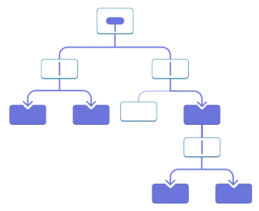
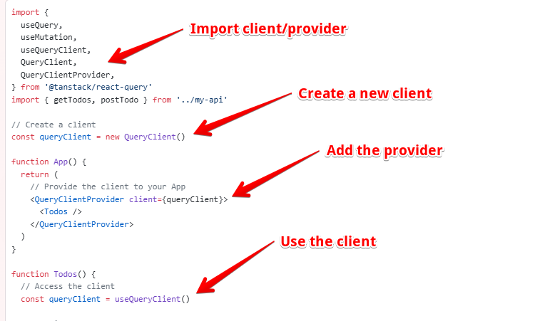

<style scoped>
@media screen {
  /* Hide not current fragments */
  [data-marpit-fragment]:not([data-marpit-fragment]:current) {
    display: none;
  }
}
</style>

<!-- class: invert -->

# State and Data Management in React and Next.js

_Working with and caching data in your React application_

---

<!-- class: lead -->

## Overview

<style scoped>
  section {
    font-size: 24px;
  }
</style>

- Client vs. server state: what belongs where, and why it matters
- Local component state with `useState()` and sharing via props
- The cost of prop drilling and when to avoid it
- Using `createContext()` to provide shared state (and its limits)
- When a reducer + context pattern can help
- Managing server state with TanStack Query
  - Provider/query client, `useQuery`, query keys and caching
  - `useMutation` and query invalidation
  - `useInfiniteQuery` for pagination/infinite scroll
  - SSR/Next.js: prefetching and dehydration to avoid waterfalls
- When you might need Redux (rich client-only state)

By the end you’ll be able to choose the right tool for state, implement queries/mutations with TanStack Query, and prefetch/dehydrate data for fast SSR in Next.js.

---

## Side note: server state management

We have seen that Next and related tooling (Prisma, Prisma Postgres) provide data management options as well.

We may be able to achieve all we need to using server-side data fetching along with caching options (incremental static regeneration, query caching) to achieve efficient data management without additional client-side tools.

This presentation won't be focused on Prisma data access but it's important to keep in mind as a possible data management option.

---

<!-- class: invert -->

## The Basics (built in state management in React)

---

<!-- class: lead -->

<style scoped>
  section {
    font-size: 20px;
  }
</style>

## `useState()`

`useState` is a React hook that allows us to maintain state in a react component across multiple render cycles. This is the simplest way to maintain state in a React application.

```tsx
import React, { useState } from "react";

const Counter = () => {
  const [count, setCount] = useState<number>(0);

  const increment = () => setCount((prev) => prev + 1);
  const decrement = () => setCount((prev) => prev - 1);
  const reset = () => setCount(0);

  return (
    <div style={{ textAlign: "center", marginTop: "50px" }}>
      <h1>Counter: {count}</h1>
      <button onClick={increment} style={{ margin: "5px" }}>
        +
      </button>
      <button onClick={decrement} style={{ margin: "5px" }}>
        -
      </button>
      <button onClick={reset} style={{ margin: "5px" }}>
        Reset
      </button>
    </div>
  );
};

export default Counter;
```

---

## `useState()` for shared state

We know that we can manage state within a single component using `useState()` but _how can we handle sharing this state between multiple components?_

<div data-marpit-fragment>

We can handle state management where state and/or actions are accessible by multiple components by simply _moving the state and actions to a common parent component_ and passing the data and event handlers as props to the children.

</div>

---

## `useState()` for shared state example

<style scoped>
  section {
    font-size: 28px;
  }
</style>

Here we see an example component where two components (`<Display />` and `<Incrementer />`) both have access to state or the state mutator in a single shared parent component `<App />`.

```tsx
const App = () => {
  const [count, setCount] = useState<number>(0);
  const increment = () => setCount((prev) => prev + 1);

  return (
    <div style={{ textAlign: "center", marginTop: "50px" }}>
      <h1>Shared State Example</h1>
      {/* Child that displays the count */}
      <Display count={count} />
      {/* Child that increments the count */}
      <Incrementer onIncrement={increment} />
    </div>
  );
};
```

---

## `useState()` going deeper with props

First, run and take a look at the code here `demos\react_state_props`

Start with the `demos\react_state_props\src\Counter.tsx` component and trace (in code) the hierarchy of components and how data and mutation functions flow through the code.

If you have not already, install [React Developer Tools](https://chromewebstore.google.com/detail/react-developer-tools). Inspect the components and their state in React Developer Tools.

Although this example is contrived, this is a pattern that is seen when state need to be shared by many components.

Do we see any problems with this pattern?

---

## Prop drilling



Passing data to child components makes it clear and explicit how data is moving through our application but can cause issues if we need to pass data down too deeply or through too many intermediary components that don't directly need access to the data. Passing data deeply down to child components is known as _prop drilling_ and generally should be avoided.

---

## Example: state distributed throughout the UI


---

## Context

To avoid prop drilling, React provides the `createContext()` hook to provide state via context to child components without needing to explicitly pass the data via props.

Once a context is created and a provider for that context is used, as a component in a parent component, all children can read from that shared context state.

**Read: [Passing Data Deeply with Context](https://react.dev/learn/passing-data-deeply-with-context)**

---

## Context Auth Example

A common use case for context usage is auth. It is often the case in React apps requiring auth that multiple components at various locations in the component hierarchy need access to auth state (whether or not the user is logged in, user data, etc.).

Take a look at, run and inspect the auth example using React Dev Tools in chrome: `demos\context_auth_example`.

Start with the root component: `demos\context_auth_example\src\App.tsx`. Note the use of the provider.

Look at the context component: `demos\context_auth_example\src\AuthContext.tsx`

Look at the child components of `App.tsx` and see how they are using the auth context.

---

## Context Limitations

Context allows us to share state between any component inside our application.

_Do we see any risks with using context? Do we see any limits we should place on our use of context?_

<div data-marpit-fragment>

Context is essentially a (potentially) _global data_ store. All the reasons we know to not use or overuse global data apply here. It can lead to spaghetti code where side effects and mutations can come from anywhere in our application. It can make it difficult to understand, maintain and debug our code.

Context is generally limited to items like authentication, theming and settings where it is best to have a single source of truth and a centralized way of access some data.

For more specific types of data (i.e. a specific product detail, article content), it is better to use an alternative means of state management.

</div>

---

## Reducer + Context

<style scoped>
  section {
    font-size: 22px;
  }
</style>

For complex local workflows (wizards, multi-step forms), pair `useReducer` with context to co-locate logic while avoiding prop drilling.

```tsx
type State = { step: number; email: string };
type Action =
  | { type: "next" }
  | { type: "back" }
  | { type: "setEmail"; email: string };

function reducer(state: State, action: Action): State {
  switch (action.type) {
    case "next":
      return { ...state, step: state.step + 1 };
    case "back":
      return { ...state, step: Math.max(0, state.step - 1) };
    case "setEmail":
      return { ...state, email: action.email };
  }
}

const WizardContext = React.createContext<{
  state: State;
  dispatch: React.Dispatch<Action>;
} | null>(null);
```

---

Read: https://react.dev/learn/scaling-up-with-reducer-and-context

---

<!-- class: invert -->

## TanStack Query

Query client to simplify managing server state in your application.

---

<style scoped>
  section {
    font-size: 24px;
  }
</style>

<!-- class: lead -->

_There are only two hard things in Computer Science: cache invalidation and naming things._

-- Phil Karlton

_There are only two hard problems in distributed systems: 2. Exactly-once delivery 1. Guaranteed order of messages 2. Exactly-once delivery_

-- Mathias Verraes

_there's two hard problems in computer science: we only have one joke and it's not funny._

-- Phillip Scott Bowden

_There are so many variations on the “there are only two hard problems in computer programming...” joke that I’m starting to suspect that programming isn’t actually very easy._

-- Nat Pryce

[Source](http://martinfowler.com/bliki/TwoHardThings.html)

TanStack Query (in part) aims to make the first hard thing (caching, in this case server state) a bit easier.

---

## TanStack Query Context

We have all dealt with server state in our applications. What are common ways to handle this? What are potential issues?

<div data-marpit-fragment>

### Option 1 - Use `fetch` or `axios` to just get the server data we need, when we need it.

</div>

<div data-marpit-fragment>

Problems: no built in caching, killing our server with re-fetches on re-render, multiple components fetching the same data.

</div>

<div data-marpit-fragment>

### Option 2 - Use a global state manger (Pinia for Vue, Redux for React)

</div>

<div data-marpit-fragment>

Problems: Global state management, additional indirection to get simple server state, poor co-location

</div>

---

<style scoped>
  section {
    font-size: 24px;
  }
</style>

## TanStack Query Solution for Server State Management

_TanStack Query (formerly known as React Query) is often described as the missing data-fetching library for web applications, but in more technical terms, it makes fetching, caching, synchronizing and updating server state in your web applications a breeze._

- [Source](https://tanstack.com/query/latest/docs/framework/react/overview)

In the majority of cases, when dealing with server state, we are _simply retrieving items or collections_ (posts, products, users, chats, etc.). We want to query our server without the overhead of redundant and uncached requests.

TanStack Query is a simple drop-in solution that allows us to _co-locate our server queries in the components that are using them while automatically caching those queries_. This allows us to avoid global state and better containerize and co-locate state with the components that are using them.

TanStack Query also supports _mutations_ and _query invalidation_, allowing the user to update server state and clear cached queries that were affected.

---

## Hello Todo!

There are three basic features that we need to understand to start using TanStack Query productively.

1. Context / Provider
2. Queries
3. Mutations / query invalidation

Let's take 5 minutes to review the quick start guide to get a sense of how this all works:

[https://tanstack.com/query/latest/docs/framework/react/quick-start](https://tanstack.com/query/latest/docs/framework/react/quick-start)

---

## Query Context

The query client provides a single, centralized, global client for running all of our queries. This is just setup, that must be done, whenever we use TanStack Query.



---

## Query Functions

<!-- <style scoped>
  section {
    font-size: 24px;
  }
</style> -->

Before we look at the queries themselves, we need a bit of context. What do the functions that the queries call (the query functions) look like?

These are just plain async functions that throw exceptions in the case of errors. Simple!

<!-- type Todo = {
  userId: number;
  id: number;
  title: string;
  completed: boolean;
}; -->

```typescript
async function fetchTodoList(): Promise<Todo[]> {
  const res = await fetch(
    "https://jsonplaceholder.typicode.com/todos?_limit=5"
  );
  if (!res.ok) {
    throw new Error("Network response was not ok");
  }
  return res.json();
}
```

---

## Queries

<style scoped>
  section {
    font-size: 22px;
  }
</style>

Now for the main course, queries!

```typescript
function Todos() {
  const { isPending, isError, data, error } = useQuery<Todo[], Error>({
    queryKey: ["todos"],
    queryFn: fetchTodoList,
  });

  if (isPending) {
    return <span>Loading...</span>;
  }

  if (isError) {
    return <span>Error: {error.message}</span>;
  }

  return (
    <ul>
      {data!.map((todo) => (
        <li key={todo.id}>{todo.title}</li>
      ))}
    </ul>
  );
}

export default Todos;
```

---

## `useQuery` hook

`useQuery` is a hook. As the query state changes (from pending to success/error), the query state (`isPending`, `isError`, `data`) update and trigger the component to re-render.

No more boilerplate success/error handling code for our API calls. Declarative programming, for the win!

```typescript
const { isPending, isError, data, error } = useQuery<Todo[], Error>({
  queryKey: ["todos"],
  queryFn: fetchTodoList,
});
```

```typescript
if (isPending) {
  return <span>Loading...</span>;
}
```

---

## Query key

We notice this line in our query:
`queryKey: ["todos"]`.


---

## Query key

A query key is used to uniquely identify a query (primarily for the purposes of caching).

The query key is always an array. It can contain a single item (i.e. for the collection of todos) or identify a specific item (like an individual todo).

```javascript
useQuery({ queryKey: ['todo', 5], ... })
```

There is a hierarchy of keys. In the above example, if this individual todo was updated, you would want to invalidate this query key: `['todo', 5]`.

If you wanted to invalidate all todo queries, you would invalidate this query key: `['todo']`

**Read: [Query Keys](https://tanstack.com/query/latest/docs/framework/react/guides/query-keys)**

---

## Query key invalidation patterns

```ts
// Invalidate a single item
queryClient.invalidateQueries({ queryKey: ["todo", todoId] });

// Invalidate a whole collection
queryClient.invalidateQueries({ queryKey: ["todo"] });
```

Keep keys stable and descriptive; prefer arrays over concatenated strings.

---

## Special Query: `useInfiniteQuery`

In cases where you need to repeatedly call an endpoint and append the response data to your local data, you should use `useInfiniteQuery`.

This is most commonly used for infinite scroll.

Let's take a minute to review the example in the docs:

[https://tanstack.com/query/latest/docs/framework/react/guides/infinite-queries](https://tanstack.com/query/latest/docs/framework/react/guides/infinite-queries)

---

## Mutations (`useMutation`)

<style scoped>
  section {
    font-size: 24px;
  }
</style>

We use mutations to update server state and optionally invalidate query keys.

First, can use guess what kind of function the `useMutation` hook uses for its mutation function (`mutationFn`)?

<div data-marpit-fragment>

If you guessed a simple, plain, async function, give yourself a cookie!

```typescript
export async function postTodo(newTodo: Todo): Promise<Todo> {
  const res = await fetch("https://jsonplaceholder.typicode.com/todos", {
    method: "POST",
    headers: {
      "Content-Type": "application/json",
    },
    body: JSON.stringify(newTodo),
  });

  if (!res.ok) {
    throw new Error("Error creating todo");
  }

  return res.json();
}
```

</div>

---

## `useMutation` example with query invalidation

```typescript
function Todos() {
  // ...
  // Mutations
  const mutation = useMutation({
    mutationFn: postTodo,
    onSuccess: () => {
      // Invalidate and refetch
      queryClient.invalidateQueries({ queryKey: ["todos"] });
    },
  });

  return (
    <div>
      // ...
      <button
        onClick={() => {
          mutation.mutate({
            id: Date.now(),
            title: "Do Laundry",
          });
        }}
      >
        {mutation.isPending ? "Adding..." : "Add Todo"}
      </button>
      {mutation.isError && (
        <div style={{ color: "red" }}>
          Error: {(mutation.error as Error).message}
        </div>
      )}
    </div>
  );
}
```

---

## Using TanStack Query on the server

Last week we talked about various rendering strategies available with Next including SSR (server side rendering). To review, what are some benefits of SSR and hybrid rendering over client-side SPA rendering?

<div data-marpit-fragment>

Benefits of SSR:

- Performance, avoids request waterfalls, cacheable pages and fast first paint
- SEO, all data served statically to the client, including metadata for better indexing

</div>

<div data-marpit-fragment>

Is it possible to get the benefits of SSR with TanStack Query?

</div>

<div data-marpit-fragment>

Yes! (with a bit of additional setup)

</div>

---

## Request waterfalls

Request waterfalls occur when, multiple server requests must be chained together sequentially to get all the data needed to render a given page.

In this hypothetical example, we are code splitting and chaining together multiple API requests to get all the data needed to display a feed of items. This results in 5 separate, sequential calls to the server.

This is 🐌🐌🐌 slow and not at all good for UX!

```
1. |> Markup
2.   |> JS for <Feed>
3.     |> getFeed()
4.       |> JS for <GraphFeedItem>
5.         |> getGraphDataById()
```

## [Source](https://tanstack.com/query/latest/docs/framework/react/guides/request-waterfalls)

---

## Prefetching and dehydration

To handle bundling the data the client will need with the server rendered data, TanStack Query uses _pre-fetching_ and _dehydration_.

_Pre-fetching_ involves fetching data for a query before it has run on the client so that it is immediately available.

_Dehydration_ involves serializing the pre-fetched data so it is available on the client and can be rehydrated and immediately used.

Note: if you are looking to implement this pattern in your own app, refer to the [advanced server rendering guide](https://tanstack.com/query/latest/docs/framework/react/guides/queries).

---

## Critical methods and flow for querying on the server

<style scoped>
  section {
    font-size: 24px;
  }
</style>

TanStack Query provides a few methods and components needed to handle fetching data on the server:

- `queryClient.prefetchQuery()` - pre-fetches a query so the results are available immediately to subsequent queries.
- `<HydrationBoundary state={dehydrate(queryClient)}>` - a container that includes a dehydrated query client with pre-fetched data.

### The basic steps for dehydrating query client data are as follows:

1. On the server, in a server component, **fetch and dehydrate the data**.
2. The query client can only run on the client so, create a `HydrationBoundary` and use the `use client` directive in a child component to **keep query client usage out of the server components**.
3. **Use the query client as normal in the child client component** (data has been pre-fetched on the server).

---

## Demo server side data queries

- Demo: `demos\next_tanstack_query` - you can run this
- Server-side pre-fetching is happening in:
  - `demos\next_tanstack_query\app\page.tsx`
  - `demos\next_tanstack_query\app\posts\[id]\page.tsx`
- Review the code and read the comments in these and the child components.
- Note the provider setup in: `demos\next_tanstack_query\app\providers.tsx`

---

## TanStack Query limitations

<style scoped>
  section {
    font-size: 26px;
  }
</style>

Through a combination of TanStack query, state, and context, you can handle your state needs in most applications.

Are there any applications where we think we might need additional state management?

<div data-marpit-fragment>

Rich client application that maintain a lot of client-side state that is not stored, or not stored routinely to the server may need additional tools for state management.

Examples: multi-step setup/account signup flows, games, theming, user settings, etc. For these, you may want a state management library like Redux.

Redux is a lot like Pinia, which you have all used, with shared central state and a clear pattern for state mutation (reducers).

We aren't covering Redux in this course but, if your app needs it, review the [official documentation and guides](https://redux.js.org/).

</div>

---

## Choosing the right tool

- `useState`/props: local UI state, simple and colocated
- Context: auth/theme/settings shared widely
- Reducer + Context: complex local flows needing structured updates
- TanStack Query: server state (fetch/cache/sync/mutate)
- Redux (or similar): larger cross-cutting client-only state

---

## Questions?


