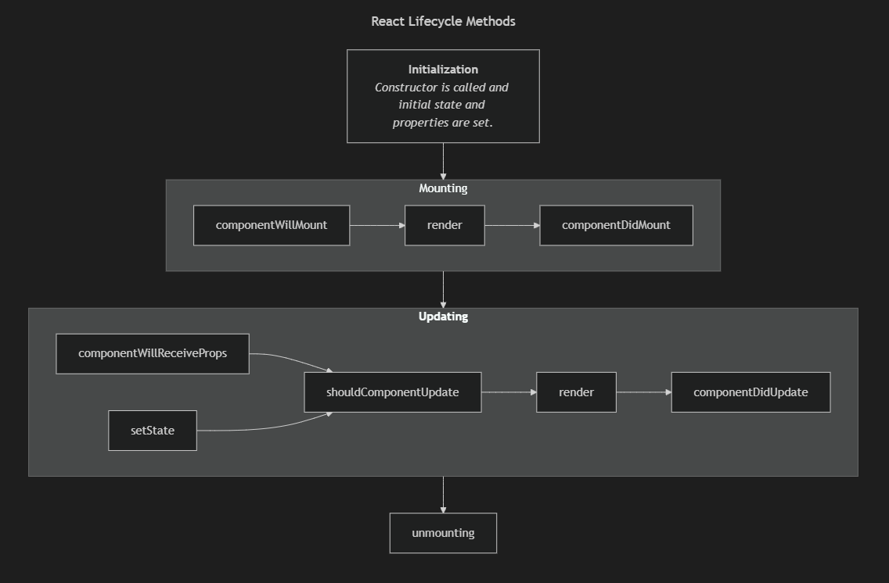

# React

_The fundamentals of react for experienced developers_

---



---

## Main Component Lifecycle Methods

<style>
    #react-lifecycle svg {
        max-height: 540px;
    }
</style>

<div class="mermaid" id="react-lifecycle-diagram">
flowchart TD
    mounting-->updating
    updating-->unmounting
    initialization[
        **Initialization**
        _Constructor is called and initial state and properties are set._
    ]-->mounting
    subgraph mounting[Mounting]
        direction LR
        componentWillMount-->
        render-->
        componentDidMount
    end
    subgraph updating[
        **Updating**
    ]
        direction LR
        componentWillReceiveProps --> shouldComponentUpdate
        setState --> shouldComponentUpdate
        shouldComponentUpdate -->
        render2[render] -->
        componentDidUpdate
    end
</div>

---

## Component Hierarchy

<div class="mermaid">
graph TD
  App --> Header
  App --> Dashboard
  Dashboard --> Sidebar
  Dashboard --> Content
  Content --> Card
</div>

---

## State & Props Flow

<div class="mermaid">
graph LR
  ParentComponent -->|props| ChildComponent
  ChildComponent -->|callback| ParentComponent
</div>

---

## Context Usage

<div class="mermaid">
graph TD
  ThemeProvider --> App
  App --> Header
  App --> Dashboard
  Header --> ThemeConsumer
  Dashboard --> ThemeConsumer
</div>

---

## useEffect Lifecycle Timeline

<div>
gantt
    title useEffect Lifecycle
    dateFormat  HH
    axisFormat  %H:%M
    section Component
    Mount        :a1, 00, 1
    Update       :a2, after a1, 2
    Cleanup      :a3, after a2, 1
</div>

- Shows mounting → updating → cleanup in functional components.

---

## Hooks Interaction Flow

<div class="mermaid">
graph TD
  useState --> Component
  useRef --> Component
  useEffect --> Component
  useContext --> Component
  Component --> UI
</div>

- Visualizes how different hooks interact with the component and UI.

---

## Components & JSX

```jsx
function Button({ children, onClick }) {
  return <button onClick={onClick}>{children}</button>;
}
```

```jsx
<Card>
  <CardHeader title="Welcome" />
  <CardBody>Content here</CardBody>
</Card>
```

---

## State & Lifecycle

```jsx
const [count, setCount] = useState(0);
useEffect(() => {
  console.log("Component mounted");
  return () => console.log("Cleanup");
}, []);
```

---

## Advanced Hooks & Performance

```jsx
const memoizedValue = useMemo(() => computeExpensive(value), [value]);
const memoizedCallback = useCallback(() => doSomething(a), [a]);
const inputRef = useRef();
```

```jsx
function useWindowWidth() { ... }
```

---

## Routing & Async Data

```jsx
<Routes>
  <Route path="/" element={<Home />} />
  <Route path="dashboard" element={<Dashboard />} />
</Routes>
```

```jsx
const { data, isLoading } = useQuery("todos", fetchTodos);
```

---

## Testing & Modern Patterns

```jsx
render(<Button>Click me</Button>);
expect(screen.getByText("Click me")).toBeInTheDocument();
```

- Compound components, Render props, HOCs
- TypeScript integration

---

## Best Practices & Anti-Patterns

- Small, reusable, composable components
- Avoid prop drilling and state duplication
- Use memoization & lazy loading
- **Q/A**

<script type="module">
  import mermaid from 'https://cdn.jsdelivr.net/npm/mermaid@11/dist/mermaid.esm.min.mjs';
  mermaid.initialize({ startOnLoad: true });
</script>
