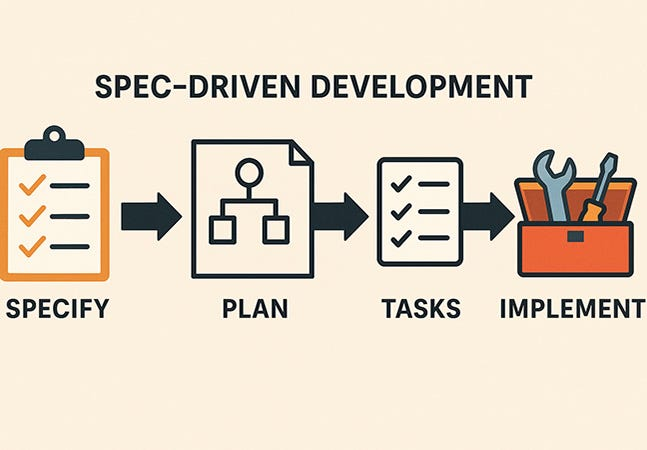
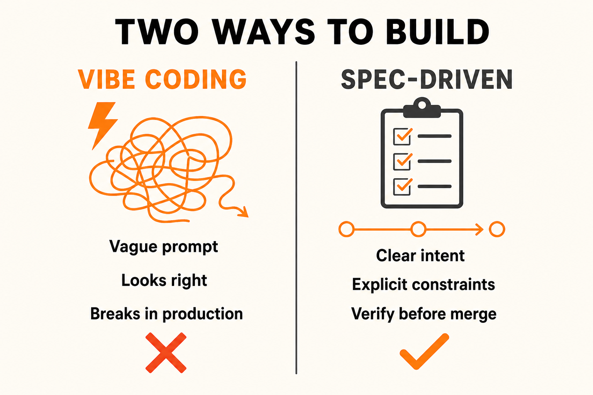
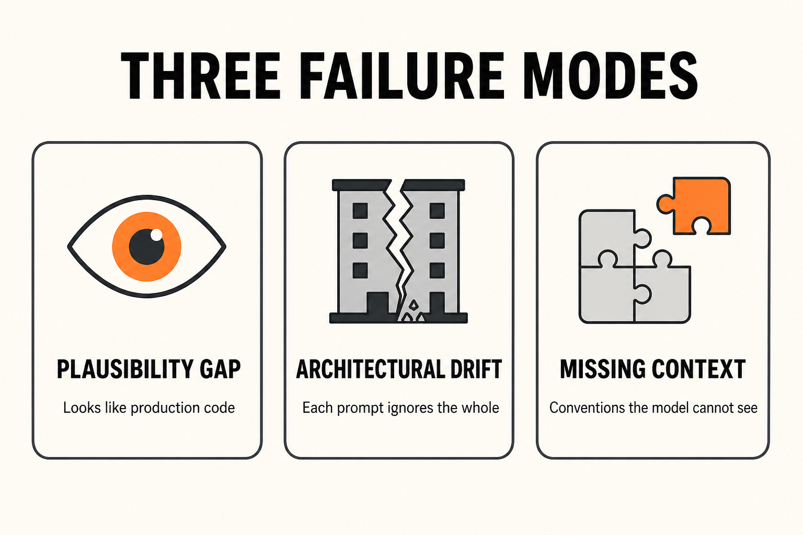
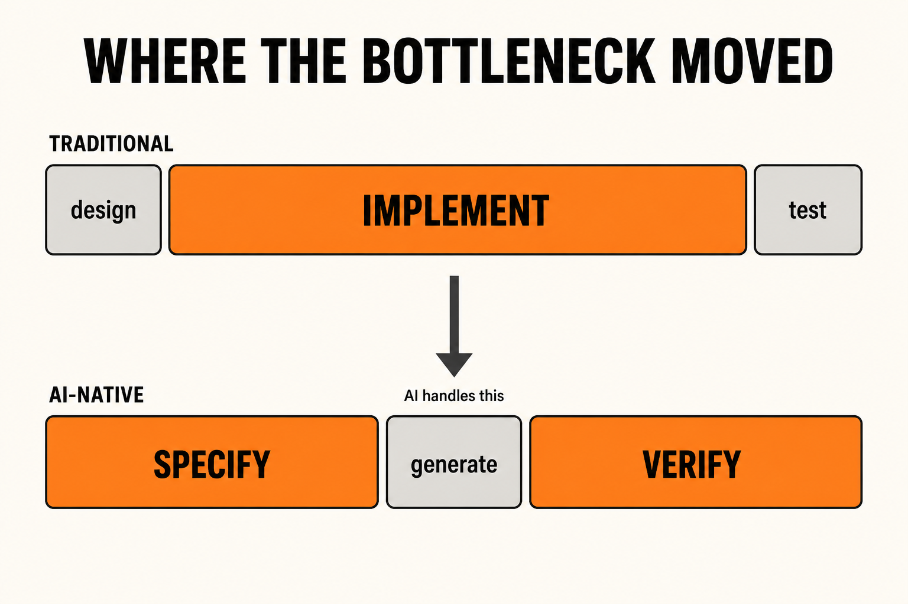
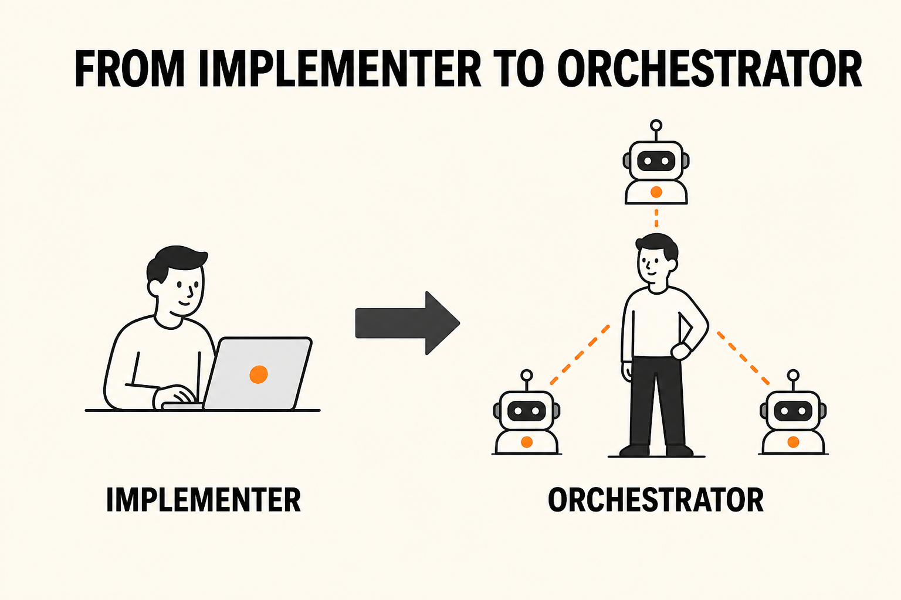
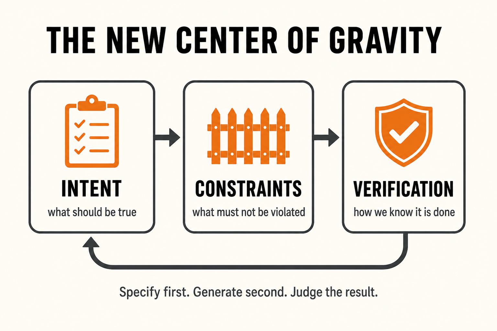
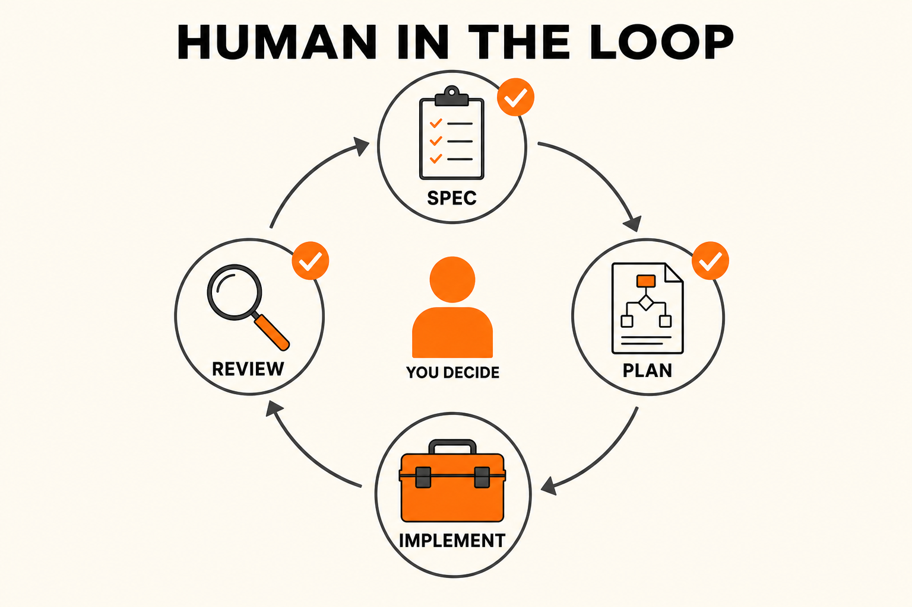

<!-- only include once in document -->

<!-- class: invert -->

# Spec Driven Development (SDD)

---

<!-- class: lead -->

## SDD Overview

- Disclaimers
- History
- Motivation
- Foundational concepts
- SDD Process, key steps and artifacts
- SDD in practice

---

## Disclaimer - all is change

AI engineering practices are evolving rapidly. In cases like MCP, something that was completely new becomes industry standard within a year. Engineers are looking for and building out abstractions for common problems and adopting useful frameworks and patterns quickly. The dust has not settled, things will continue to change, standards are still emerging.

That said, it is important that developers are not standing still. These tools are transforming the industry and we must do our best to stay informed and current on the most standard and current tooling.

---

## Disclaimer - it's not free

Use of AI coding agents is not required for this class but most of us are using these tools anyway. What we are learning in this class are general processes around software development with AI. I will be using Cursor but the processes should be applicable to whatever coding tools you use.

There are free, limited, tiers available to you but it may be worth investing in a subscription to go deeper with your learning.

I will be using Cursor. The React Native portion will work with Claude. Claude has plugin integrations with Cursor and VS Code.

---

## History, very briefly

Software engineering has known for decades that **ambiguous requirements are expensive**. Boehm (1981): a defect found in production can cost far more than one caught in design.

What changed in 2025 is speed. Karpathy named **vibe coding**: describe the vibe, accept the diffs, ship. Prototyping got cheaper. Production defects got cheaper to _create_ at volume.

**Spec-driven development** is the production answer taking shape around that: write intent and constraints first, review a plan, then let the agent implement against criteria you can actually check.

The name is new. The underlying discipline is not. AI just makes skipping it visible faster.

---

<!-- class: invert -->

# Why SDD?

---

<!-- class: lead -->

## The vibe-coding trap

In February 2025, Andrej Karpathy named a new way of writing software: **vibe coding**.

You describe what you want in loose language, accept the diffs, paste the errors back into chat, and let the model fill in the rest.

For a prototype, it feels like a superpower. For production, it is a trap.

The trap is not that AI is weak. The trap is **mistaking fluency for understanding**.

---

---

## Vibe prototyping is fine. Vibe production is not.

Use the loose, playful mode when the output is **meant to be thrown away**:

- Can this API integration even work?
- How does this UI pattern feel?
- A one-off script you will never ship

Do **not** use it when you will own the result in production.

Karpathy's own caveat: vibe coding falls short for anything more complex than a throwaway weekend project.

The capability is real. Giving up engineering judgment is the mistake.

---

## Three failure modes you can already predict

**Plausibility gap** — AI code looks like production code. Bugs hide behind clean formatting and familiar patterns. You have no map of the fragile parts.

**Architectural drift** — each prompt solves the task in front of you. Schemas diverge, error handling forks, auth gets copied instead of shared. The system "works" and becomes expensive to change.

**Missing context** — team conventions live outside the files: validation belongs in the service layer, soft deletes, localized errors. The model cannot see what you did not write down.

---

## Same ticket, two engineers

The task: rate-limit payment initiation. Max **10 requests per minute per user**.

**Engineer A** types: _"Add rate limiting to the payment endpoint, max 10 requests per minute."_

Thirty seconds later: sliding-window middleware, keyed on **client IP**, Redis client, tests pass. Looks clean. Merged.

**Day 3:** a corporate customer behind a shared NAT is blocked. A fraudster on rotating residential IPs is not.

The implementation was correct for the prompt. The prompt was not the real problem.

---

## Engineer B spent 10 minutes writing first

Before opening the agent:

- Limit **per authenticated user**, not IP — we have corporate customers behind NATs
- Auth already attaches `user_id` — key on that
- Idempotent retries with the same key **do not count**
- Emit the team's existing rate-limit metric format
- Use the **approved cache wrapper**, not a new Redis client

The agent produces different code. Engineer B reviews it against the notes, finds a gap on failed retries, updates the spec, regenerates, merges.

Same tool. Same ticket. Different engineering. One extra 10 minutes vs an incident, a rollback, and a day of cleanup.

---

## Why the old workflow no longer scales

Traditional development assumed **implementation speed** was the bottleneck, and that you were the author of every line. Both assumptions broke.

You used to discover the design _by writing the code_. Edge cases showed up in tests. The data model changed when you hit the third entity. That worked because **you** accumulated understanding as you went.

An agent does not. It starts fresh at each context boundary. Underspecify, and it invents assumptions — then builds the next prompt on top of them.

So the expensive work moves **upstream** (clear spec) and **downstream** (rigorous verification). Generation in the middle is the cheap part.

---

---

## Changing nature of developer work

1. **More time before the work** - Define output, constraints, edge cases, and “done” _before_ a line is written. Skipping this costs more later.
2. **Review replaces writing as the primary activity** - Review agent work to confirm it matches intent, constraints, edge cases, etc.
3. **Communication takes more of the day** - Coversations outside the dev team to collaboratively determined exact business rules and product specs.
4. **Verification is designed up front** - Tests and success criteria before implementation.

- Code writing does **not** disappear: performance-critical paths, novel algorithms, thin training-data coverage, deep system-specific context.
- Addy Osmani: _Every engineer is a manager now_ - directing, reviewing, taking accountability for work others produce.
- Identity shift: implementation shifts to system design and quality ownership. The same judgment (edge cases, architectural coherence) is what makes you good at directing agents.

---

## Human-in-the-Loop (HITL): required checkpoints

- Human must explicitly review/approve decisions above a threshold of consequence. Borrowed from control theory/robotics: operator confirmation before irreversible actions.
- Loop: agent reasons and proposes then engineer reviews and decides. Advances past human-relevant points only with explicit sign-off.

---

## HITL in SDD

1. **Review specs before planning** - Highest-value checkpoint. Catches misunderstandings before they are code. Cursor Plan Mode: confirm/correct the plan first.
2. **Review plan before implementation** - Humans check intent, constraints, system fit (history, team decisions, real user behavior).
3. **Review implementation diff and functionality** - After implementation completes, human should review the code diffs and perform basic user testing (automated testing should be part of the implementation).

- Calibrated automation, not maximum automation. Fast on well-scoped work; slower on risky work.
- **Speed myth:** Skipping HITL to go faster is backwards. A 10-minute spec review prevents hours of remediating a misaligned implementation. Speed comes from getting the spec right _before_ execution.

---

---

<!-- class: invert -->

# Foundational concepts

---

---

## You are no longer paid mainly to type the code

When an agent can draft a CRUD endpoint in 30 seconds, the scarce work moves **around** the translation:

- What should this actually do?
- What invariants must hold?
- What happens on bad input or under load?
- Is this the right design for _this_ system?

An **orchestrator** defines work precisely, assigns it, reviews against intent, integrates what passes, and redirects what does not.

Addy Osmani: _every engineer is a manager now_ — not of people, of work that other capable entities produce.

---

## What this is _not_

- **Not** a course on building LLMs or "AI products"
- **Not** a tour of whichever IDE plugin is hot this quarter
- **Not** removing humans from the loop — judgment becomes **more** important
- **Not** "coding less" as a goal — some of you will write more, because you can take on harder work
- **Not** only for seniors — the barrier is being willing to work differently

AI-native engineering is a **judgment-centered practice** for using AI across the whole lifecycle. The tools will change. The practice should hold up.

---

---

## Intent: what should be true when you are done

Intent is an **outcome**, not a list of implementation steps.

**Weak:** "Add a user profile page."

**Strong:** "Return display name, avatar URL, member-since date, and the 2 most recent public posts. 404 if the user does not exist. Hide email from unauthenticated callers. Cache 60s using the existing user-resource cache key convention."

Vague intent produces vague code. The model will fill every gap with **training-data defaults** for "what a profile page usually looks like." Those defaults will match your system only by luck.

---

## Constraints: the walls the agent cannot see

The most common AI failure: the agent **violates a constraint it was never told**.

The code passes tests, merges, and the violation shows up later — often when it is expensive.

Write them down **before** the task:

- **Technical** — existing auth library, p99 under 200ms, no new database
- **Business** — all locales, backward-compatible with v2, no emails to anonymous users
- **Quality** — coverage bar, security scan, project naming conventions

If it is not in the spec, the model is free to invent something plausible.

---

## Verification: your judgment replaces the model's confidence

AI is confident. It can also be wrong: hallucinated APIs, misread code, locally smart assumptions that are globally false.

Three layers:

1. **Automated** — unit/integration tests, linters, types, CI. Catches the embarrassing class of errors quickly.
2. **Structured review** — does it match intent, respect constraints, take shortcuts that will hurt later?
3. **Acceptance** — run it the way a real user would.

Tests the agent wrote are necessary and **not sufficient**. Agents can generate tests that pass without covering the behavior that matters.

Review against **criteria**, not against a vibe that it "looks right."

---

---

## Human-in-the-loop is how you stay fast

HITL is **calibrated automation**, not maximum automation.

Checkpoints that actually pay for themselves:

1. **Review the spec / plan before execution** — cheapest place to catch a misunderstanding. Cursor Plan Mode is this habit, formalized.
2. **Review output before merge** — CI already checked that it compiles. You check that it belongs in _this_ system.
3. **Stay close on high-risk work** — auth, production data, new dependencies. A utility function can be reviewed quickly. A migration cannot.

Skipping review "to go faster" is backwards. A 10-minute spec review prevents hours of remediating the wrong implementation.

---

## The skill stack above "can it write code?"

| Skill                       | What it actually is                                               |
| --------------------------- | ----------------------------------------------------------------- |
| **Spec literacy**           | Write precise intent before you prompt                            |
| **Context engineering**     | Give the agent the files, conventions, and examples it needs      |
| **Orchestration**           | Break work into scoped subtasks and integrate the results         |
| **Verification discipline** | Review against criteria, not gut feel                             |
| **Risk ownership**          | Calibrate how close you stay; not everything is equally dangerous |
| **Systems thinking**        | Does this feature even belong here, six months from now?          |
| **Communication**           | Turn a messy request into testable behavior                       |
| **Harness engineering**     | Rules, tests, and feedback loops that make agents reliable        |

Technical depth is still required. It is now the **floor**, not the differentiator.

---

## What you actually do on a Tuesday

**Before:** write the behavior, constraints, edge cases, and "done." Load context on purpose — rules files, conventions, approved libraries. Treat that config as infrastructure.

**During:** review output against the spec. If it is wrong, diagnose the **gap in the spec** before re-rolling the prompt. Rephrasing and hoping is a random walk.

**Throughout:** every commit is **yours**. The agent is not accountable. Stay close on irreversible decisions. Use AI for docs, PR descriptions, and design exploration — not only for generating code.

If it looks like you are typing less, that can still be more engineering.

---

<!-- class: invert -->

# What this means for you

---

<!-- class: lead -->

## If AI writes the basics, how do juniors grow?

Honest answer: the market is harder, and the work you used to learn on is exactly what agents now draft.

The skills that make a senior did **not** disappear. They matter more, because it is easier than ever to ship something that looks right and is wrong.

Habits that still work:

- Read agent code until you could have written it
- Go one layer deeper than the framework docs
- Take the harder problem on purpose
- Treat the agent as a **tutor**, not a skip button
- Pair with someone on the _agent_, not only on the code

Used well, this is the best learning accelerator juniors have had. Used as a shortcut, it hollows out the foundation you will need in six months.

---

## Start with one habit this week

Before you ask an agent to implement anything that will survive the afternoon, spend **five minutes** writing:

1. What should be true when you are done?
2. What constraints apply?
3. How will you know it is done?

That single change produces better output than cold prompting. The rest of SDD is this habit, scaled up and made reviewable.

---

<!-- class: invert -->

# SDD in one picture

---

---

## From mindset to process

The rest of this session turns that mindset into a **repeatable process**:

- **Specify** — intent, constraints, acceptance criteria
- **Plan** — approach the agent must follow, reviewed before it writes code
- **Tasks** — scoped work the agent can actually finish
- **Implement** — generate, then verify against the spec

Same loop as HITL: humans sign off where misunderstanding is expensive. Agents run where the work is well specified.

Next: artifacts, the steps in practice, and how we will use this in class.

---

<!-- class: invert -->

# Takeaways

---

<!-- class: lead -->

## If you remember four things

1. **Vibe coding prototypes. Specs ship.** Fluency is not understanding.
2. **You orchestrate.** Intent, constraints, and verification are the job. Generation is the cheap middle.
3. **Review early.** Fixing the spec is faster than fixing the incident.
4. **Own the commit.** The agent has no accountability. You do.

AI replaces mechanical tasks, not the purpose of engineering: decide what to build, define "done," and make sure it is true.
